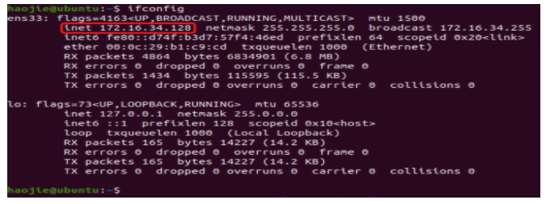
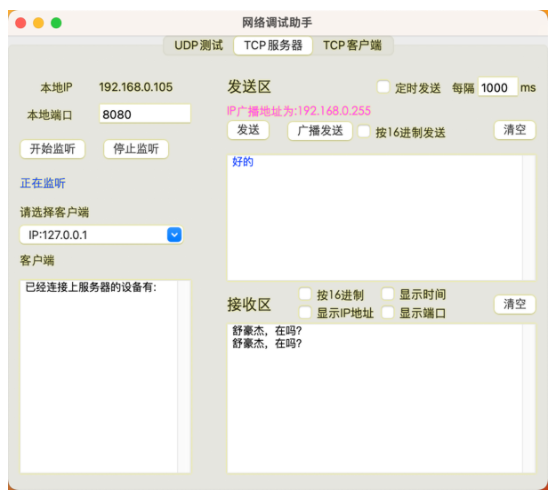
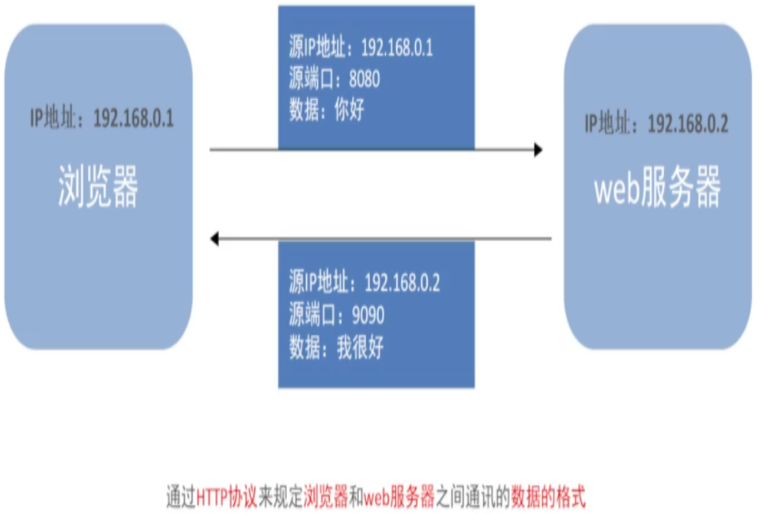

# 计算机网络

网络通信三要素：IP、端口、协议

## 一、IP地址

### 1. IP地址的概念

IP地址就是标识网络设备的一个地址，好比现实生活中的家庭地址

### 2. IP地址的表现形式

IP地址整个只有41亿个，远远超过现在的网络设备数。怎么解决整个问题呢？

对外进行访问的时候，用到的是公网，电信运营商给的


对内会有一个局域网IP，在同一个区域内的人，使用的是同一个公网IP，此时可以用不同的局域网IP来区分它们。



通过公网IP+局域网IP，可以解决IP地址不够分的问题。

### 3. 本机地址

(1) 127.0.0.1: 回环测试IP，表示本机地址。
(2) localhost: 127.0.0.1对应的域名是localhost，域名是IP的别名，通过解析域名可以获得IP。

### 4. 检查网络

检查本机网络: ping 127.0.0.1
检查本机联网: ping www.baidu.com

## 二、端口

### 1. 什么是端口

传输数据的通道，数据传输的必经之路。好比教室的门。

### 2. 端口号

操作系统为了管理端口，对端口进行了编号，这就是端口号。 

> 网络通信流程：通过对方的IP地址找到对应的设备，再通过端口号找到对应的端口，通过端口给运行的应用程序传输数据。

### 3. 端口号分类

#### （1）知名端口号

总所周知的端口号：范围从0到1023，这些端口号会分配给一些服务，例如：

* 21: FTP
* 25: SMTP
* 80: HTTP

#### （2）动态端口号

程序员开发应用程序使用的端口号称为动态端口号。范围从1024到65535。如果没有设置端口号，操作系统会在范围内随机生成一个给程序使用。当程序退出时，端口会被释放。

## 三、socket

### 1. socket介绍

当知道ip和端口之后，就可以进行网络连接了吗？并不能。就像我们知道布达拉宫的地址，还得借助交通工具来达到。socket就是这个工具

### 2. socket是什么？

socket(简称套接字)是程序之间通信的一个工具。好比现实生活中的电话，当知道了对方的电话号码后，知道了对方的电话号码后，还需要使用电话才能打电话。

程序之间想要进行网络通信需要基于socket，**socket就是程序间进行网络通讯的工具**。


网络编程可以称之为socket编程，不夸张的说，只要跟网络相关的程序都用到了socket

## 四、TCP协议

### 1. TCP介绍

有了socket之后，就可以通过它来传输数据。但是要注意，数据不能随便乱发，发送之前要选择传输方式(传输协议)，保证程序之间按照指定的传输规则进行数据的通信。例如同样是去布达拉宫，是走高速公路(更快)还是走乡间小路(更便宜)，去之前首先要明确。

### 2. TCP概念

TCP: Transmission Control Protocol，传输控制协议。是一种面向连接的、可靠的、基于字节流的传输层通信协议。

#### （1）面向连接

**通信双方建立好连接才能进行数据传输**，双方都为此连接分配必要的资源来记录连接的状态和信息。当数据传输完成后，双方必须断开连接，释放资源(TCP的连接是比较消耗资源的)

#### （2）可靠传输

- 应答机制: 每个报文必须得到接受方的应答才认为报文传送成功。
- 超时重传: 发送端发送报文后启动定时器，如果指定时间没有得到应答就重新发送报文
- 错误校验: 发送数据时，同时发送校验码。接受方接受时先取数据，再通过校验函数来判断数据是否有误。
- 流量控制: TCP协议还会通过流量控制的方式来避免发送过快导致接收方来不及接受的情况。

只要选择了TCP协议，它都会自动帮我们去做上述的操作，不需要我们去写代码。

**协议就是通信的规则，就像上面的例子，只要我们选择走高速公路，就会有服务区休息、夜间路灯这些配套设施给到我们。**

### 3. TCP通信步骤

1. 建立连接
2. 传输数据
3. 关闭连接

TCP在通信开始之前一定要建立连接，才能发送数据，通信结束要关闭连接。

## 五、TCP协议程序开发

### 1. 数据的编码转化

前面介绍过，TCP协议是通过字节流的形式发送的。因此数据，例如字符串需要首先转换为二进制数据才能发送出去。

`encode`: 编码，字符串转为字节码
`decode`: 解码，字节码转为字符串

### 2. tcp客户端开发流程

1. 创建客户端套接字对象
2. 和服务端套接字建立连接
3. 发送数据
4. 接收数据
5. 关闭客户端套接字

### 3. tcp客户端代码实现

上述过程可以用代码实现

```python
import socket

if __name__ == '__main__':
    # 1. 创建客户端套接字对象
    # AF_INET: 表示ipv4, SOCK_STREAM表示的是tcp协议
    tcp_client_socket = socket.socket(socket.AF_INET, socket.SOCK_STREAM)

    # 2. 和服务端套接字建立连接, connect里面传参为元组类型
    tcp_client_socket.connect(("127.0.0.1", 8080))

    # 3. 发送数据
    send_str = "舒豪杰，在吗？"
    send_data = send_str.encode(encoding="gbk")
    tcp_client_socket.send(send_data)

    # 4. 接收数据
    # 1024: 一次接收到的数据最大字节
    recv_data = tcp_client_socket.recv(1024)
    print(recv_data.decode(encoding="gbk"))

    # 5. 关闭socket连接
    tcp_client_socket.close()
```
代码执行前需要服务端监听8080端口，可以用网络调试助手这个程序。



### 4. tcp服务端开发流程

1. 创建socket对象
2. 绑定ip地址和端口号
3. 设置监听模式
4. 等待客户端socket连接
5. 接收数据
6. 发送数据
7. 关闭连接

### 5. tcp服务端代码实现

```python
import socket


if __name__ == '__main__':
    # 1. 创建socket对象
    tcp_server_socket = socket.socket(socket.AF_INET, socket.SOCK_STREAM)

    # 2. 绑定ip地址和端口号
    tcp_server_socket.bind(("", 9091))

    # 3. 监听, 128为允许连接的最大个数
    tcp_server_socket.listen(128)

    # 4. 等待客户端连接
    # accept方法会返回一个元祖类型，第一个是新的socket对象，第二个是客户端ip和端口信息
    new_socket, client_info = tcp_server_socket.accept()

    # 5. 接收数据. recv为接收的最大字节个数
    recv_data = new_socket.recv(1024)
    print(f"来自客户端的消息:{recv_data.decode('utf-8')}")

    # 6. 发送数据
    new_socket.send("你好，客服正忙，请稍后再拨".encode("utf-8"))

    # 7. 关闭sockt
    new_socket.close()
```

### 6. 端口复用

在MacOS系统或者Linux系统，当我们执行完上述服务端代码，然后再次执行，会出现如下报错

```bash
Traceback (most recent call last):
  File "/Users/haojie/workspaces/codes/learning-notes/python/网络编程/codes/tcp服务端代码实现.py", line 9, in <module>
    tcp_server_socket.bind(("", 9091))
OSError: [Errno 48] Address already in use
```
这是因为在MacOS或者Linux中，**服务端程序退出后，端口号不会立马释放**，需要等待1~2分钟。为了解决这个问题，可以使用如下方案来解决。

```python
import socket


if __name__ == '__main__':
    tcp_server_socket = socket.socket(socket.AF_INET, socket.SOCK_STREAM)
    # 参数1: 设置当前socket
    # 参数2：设置端口复用选项
    # 参数3：设置端口复用选项的值(True表示开启端口复用)
    tcp_server_socket.setsockopt(socket.SOL_SOCKET, socket.SO_REUSEADDR, True)
    tcp_server_socket.bind(("", 9091))
    tcp_server_socket.listen(128)
    new_socket, client_info = tcp_server_socket.accept()
    recv_data = new_socket.recv(1024)
    print(recv_data.decode("utf-8"))
    new_socket.send("你好，客服正忙，请稍后再拨".encode("utf-8"))
    new_socket.close()
```

### 7. TCP网络注意事项

1. 客户端必须要建立连接，才能通讯
2. 服务端必须绑定端口号，否则客户端找不到这个TCP服务端程序
3. 客户端listen后的套接字是被动套接字，**只负责接收连接请求，不能收发消息**。连接成功后，产生的新的套接字，可以收发消息。
4. 服务端关闭accept产生的新套接字，意味着和客户端的通信已经完毕。

### 8. send和recv

客户端send不是直接把数据发送给服务端。想要发送数据，必须通过网卡发送数据，应用程序无法通过直接通过网卡发送数据，需要调用操作系统接口。应用程序首先将发送的数据先写入到发送缓冲区(内存中的一片空间)，再由操作系统控制网卡把发送缓冲区的数据发送给服务端网卡。

服务端recv也不是直接从客户端接收数据。它需要调用操作系统接口，由操作系统通过网卡接收数据，把接收的数据写入到缓冲区，应用程序再从缓冲区获取客户端发送的数据。


注意：应用程序是无法直接控制硬件的。

### 9. 多任务版服务端程序(重点)

直接看代码和代码注释，重点注意两个死循环的作用。**一个是为了监听多个客户端，一个是为了和同一个客户端循环收发消息。**

```python
import socket
import threading


def handle_client(new_socket, client_info):
    # 重点: 这里为True时，可以循环接收数据。因为send完之后，还会再返回接收。
    while True:
        recv_data = new_socket.recv(1024)
        # 可以通过recv_data是否为0，来判断客户端是否下线了
        if len(recv_data) == 0:
            print(f'客户端{client_info}下线了')
            # 一旦客户端下线，此时跳出循环，结束对次客户端的收发，此时该子线程也执行完毕
            break
        print("来自客户端消息：", recv_data.decode("gbk"))
        new_socket.send("你好，客服正忙，请稍后再拨".encode("gbk"))
    new_socket.close()


def main():
    tcp_server_socket = socket.socket(socket.AF_INET, socket.SOCK_STREAM)
    tcp_server_socket.setsockopt(socket.SOL_SOCKET, socket.SO_REUSEADDR, True)
    tcp_server_socket.bind(("", 9091))
    tcp_server_socket.listen(128)
    # 如果不死循环, 程序执行完就结束了, 不能持续监听
    while True:
        # 当有客户端连接过来时, 去创建子线程
        new_socket, client_info = tcp_server_socket.accept()
        print(f"来自客户端连接:{client_info}")
        # 创建子线程，防止主线程阻塞
        t = threading.Thread(target=handle_client, args=(new_socket, client_info))
        
        # 加一个主线程守护，防止主线程无法主动结束 
        t.daemon = True
        
        t.start()


if __name__ == '__main__':
    main()
```

## 六、UDP协议

UDP和TCP都是传输层协议

UDP：无连接，不可靠传输，优势是消耗资源小。发送之前无须确认对端是否存在，发送端可随时发送数据。


TCP：有连接，可靠传输，消耗资源也多。发送之前需确认对方是否有收发能力。


## 七、TCP三次握手和四次挥手

### 1. 三次握手

保证客户端和服务端都有收、发能力。就像线上面试

1. 面试官问可以听到吗 
2. 我说可以听到，你那边可以听到吗
3. 面试官说可以听到

### 2. 四次挥手

保证客户端和服务端都发起结束并回应结束，才代表这次连接真正结束。就像结束面试一样： 

1. 面试官说我没有其他问题了 
2. 我说好的 
3. 我想了想我这边还有没有其他问题，确认好之后说我也没有其他问题了 
4. 面试官说好的

之所以挥手多一次，是因为面试官没有其他问题，我这边还有可能有其他问题。而在连接的时候，只需要去确认连接，不会有判断(自己是否还有其他问题)，因此服务端收、发是在一起的。

## 八、HTTP协议

### 1.URL

URL:Unique Resource Locator, 统一资源定位符，通俗理解就是网络资源地址。

URL，例如https://www.itcast.com/18/1122/10/E178.html。它由三部分组成：

1. 协议部分：分为三种。https://, http://, ftp://

2. 域名: IP地址的别名。www.itcast.com

3. 资源路径部分:例子中后面部分就是资源路径部分。

4. 此外还可以有查询参数部分:?query=1&item=2

### 2. HTTP协议

思考，如下图所示，有一个浏览器客户端要和一个web服务器之间进行通讯。



它们之间可以通过上节的TCP协议来进行通讯，客户端发送数据:"你好"，web服务器回复:"我很好"，这个数据并没有规定格式。

HTTP协议的作用就是**规定浏览器和web服务器之间通讯的数据的格式**。HTTP协议全称HyperText Transfer Protocol。超文本协议，**因为它超越了文本，可以用来发图片，视频，等等**。XXx

注意: 

1. HTTP协议是规定浏览器和web服务器之间的协议。其他客户端和服务端的通信不在HTTP协议规定范围内。
2. **HTTP协议是基于TCP协议的**，发送数据钱需要先建立连接。**TCP协议是用来保证网络中数据传输的安全性的，HTTP协议是用来规定这些数据具体格式的**
3. HTTP协议分别规定了请求数据的格式，响应数据的格式，并且它们一般都是成对出现的。

### 3. 浏览器访问web服务器过程

1. DNS将域名解析为IP地址
2. 获取IP地址
3. 建立连接
4. 发送HTTP请求
5. web服务器根据请求获取资源
6. 返回HTTP响应数据

如下图所示


### 4. HTTP请求报文

HTTP请求最常见请求报文有两种

1. GET请求：获取web服务器数据
2. POST请求：向web服务器提交数据

#### （1）GET请求

GET请求的报文分为三部分：

- 请求行
- 请求头
- 空行

如下图所示，注意看后面的注释。


1. 请求行规定

- GET请求方式 
- 请求资源路径 
- HTTP协议版本

2. 请求头都是以键值对形式出现的，是浏览器想告诉web服务器的信息。另外GET请求报文用代码去读，实际是这样的


在浏览器中，点击""View source"可以看到原始的请求报文


#### （2）POST请求

POST请求比GET请求多了一个请求体。如下图所示。


### 5. HTTP响应报文

无论是哪一种请求方式，响应报文都包含四部分：响应行，响应头，空行，响应体。


其中响应行包含HTTP协议版本，状态码，状态描述。状态码常见的有

- 200: 服务器成功处理请求
- 400: 错误请求, 请求地址或者参数有误
- 404: 请求资源在服务器中不存在
- 500: 服务器内部源代码出现报错

### 6. HTTP协议通信过程

HTTP请求过程如下：

1. 浏览器发送HTTP请求数据(超文本)
2. 服务器返回HTTP响应数据(超文本)。**返回的超文本中可能包含链接，链接指向图片。**
3. 浏览器在渲染html的时候，逐行执行，当碰到链接的时候，根据链接请求图片
4. 服务器返回图片


例如我们访问www.baidu.com，它返回的响应中是没有图片的，这是因为图片不在这个响应里。它需要额外的请求和响应才能拿到这个图片。


### 7. 搭建Python自带静态web服务器

静态web服务器：为浏览器提供静态文档的程序。

用命令`python3 -m http.server 端口号`执行即可，端口号默认8000

### 8. 开发静态web服务器-返回固定页面(重点)

1. 实现tcp服务器
2. 接收到浏览器发送的http请求报文
3. 读取固定页面的数据，构建响应报文并返回
4. 关闭客户端的socket

#### （1）返回文本

```python
import socket

if __name__ == '__main__':
    # 1.实现tcp服务器
    tcp_server_socket = socket.socket(socket.AF_INET, socket.SOCK_STREAM)
    tcp_server_socket.setsockopt(socket.SOL_SOCKET, socket.SO_REUSEADDR, True)
    tcp_server_socket.bind(("", 9091))
    tcp_server_socket.listen(128)

    # 循环接收客户端连接
    while True:
        new_socket, client_info = tcp_server_socket.accept()
        recv_data = new_socket.recv(1024)
        # 接收到浏览器发送的http请求报文
        if len(recv_data) == 0:
            print(f"{client_info}下线")
            new_socket.close()
            continue
        # 构建响应报文
        response_line = "HTTP/1.1 200 OK\r\n"
        response_head = "Server:NBW/1.0\r\n"
        response_body = "hello world"
        response_data = (response_line+response_head+"\r\n"+response_body).encode("utf-8")
        print(recv_data)
        new_socket.send(response_data)
        new_socket.close()
```
这样就搭建好了一个静态的web服务器。 注意如果这里返回的数据，现在是按照HTTP协议的响应格式，如果还是用之前TCP协议任意格式的数据，此时浏览器会报错。


而按照HTTP协议的响应格式，此时浏览器中的样式为：


#### （2）返回文件

以返回html文件为例

```python
import socket

if __name__ == '__main__':
    # 1.实现tcp服务器
    tcp_server_socket = socket.socket(socket.AF_INET, socket.SOCK_STREAM)
    tcp_server_socket.setsockopt(socket.SOL_SOCKET, socket.SO_REUSEADDR, True)
    tcp_server_socket.bind(("", 9091))
    tcp_server_socket.listen(128)

    # 循环接收客户端连接
    while True:
        new_socket, client_info = tcp_server_socket.accept()
        recv_data = new_socket.recv(1024)
        # 接收到浏览器发送的http请求报文
        if len(recv_data) == 0:
            print(f"{client_info}下线")
            new_socket.close()
            continue
        # 构建响应报文
        with open('index.html', "rb") as f:
            file_data = f.read()
        response_line = "HTTP/1.1 200 OK\r\n"
        response_head = "Server:NBW/1.0\r\n"
        response_body = file_data
        response_data = (response_line+response_head+"\r\n").encode("utf-8")+file_data
        print(recv_data)
        new_socket.send(response_data)
        new_socket.close()
```

### 9. 开发静态web服务器-返回指定页面(重点)

上述代码有一个很明显的缺陷，在构建响应报文的时候用的是

```python
with open('index.html', "rb") as f:
    file_data = f.read()
```
它会出现一个问题，用户在浏览器中无论是输入`http://127.0.0.1:9091/index.html` 还是`http://127.0.0.1:9091/test.html` 
拿到的响应都是一样的。需要根据用户的请求来返回实际数据，或者返回404。

```python
import socket

if __name__ == '__main__':
    # 1.实现tcp服务器
    tcp_server_socket = socket.socket(socket.AF_INET, socket.SOCK_STREAM)
    tcp_server_socket.setsockopt(socket.SOL_SOCKET, socket.SO_REUSEADDR, True)
    tcp_server_socket.bind(("", 9091))
    tcp_server_socket.listen(128)

    # 循环接收客户端连接
    while True:
        new_socket, client_info = tcp_server_socket.accept()
        recv_data = new_socket.recv(1024)
        # 接收到浏览器发送的http请求报文
        if len(recv_data) == 0:
            print(f"{client_info}下线")
            new_socket.close()
            continue
        recv_str = recv_data.decode("utf-8")
        # 从客户端请求数据中拿到请求资源, 例如
        request_path = recv_str.split(" ", maxsplit=2)[1]
        # 判断是否为根，如果是，访问默认页面
        if request_path == '/':
            request_path = '/index.html'
        # 判断是否能找到数据
        try:
            with open('../html' + request_path, "rb") as f:
                file_data = f.read()
        # 如果找不到数据，返回404
        except Exception as e:
            response_line = "HTTP/1.1 404 Not Found\r\n"
            response_head = "Server:NBW/1.0\r\n"
            with open("../html/404.html", "rb") as f:
                file_data = f.read()
            response_body = file_data
            response_data = (response_line + response_head + "\r\n").encode("utf-8") + file_data
            new_socket.send(response_data)
        else:
            response_line = "HTTP/1.1 200 OK\r\n"
            response_head = "Server:NBW/1.0\r\n"
            response_body = file_data
            response_data = (response_line+response_head+"\r\n").encode("utf-8")+file_data
            new_socket.send(response_data)
        finally:
            new_socket.close()
```

自此，一个完整的静态web服务器就构建好了。

### 10. 短连接和长链接

短连接：客户端和服务端连接上之后，收、发一次，关闭连接。短连接的好处是及时释放资源，我们现在使用的HTTP协议是短连接。

长连接：客户端和服务端连接上之后，不断地进行收、发。长连接的优势是速度更快，但是占有资源较多。

## 九、HTTPS协议

### 1. https协议简介

HTTPS 协议在HTTP的基础上，HTTPS 在HTTP 的基础下加入了SSL，通过传输加密和身份认证保证了传输过程的安全性。

### 2. nginx中配置https协议

```bash
server {
    # 服务器端口使用443，开启ssl, 这里ssl就是上面安装的ssl模块
    listen       443 ssl;
    # 域名，多个以空格分开
    server_name  hack520.com www.hack520.com;
    
    # ssl证书地址
    ssl_certificate     /usr/local/nginx/cert/ssl.pem;  # pem文件的路径
    ssl_certificate_key  /usr/local/nginx/cert/ssl.key; # key文件的路径
    
    # ssl验证相关配置
    ssl_session_timeout  5m;    #缓存有效期
    ssl_ciphers ECDHE-RSA-AES128-GCM-SHA256:ECDHE:ECDH:AES:HIGH:!NULL:!aNULL:!MD5:!ADH:!RC4;    #加密算法
    ssl_protocols TLSv1 TLSv1.1 TLSv1.2;    #安全链接可选的加密协议
    ssl_prefer_server_ciphers on;   #使用服务器端的首选算法

    location / {
        root   html;
        index  index.html index.htm;
    }
}
```

## 十、DNS

### 1. DNS是什么？

DNS（Domain Name System，域名系统）**是一个服务**，DNS 提供了一个分布式的命名系统，用于将域名（例如 www.example.com）映射到其对应的 IP 地址。它是互联网中的一个关键组件，用于解析域名并提供 IP 地址以进行通信。

这里有个问题，DNS既然是一个服务，那么这个服务是部署在我们本机上的吗？

并不是，通常在不需要做域名解析的情况下，我们是不需要部署DNS服务的。我们本地和DNS服务器直接采用DNS协议来进行通信，DNS 协议定义了客户端和服务器之间的通信规范，包括查询域名、获取 IP 地址等操作。DNS 协议通常运行在 UDP（User Datagram Protocol）或 TCP（Transmission Control Protocol）之上，并使用特定的端口号（默认为 UDP 的 53 端口）进行通信。

### 2. nslookup

安装`sudo yum install bind-utils`

查看

```bash
[root@vm1022 ~]# nslookup baidu.com
Server:		10.1.32.147
Address:	10.1.32.147#53

Non-authoritative answer:
Name:	baidu.com
Address: 110.242.68.66
Name:	baidu.com
Address: 39.156.66.10
```

### 3. dig

```bash
[root@vm1022 ~]# dig baidu.com

; <<>> DiG 9.11.4-P2-RedHat-9.11.4-26.P2.el7_9.15 <<>> baidu.com
;; global options: +cmd
;; Got answer:
;; ->>HEADER<<- opcode: QUERY, status: NOERROR, id: 23587
;; flags: qr rd ra; QUERY: 1, ANSWER: 2, AUTHORITY: 5, ADDITIONAL: 10

;; OPT PSEUDOSECTION:
; EDNS: version: 0, flags:; udp: 4096
;; QUESTION SECTION:
;baidu.com.			IN	A

;; ANSWER SECTION:
baidu.com.		539	IN	A	39.156.66.10
baidu.com.		539	IN	A	110.242.68.66

;; AUTHORITY SECTION:
baidu.com.		108177	IN	NS	ns7.baidu.com.
baidu.com.		108177	IN	NS	ns1.baidu.com.
baidu.com.		108177	IN	NS	ns3.baidu.com.
baidu.com.		108177	IN	NS	ns4.baidu.com.
baidu.com.		108177	IN	NS	ns2.baidu.com.

;; ADDITIONAL SECTION:
ns1.baidu.com.		108177	IN	A	110.242.68.134
ns2.baidu.com.		9976	IN	A	220.181.33.31
ns3.baidu.com.		60541	IN	A	36.155.132.78
ns3.baidu.com.		60541	IN	A	153.3.238.93
ns4.baidu.com.		11724	IN	A	111.45.3.226
ns4.baidu.com.		11724	IN	A	14.215.178.80
ns7.baidu.com.		108177	IN	A	180.76.76.92
ns7.baidu.com.		108177	IN	AAAA	240e:940:603:4:0:ff:b01b:589a
ns7.baidu.com.		108177	IN	AAAA	240e:bf:b801:1002:0:ff:b024:26de

;; Query time: 2 msec
;; SERVER: 10.1.32.147#53(10.1.32.147)
;; WHEN: Thu Apr 11 16:25:22 HKT 2024
;; MSG SIZE  rcvd: 328
```

## 十一、防火墙

### 1. 作用

防火墙是一种网络安全系统，它根据定义的规则来监视和控制传入和传出的网络流量。主要用于确定和阻止不受信任的网络访问系统。


在CentOS 7中，新引入了firewalld服务（防火墙），取代了CentOS 6之前的iptables服务。firewalld自身并不具备防火墙的功能，而是和iptables一样需要通过内核的netfilter来实现，也就是说firewalld和 iptables一样，他们的作用都是用于维护规则，而真正使用规则干活的是内核的netfilter。

### 2. 启动/关闭firewalld

前面说过linux默认使用firewalld防火墙，如果想换回iptables防火墙，可关闭firewalld并安装iptables。

```bash
# 查看防火墙状态，下面两条命令均可以
firewall-cmd --state  # 关闭后显示notrunning，开启后显示running
systemctl status firewalld  #
# 关闭防火墙
systemctl stop firewalld
# 启动防火墙
systemctl start firewalld
```

### 3. firewalld区域(zone) 

### 4. firewalld规则(rules) 

#### （1）添加firewalld规则

例如要阻止10.2.133.215服务器访问8000端口，可以使用如何的命令

```bash
# 确定防火墙的默认区域
[root@vm1022 ~]# firewall-cmd --get-default-zone
public
# 设置防火墙规则
[root@vm1022 ~]# firewall-cmd --zone=public --add-rich-rule='rule family="ipv4" source address="10.2.133.215" port port=8000 protocol=tcp reject'
success
# 启动8000端口
[root@vm1022 ~]# python3 -m http.server
Serving HTTP on 0.0.0.0 port 8000 (http://0.0.0.0:8000/) ...
# 查看防火墙规则
[root@vm1022 ~]# firewall-cmd --list-all --zone=public
public (active)
  target: default
  icmp-block-inversion: no
  interfaces: ens192
  sources: 
  services: ssh dhcpv6-client
  ports: 12010/tcp 12011/tcp 161/udp
  protocols: 
  masquerade: no
  forward-ports: 
  source-ports: 
  icmp-blocks: 
  rich rules: 
	rule family="ipv4" source address="10.2.133.215" port port="8000" protocol="tcp" reject
```

此时可以在10.2.133.215服务器上发现已经无法telnet这个端口了

```bash
[root@manager ~]# telnet 10.2.133.178 8000
Trying 10.2.133.178...
telnet: connect to address 10.2.133.178: Connection refused
```

#### （2）取消规则

```bash
# 取消规则
[root@vm1022 ~]# firewall-cmd --zone=public --remove-rich-rule='rule family="ipv4" source address="10.2.133.215" port port=8000 protocol=tcp reject'
success
[root@vm1022 ~]# firewall-cmd --reload
```

此时再telnet，仍然不能通，为什么？

```bash
[root@manager ~]# telnet 10.2.133.178 8000
Trying 10.2.133.178...
telnet: connect to address 10.2.133.178: Connection refused
```

### 5. iptables防火墙

iptables防火墙启动/关闭/状态检查相关命令

```bash
# 查看防火墙状态
service iptables status
# 停止防火墙
service iptables stop 
# 启动防火墙
service iptables start
# 重启防火墙
service iptables restart
```

## 十二、 抓包

### 1. 什么是抓包

抓包的实质是通过监听**网络接口**，捕获经过该接口的数据包，并将其记录下来，以供后续分析和处理。

### 2. 如何抓包

在linux中，

`sudo tcpdump -i <interface> -w <output_file>`

其中 `<interface>` 是要监听的网络接口，比如 `eth0`、`wlan0` 等。这将捕获经过指定网络接口并目标端口为 80 的所有数据包。
