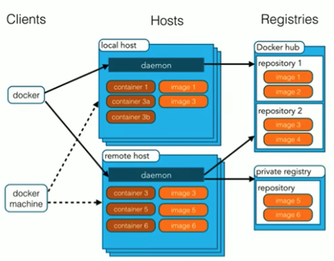
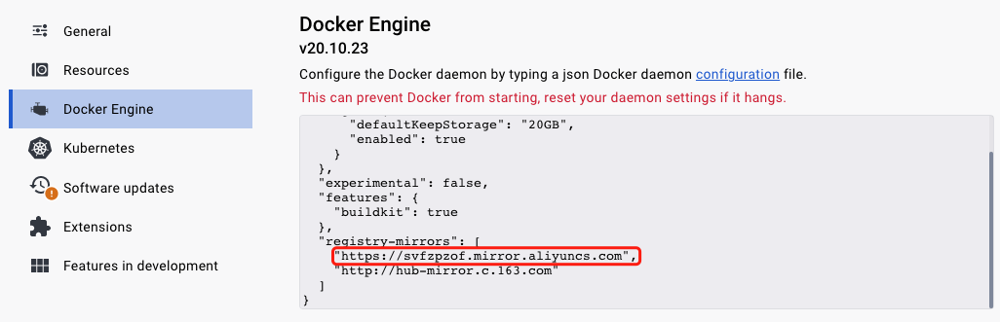
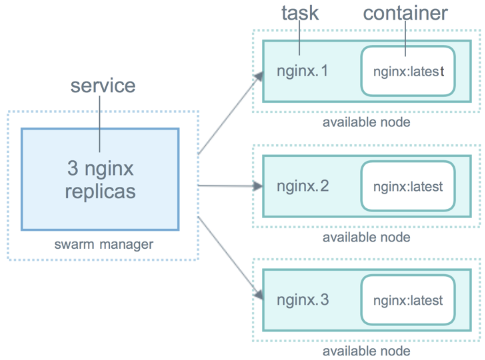

#  docker

## 一、安装docker

一定要采用docker官方文档提供的方法来安装, 否则后面可能会有问题

### 1. Ubuntu

#### （1）配置源

```Bash
 1. sudo apt-get update
 2. sudo apt-get install \
    apt-transport-https \
    ca-certificates \
    curl \
    gnupg \
    lsb-release
3. curl -fsSL https://download.docker.com/linux/ubuntu/gpg | sudo gpg --dearmor -o /usr/share/keyrings/docker-archive-keyring.gpg
4. echo \
  "deb [arch=amd64 signed-by=/usr/share/keyrings/docker-archive-keyring.gpg] https://download.docker.com/linux/ubuntu \
  $(lsb_release -cs) stable" | sudo tee /etc/apt/sources.list.d/docker.list > /dev/null
```

#### （2）docker国内源

采用上面的配置,在下一步安装docker的时候,可能速度非常慢,可以配置国内源

```Bash
1. 配置 apt-get 可以使用 https 库
$ sudo apt-get install -y apt-transport-https ca-certificates curl software-properties-common

2. 添加 Docker 使用的公钥
$ curl -fsSL https://mirrors.cloud.tencent.com/docker-ce/linux/ubuntu/gpg | sudo apt-key add -

3. 添加 Docker 远程仓库
$ sudo add-apt-repository "deb [arch=amd64] https://mirrors.cloud.tencent.com/docker-ce/linux/ubuntu $(lsb_release -cs) stable"
$ sudo apt-get update

4. 配置docker镜像加速
{
    "registry-mirrors": [
     "https://mirror.ccs.tencentyun.com"
    ]
}
配置文件在 /etc/docker/daemon.json
```

#### （3）安装docker

```Bash
 sudo apt-get update
 sudo apt-get install docker-ce docker-ce-cli containerd.io
```

完成安装后测试一下`sudo docker run hello-world`, 后面可以用`sudo chmod 666 /var/run/docker.sock`来去掉sudo.

#### （4）安装docker-compose

```Bash
1.安装 
sudo curl -L "https://github.com/docker/compose/releases/download/1.29.2/docker-compose-$(uname -s)-$(uname -m)" -o /usr/local/bin/docker-compose.yml

2.修改权限
sudo chmod +x /usr/local/bin/docker-compose.yml

3.测试
docker-compose.yml --version
```

#### （5）添加用户到docker组

```Bash
1.groups  # 列出自己的用户组，确认自己在不在 docker 组中

2.sudo groupadd docker  # 没有则新增docker组

3.sudo gpasswd -a ${USER} docker  # 把当前用户加入到docker组中

4.sudo systemctl restart docker # 重启docker服务
```

### 2. CentOS

#### （1）配置源

```bash
sudo yum install -y yum-utils
sudo yum-config-manager --add-repo https://download.docker.com/linux/centos/docker-ce.repo
```

#### （2）安装docker

```bash
# 安装docker
sudo yum install docker-ce docker-ce-cli containerd.io docker-buildx-plugin docker-compose-plugin
# 启动docker
sudo systemctl start docker
# 测试是否安装完成
sudo docker run hello-world
```

#### （3）添加用户到docker组

```bash
1.groups  # 列出自己的用户组，确认自己在不在 docker 组中

2.sudo groupadd docker  # 没有则新增docker组

3.sudo gpasswd -a ${USER} docker  # 把当前用户加入到docker组中

4.sudo systemctl restart docker # 重启docker服务
```

#### （4）安装docker-compose

```bash
1.安装 
sudo curl -L "https://github.com/docker/compose/releases/download/1.29.2/docker-compose-$(uname -s)-$(uname -m)" -o /usr/local/bin/docker-compose.yml

2.修改权限
sudo chmod +x /usr/local/bin/docker-compose.yml

3.测试
docker-compose.yml --version
```

## 二、docker架构

### 1. 架构图

docker由三部分组成：

- clients：客户端。操作docker的命令都是在客户端完成的，客户端发送命令给守护进程。
- hosts：
  - daemon：守护进程。启动docker之后，守护进程就会启动。
  - image：镜像。**镜像就相当于是一个root文件系统**，例如ubuntu:16.04就包含了完整的一套ubuntu16.04最小系统的root文件系统。
  - container：容器。镜像和容器的关系就像是类和对象的关系。镜像是静态的定义，容器是镜像运行时的实体。**container 就是 process，启动container背后的原理就是启动process。**
- repository：镜像仓库。仓库可以看作是一个代码控制中心，用来保存镜像。



### 2. 阿里云镜像加速器

登录阿里云<https://cr.console.aliyun.com/cn-hangzhou/instances/mirrors>，找到加速器地址。然后按照下面的文档来进行配置。对于mac，可以在桌面端软件中进行配置。



```bash
cat ~/.docker/daemon.json  # 检查配置
```

## 三、docker服务

### 1. 开启docker服务

```bash
systemctl start docker # 启动docker服务
systemctl stop docker # 停止docker服务
systemctl restart docker # 重启docker服务
systemctl status docker # 查看docker服务状态
systemctl enable docker # 设置开机启动docker服务
```

### 2. 对docker服务的理解

`systemctl start docker`启动docker之后，可以查看系统的进程

```bash
[haojie@localhost ~]$ ps -ef | grep docker
root       3155      1  0 04:20 ?        00:00:02 /usr/bin/dockerd -H fd:// --containerd=/run/containerd/containerd.sock
haojie    10844   3471  0 06:01 pts/0    00:00:00 grep --color=auto docker
```

如果此时强行将该进程杀掉`kill -9 3155`，守护进程会另外再启动一个进程。

```bash
[haojie@localhost ~]$ ps -ef | grep docker
root      11082      1 28 06:12 ?        00:00:00 /usr/bin/dockerd -H fd:// --containerd=/run/containerd/containerd.sock
haojie    11221   3471  0 06:12 pts/0    00:00:00 grep --color=auto docker
```

## 四、镜像相关命令

### 1. 查看镜像

docker images: 查看本机所有镜像

```bash
[haojie@localhost ~]$ docker images
REPOSITORY            TAG       IMAGE ID       CREATED          SIZE
shuhaojie/stackdemo   latest    3f4ec02bf9d8   40 minutes ago   84.6MB
redis                 alpine    0b405767398c   8 days ago       29.9MB
```

- REPOSITORY：仓库，也就是镜像名称。镜像涵盖了软件和其运行的文件系统。
- TAG：版本号。如果不指定版本，就用最新版本`latest`
- IMAGE ID：镜像id。删除等操作的时候会用到。
- CREATED：镜像创建时间。
- SIZE：镜像大小。

REPOSITORY+TAG就是镜像的具体版本名称，可以在docker ps中看到

```bash
CONTAINER ID   IMAGE                        COMMAND                  CREATED       STATUS       PORTS                                       NAMES
275e359c08cb   redis:alpine                 "docker-entrypoint.s…"   4 hours ago   Up 4 hours   6379/tcp                                    stackdemo_redis_1
99883979b298   shuhaojie/stackdemo:latest   "python app.py"          4 hours ago   Up 4 hours   0.0.0.0:8000->8000/tcp, :::8000->8000/tcp   stackdemo_web
```

**当我们在build镜像的时候，通过这个名称来判断本地是否存在这个镜像，如果存在就用本地的**

### 2. 搜索镜像

```bash
[haojie@localhost ~]$ docker search redis
NAME                                DESCRIPTION                                     STARS     OFFICIAL   AUTOMATED
redis                               Redis is an open source key-value store that…   12100     [OK]       
redislabs/redisearch                Redis With the RedisSearch module pre-loaded…   56                   
redislabs/redisinsight              RedisInsight - The GUI for Redis                87                   
redislabs/rebloom                   A probablistic datatypes module for Redis       23                   [OK]
redislabs/redis                     Clustered in-memory database engine compatib…   38                   
redislabs/rejson                    RedisJSON - Enhanced JSON data type processi…   53                   
redis/redis-stack-server            redis-stack-server installs a Redis server w…   44                   
```

### 3. 拉取镜像

```bash
[haojie@localhost ~]$ docker pull redis
Using default tag: latest
latest: Pulling from library/redis
f03b40093957: Pull complete 
8db26c5e8435: Pull complete 
37e84c7a626f: Pull complete 
806c192e0375: Pull complete 
08769906aa59: Pull complete 
635073d8ccd5: Pull complete 
Digest: sha256:f9724694a0b97288d2255ff2b69642dfba7f34c8e41aaf0a59d33d10d8a42687
Status: Downloaded newer image for redis:latest
docker.io/library/redis:latest
```

下载的时候，是一层一层下载的

### 4. 制作镜像

docker build: 可以通过Dockerfile来制作镜像。

```bash
docker build -t koa-demo:1.0 . # .表示Dockerfile相对路径
```

### 5. 上传镜像

docker push：将镜像上传到仓库。上传镜像要稍微复杂一些，它需要以下步骤。

- 登录dockerhub账号

  - 如果是dockerhub：`docker login`

  - 如果是公司dockerhub：`docker login myRegistry.com`

- 修改镜像名称

  - 如果是dockerhub：`docker tag <image_id> username/myImage`
  - 如果是公司dockerhub：`docker tag <image_id> myRegistry.com/myImage`

- 上传镜像：

  - 如果是dockerhub：`docker push username/my-repo`
  - 如果是公司dockerhub：`docker push myRegistry.com/myImage`

### 6. 删除镜像

```bash
docker rmi <image_id> # 删除镜像.  
docker rmi -f $(docker images -aq) # 删除所有镜像
```

### 7. 容器转镜像

docker commit: 容器转化为镜像。假设一个容器没有vim, 但希望安装vim后, 即使重启容器也会有vim, 下面是主要步骤

```bash
docker exec -it container_id bash # 在终端: 进入容器
yum install vim -y  # 在容器内: 安装vim
docker commit container_id repo:tag  # 在终端: 容器转镜像   
```

### 8. 镜像导出为tar

docker save: 将镜像制作为tar文件

```bash
[haojie@localhost ~]$ docker save -o hello-world.tar 9c7a54a9a43c
# 这种方式更好
[haojie@localhost ~]$ docker save 9c7a54a9a43c | gzip > hello-world.tar
```

### 9. 导入tar为镜像

docker load: 导入使用docker save出的镜像

```bash
[haojie@localhost ~]$ docker load -i hello-world.tar 
Loaded image ID: sha256:9c7a54a9a43cca047013b82af109fe963fde787f63f9e016fdc3384500c2823d
```

### 10. 为镜像打标签

```bash
docker tag {image_id} registry:tag
```

例如

```bash
[haojie@hecs-300320 ~]$ docker tag 6ac centos:python3-vim
[haojie@hecs-300320 ~]$ docker images
REPOSITORY   TAG           IMAGE ID       CREATED        SIZE
centos       python-vim    6ac7cccc4920   17 hours ago   620MB
centos       python3-vim   6ac7cccc4920   17 hours ago   620MB
mysql        latest        05db07cd74c0   11 days ago    565MB
redis        latest        0ec8ab59a35f   12 days ago    117MB
```

## 五、 容器相关命令

### 1. 查看容器

docker ps  查看正在运行的容器。docker ps -a 查看所有容器。

```
[haojie@localhost ~]$ docker ps -a
CONTAINER ID   IMAGE           COMMAND       CREATED         STATUS    PORTS     NAMES
5ca7ec3cf3d3   centos:latest   "/bin/bash"   3 minutes ago   Created             c1
```

- CONTAINER ID：容器id
- IMAGE：镜像的具体版本名称
- COMMAND：容器初始化时的命令
- CREATED：创建时间
- STATUS：状态。正在运行的docker状态为up...
- PORTS：端口映射
- NAMES：容器名称

### 2. 创建容器

#### （1）docker run

###### a. 基本使用

docker run：创建容器并启动容器。

> 官方定义：The `docker run` command runs a command in a new container, pulling the image if needed and starting the container。docker run 命令在新容器中运行一个命令，在需要时拉取镜像并启动容器。

基本命令`docker run [OPTIONS] IMAGE [COMMAND] [ARG...]`

最基础的，不加任何参数，本地也没有image.

```bash
[haojie@master ~]$ docker run centos:latest
Unable to find image 'centos:latest' locally
latest: Pulling from library/centos
a1d0c7532777: Pull complete
Digest: sha256:a27fd8080b517143cbbbab9dfb7c8571c40d67d534bbdee55bd6c473f432b177
Status: Downloaded newer image for centos:latest
WARNING: IPv4 forwarding is disabled. Networking will not work.
[haojie@master ~]$ docker ps -a
CONTAINER ID        IMAGE               COMMAND             CREATED             STATUS                      PORTS               NAMES
42f9a6a7b104        centos:latest       "/bin/bash"         14 seconds ago      Exited (0) 13 seconds ago                       gifted_meitner
[haojie@master ~]$ docker images
REPOSITORY          TAG                 IMAGE ID            CREATED             SIZE
centos              latest              5d0da3dc9764        20 months ago       231MB
```

执行完命令之后，会拉取镜像，并创建一个容器

###### b. `name` 参数

name：为容器指定一个名称

```bash
[haojie@master ~]$ docker ps -a
CONTAINER ID        IMAGE               COMMAND             CREATED             STATUS              PORTS               NAMES
[haojie@master ~]$ docker run --name=centos centos:latest
WARNING: IPv4 forwarding is disabled. Networking will not work.
[haojie@master ~]$ docker ps -a
CONTAINER ID        IMAGE               COMMAND             CREATED             STATUS                     PORTS               NAMES
4518c27ef85b        centos:latest       "/bin/bash"         5 seconds ago       Exited (0) 3 seconds ago                       centos
```

###### c. `-i`, `-t`和`-d`参数

- `--interactive`,`-i`: 以交互模式运行容器，通常与-t 同时使用

- `-t`: 为容器重新分配一个伪输入终端，通常与`-i` 同时使用

```bash
[haojie@master ~]$ docker run -it --name=centos centos:latest
WARNING: IPv4 forwarding is disabled. Networking will not work.
# 会进入容器
[root@8ddb4a170d12 /]# 
```

想要退出并保证容器是启动状态，可以用ctrl+p+q来退出

- `-d`: 后台运行容器

```bash
[haojie@master ~]$ docker run -id --name=centos centos:latest
WARNING: IPv4 forwarding is disabled. Networking will not work.
b421e4ba51867fc64956275bbc5739d41888bcfc217f96155030022453e786e6
[haojie@master ~]$ docker ps
CONTAINER ID        IMAGE               COMMAND             CREATED             STATUS              PORTS               NAMES
b421e4ba5186        centos:latest       "/bin/bash"         3 seconds ago       Up 2 seconds                            centos
```

###### d. `-p`参数

`-p`: 指定端口映射，格式为：主机(宿主)端口:容器端口

```bash
[haojie@master ~]$ docker run -id -p 8000:80 --name=centos centos:latest
WARNING: IPv4 forwarding is disabled. Networking will not work.
855f4d9c15fac0f98ec5fc35c09b2b50ade1c70c9cdab81f7f1bc742951abdd0
[haojie@master ~]$ docker ps
CONTAINER ID        IMAGE               COMMAND             CREATED             STATUS              PORTS                  NAMES
855f4d9c15fa        centos:latest       "/bin/bash"         4 seconds ago       Up 3 seconds        0.0.0.0:8000->80/tcp   centos
```

###### e. `expose`参数

`--expose`: 开放一个端口或一组端口

```bash
[haojie@master ~]$ docker run -id --expose 8000 --name=centos centos:latest
WARNING: IPv4 forwarding is disabled. Networking will not work.
475172fa9928825aa00070f9450e86610456f7665ee3b30aa46ca6f81dec05bb
[haojie@master ~]$ docker ps
CONTAINER ID        IMAGE               COMMAND             CREATED             STATUS              PORTS               NAMES
475172fa9928        centos:latest       "/bin/bash"         4 seconds ago       Up 3 seconds        8000/tcp            centos
```

###### f. `-v`参数

`--volume , -v`: 绑定一个卷

```bash
[haojie@master ~]$ docker run -id -p 80:8000 -v /home/haojie:/haojie --name=centos centos:latest
WARNING: IPv4 forwarding is disabled. Networking will not work.
11447a624c1e97c4e6646cbb6f00e4d3199e5dca56b6e8811872a91cc34fa218
[haojie@master ~]$ docker ps
CONTAINER ID        IMAGE               COMMAND             CREATED             STATUS              PORTS                  NAMES
11447a624c1e        centos:latest       "/bin/bash"         6 seconds ago       Up 5 seconds        0.0.0.0:80->8000/tcp   centos
[haojie@master ~]$ docker exec -it 114 /bin/bash
[root@11447a624c1e /]# cd haojie/
[root@11447a624c1e haojie]# ls
1.txt
[root@11447a624c1e haojie]# touch 2.txt
[root@11447a624c1e haojie]# exit
[haojie@master ~]$ ll
总用量 4
-rw-rw-r-- 1 haojie haojie 13 5月  29 10:03 1.txt
-rw-r--r-- 1 root   root    0 5月  31 22:23 2.txt
```

由于存在挂载关系，在容器内创建一个文件，在容器外也可以看到该文件。

###### g. 命令COMMAND

在容器内执行命令(/bin/bash)。**docker容器会在其主进程完成时退出，因此如果想让容器保持运行，需要一个不结束的命令。**

例1：容器保持运行

```
[haojie@master ~]$ docker run -id --name=c1 centos:latest tail -f /dev/null
WARNING: IPv4 forwarding is disabled. Networking will not work.
813247f2301a7cee4c91b5042babe29247d113467ca87654d54b27993e6eb34c
[haojie@master ~]$ docker ps -a
CONTAINER ID        IMAGE                COMMAND                  CREATED             STATUS                   PORTS               NAMES
813247f2301a        centos:latest        "tail -f /dev/null"      5 seconds ago       Up 4 seconds                                 c1
```

例2：容器未能保持运行

```
[haojie@master ~]$ docker run -id --name=c1 centos:latest cat /etc/os-release
WARNING: IPv4 forwarding is disabled. Networking will not work.
02da5d61de873287c9e064a4b1e3989cd4fb237dca7586727fe0333dc3b1464c
[haojie@master ~]$ docker ps -a
CONTAINER ID        IMAGE                COMMAND                  CREATED             STATUS                     PORTS               NAMES
02da5d61de87        centos:latest        "cat /etc/os-release"    4 seconds ago       Exited (0) 3 seconds ago                       c1
```

当容器启动后，此时可以看到一个进程。同时可以看到该进程是由服务端的进程创建出来的。

```bash
[haojie@master ~]$ ps -ef | grep docker
root     23691 24382  0 15:19 ?        00:00:00 docker-containerd-shim -namespace moby -workdir /var/lib/docker/containerd/daemon/io.containerd.runtime.v1.linux/moby/528fa1ec98377cf17ef7eeea3960327ce3237c07a08ee80fa6e45cc4fba8b2b3 -address /var/run/docker/containerd/docker-containerd.sock -containerd-binary /usr/bin/docker-containerd -runtime-root /var/run/docker/runtime-runc -systemd-cgroup
root     24382 24375  0 Apr30 ?        01:06:25 docker-containerd --config /var/run/docker/containerd/containerd.toml
```

#### （2）docker create

docker run：创建容器并启动容器，而docker create则是只创建容

**docker run = docker create + docker start**

### 3. 启动容器

```bash
docker start {container_id}
```

### 4. 停止容器

```bash
docker stop {container_id}
```

### 5. 杀掉容器

```bash
docker kill -s KILL {container_id}
```

### 6. 删除容器

```bash
# 删除单个容器
docker rm {container_id}
# 删除一个正在运行的容器
docker rm -f {container_id}
# 删除所有容器
docker rm $(docker ps -a -q)
```

### 7. 进入容器

进入已经启动的容器，如果容器没有启动，不能进入

```bash
docker exec -it {container_id} /bin/bash
```

### 8. 查看容器信息

```bash
docker inspect {container_id}
```

### 9. docker attach

连接到正在运行中的容器，连接后可以查看容器的标准输入、输出

```bash
docker run -dit --name topdemo2 ubuntu:22.04 /usr/bin/top -b
docker attach topdemo2
```

### 10. 构建web服务器容器

- 拉取一个centos镜像，并启动一个centos容器

```bash
docker run -id centos:latest
```

- 在容器内安装python3

```bash
# 解决yum源的问题
cd /etc/yum.repos.d/
sed -i 's/mirrorlist/#mirrorlist/g' /etc/yum.repos.d/CentOS-*
sed -i 's|#baseurl=http://mirror.centos.org|baseurl=http://vault.centos.org|g' /etc/yum.repos.d/CentOS-*
yum update -y
# 安装python3
yum install -y python3
```

- 做一次commit，制作一个包含python3的镜像

```bash
docker commit 943 centos:python3
```

- 用包含python3的镜像来启动一个容器

```bash
# http_server会监听8080端口
docker run -id -v /home/haojie/python/:/haojie -p 80:9091 centos:python3 python3 /haojie/http_server.py
```

- 在本地终端或者其他终端访问`curl 121.41.55.89:80` ，注意云服务器要开放80端口

### 11. 构建mysql服务器

- 启动一个mysql容器

```bash
# 1. 暴露端口
# 2. 指定root的密码
docker run -id --name mysql -p 3306:3306 -e MYSQL_ROOT_PASSWORD=123456 mysql:latest
```

- 数据库软件连接mysql，注意云服务器要开放3306 端口

## 六、仓库相关命令

### 1. 基本概念

docker的registry和git概念一样, 可以从registry上传或下载images。当我们使用dockerhub的镜像时，可以不使用域名，如果使用其他私域的镜像时，需要带上域名。

### 2. 常用命令

docker push：将本地的镜像上传到镜像仓库

## 三、Dockerfile

### 1. Dockerfile简介

Dockerfile是一个用来构建镜像的文本文件, 文本内容包含了一条条构建镜像所需的指令和说明。例如我们要在含python3的centos镜像基础上安装vim，可以这么写。

```dockerfile
FROM centos:python3
RUN yum -y install vim
```

这里的FROM表示从哪个镜像开始构建，可以是本地已有的镜像，也可以是dockerhub或者私域的镜像。

### 2. 构建镜像

在Dockerfile文件的存放目录下, 执行构建动作

```bash
# 1. nginx表示镜像名称， v3表示版本
# 2. 最后的.表示Dockerfile相对终端执行环境的相对路径
docker build -t centos:python3 .  
```

### 3. Dockerfile命令

#### （1）FROM

定制的镜像都是基于FROM的镜像, 后续的操作都是基于该镜像做的操作

#### （2）WORKDIR

官方文档的说明,`WORKDIR`的作用是为`RUN`, `COPY`等指令设置工作目录，相当于cd到那个目录，然后执行对应的指令。如果没有设置`WORKDIR`，它会自动创建，默认是`/`，如果是从其他镜像开始构建的，那么`WORKDIR`就是其他镜像。

> The `WORKDIR` instruction sets the working directory for any `RUN`, `CMD`, `ENTRYPOINT`, `COPY` and `ADD` instructions that follow it in the `Dockerfile`. If the `WORKDIR` doesn’t exist, it will be created even if it’s not used in any subsequent `Dockerfile` instruction.

```bash
WORKDIR /a
WORKDIR b
WORKDIR c
RUN pwd
```

输出就是`/a/b/c`

#### （3）RUN

用于执行后面跟着的命令行命令

```bash
RUN <命令行命令>   # 命令行命令 等同于在终端操作的shell命令
```

例如前面的

```bash
RUN yum -y install vim
```

注意，**在RUN命令中有路径时，指的是容器外的相对路径，而不是容器内的路径，因为它此时还只是构建镜像。**

#### （4）COPY

将宿主机的文件拷贝到镜像中。由于它是构建镜像时的命令，因此它会将文件写入到镜像中，只要是由该镜像创建的容器，都会有拷贝过去的文件，这是它和挂载的不同。

```dockerfile
FROM centos:vim-python3
RUN yum -y install vim
COPY python/ /haojie/
CMD python3 /haojie/http_server.py
```

- 源路径src：宿主机内的路径，**是相对Dockerfile的路径，不能用绝对路径**。例如写成/home/haojie/python，这种写法是不对的，因为dockerfile会把它翻译成 `dockerfile路径+/home/haojie/python`。

- 目的路径dest：容器内的路径，**用的是绝对路径，或者是相对workdir的路径**。

#### （5）EXPOSE

暴露端口，这个命令的作用参见官方文档。

> The `EXPOSE` instruction does not actually publish the port. It functions as **a type of documentation between the person who builds the image and the person who runs the container**, about which ports are intended to be published

expose命令的作用并不会去暴露端口，而是作为构建镜像的开发人员和运行容器的开发人员之间一个“接口文档”，构建镜像的开发人员告诉运行容器的开发人员，该镜像监听哪个端口。因为对于运行容器的开发人员来说，它可能接触不到源码，不清楚该镜像能暴露哪个端口，expose命令能帮助他了解到。例如redis镜像。

```bash
[haojie@hecs-300320 ~]$ docker run -id redis:latest
Unable to find image 'redis:latest' locally
latest: Pulling from library/redis
c7ae2cc6d9d5d2fee1aefbea14014bb42806b45c60b7d6a1cf3313d5367ae895
[haojie@hecs-300320 ~]$ docker ps
CONTAINER ID   IMAGE          COMMAND                   CREATED         STATUS         PORTS                                                  NAMES
c7ae2cc6d9d5   redis:latest   "docker-entrypoint.s…"   5 seconds ago   Up 3 seconds   6379/tcp                                               awesome_cori
```

它这里就暴露了6379端口，因此我们需要在运行的时候通过-p来做端口映射，来保证通过访问宿主机来访问容器。

#### （6）CMD

在镜像构建好后，用镜像启动容器时(docker run)会执行的命令。**当在Dockerfile中写了CMD时，如果在用docker run或者docker-compose启动容器时，又再加了启动命令，此时执行的是docker run或者docker-compose的命令，如果没有加，执行的就是Dockerfile中的命令。**

例子1：docker run加了命令`/bin/bash`

```bash
[haojie@hecs-300320 ~]$ docker run -id centos:python-vim /bin/bash
9a25fca7d79046bf693e95e2836744a5d973b12dc25adefe9b78e7e56e56df8f
[haojie@hecs-300320 ~]$ docker ps
CONTAINER ID   IMAGE               COMMAND                   CREATED         STATUS         PORTS                                                  NAMES
9a25fca7d790   centos:python-vim   "/bin/bash"               4 seconds ago   Up 3 seconds                                                          nice_mendel
33d744b8729a   mysql:latest        "docker-entrypoint.s…"   8 hours ago     Up 8 hours     0.0.0.0:3306->3306/tcp, :::3306->3306/tcp, 33060/tcp   mysql
```

例子2：docker run中不加命令

```bash
[haojie@hecs-300320 ~]$ docker run -id centos:python-vim
dba629df688a0fb326d7e1c668fe4393673ca3f1789dd7a9e666fcd9344990d7
[haojie@hecs-300320 ~]$ docker ps
CONTAINER ID   IMAGE               COMMAND                   CREATED         STATUS         PORTS                                                  NAMES
dba629df688a   centos:python-vim   "/bin/sh -c 'python3…"   5 seconds ago   Up 4 seconds                                                          vigorous_solomon
33d744b8729a   mysql:latest        "docker-entrypoint.s…"   8 hours ago     Up 8 hours     0.0.0.0:3306->3306/tcp, :::3306->3306/tcp, 33060/tcp   mysql
```

## 四、docker-compose

### 1.简介

用于构建和启动多容器工具, 通过`docker-compose.yml`来配置项目需要的所有服务, 然后`docker-compose up`启动所有服务

### 2.多服务实例

参考官方文档<https://docs.docker.com/compose/gettingstarted/>

#### （1）文件准备

- 新建一个目录：

```bash
mkdir composetest
cd composetest
```

- 新建一个`app.py`文件

```python
# composetest/app.py
import time

import redis
from flask import Flask

app = Flask(__name__)
cache = redis.Redis(host='redis', port=6379)

def get_hit_count():
    retries = 5
    while True:
        try:
            return cache.incr('hits')
        except redis.exceptions.ConnectionError as exc:
            if retries == 0:
                raise exc
            retries -= 1
            time.sleep(0.5)

@app.route('/')
def hello():
    count = get_hit_count()
    return 'Hello World! I have been seen {} times.\n'.format(count)
```

- 新建一个requirements.txt，里面包含如下内容

```txt
# composetest/requirements.txt
flask
redis
```

- 新建一个Dockerfile

```dockerfile
# syntax=docker/dockerfile:1
FROM python:3.7-alpine
WORKDIR /code
ENV FLASK_APP=app.py
ENV FLASK_RUN_HOST=0.0.0.0
RUN apk add --no-cache gcc musl-dev linux-headers
COPY requirements.txt requirements.txt
RUN pip install -r requirements.txt
EXPOSE 5000
COPY . .
CMD ["flask", "run"]
```

- 新建一个docker-compose.yml

```yaml
services:
  web:
    build: .
    ports:
      - "8000:5000"
  redis:
    image: "redis:alpine"
```

#### （2）启动服务

```bash
docker compose up  # 注意，最新版本可以不要中间的"-"
```

此时应该会看到两个服务都启动起来了

```bash
CONTAINER ID   IMAGE             COMMAND                  CREATED          STATUS          PORTS                                                  NAMES
b69ccfb85c03   composetest-web   "flask run"              12 minutes ago   Up 12 minutes   0.0.0.0:8000->5000/tcp, :::8000->5000/tcp              composetest-web-1
ea71df663f36   redis:alpine      "docker-entrypoint.s…"   12 minutes ago   Up 12 minutes   6379/tcp                                               composetest-redis-1
```

#### （3）访问服务

在服务器内部执行

```bash
curl http://127.0.0.1:5000
```

可以看到输出

```bash
Hello World! I have been seen 1 times.
```

由于是在服务器上部署，还可以在浏览器中访问http://121.36.104.55:8000/，也是一样的输出。注意，要开放8000端口。

### 3. service指令

#### （1）service和container

在上面的例子，web实际上指的是一个服务，而不是一个容器。参考<https://stackoverflow.com/a/35585573/10844937>

> A service can be run by one or multiple containers. With `docker` you can handle containers and with `docker-compose` you can handle services.

service可以由一个或多个container组成。docker一般来操作container，docker-compose一般来操作service。可以在docker-compose中指定scale参数来指定container的个数，例如

```yaml
services:
  web:
    build: .
		scale: 4
  redis:
    image: "redis:alpine"
```

此时会有4个container

```
➜  composetest git:(master) ✗ docker ps                  
CONTAINER ID   IMAGE             COMMAND                  CREATED          STATUS          PORTS      NAMES
f17412bbb248   composetest-web   "flask run"              15 seconds ago   Up 5 seconds    5000/tcp   composetest-web-4
ded649c4cec8   composetest-web   "flask run"              15 seconds ago   Up 5 seconds    5000/tcp   composetest-web-3
642b05b9c66e   composetest-web   "flask run"              15 seconds ago   Up 5 seconds    5000/tcp   composetest-web-2
7732ae7c78c8   composetest-web   "flask run"              16 seconds ago   Up 5 seconds    5000/tcp   composetest-web-1
1cf0b1c34972   redis:alpine      "docker-entrypoint.s…"   10 minutes ago   Up 10 minutes   6379/tcp   composetest-redis-1
```

在docker-compose中，必须有service name，而不必有container name，如果没有container name，那么container name=`<当前工作路径名>_<service name>_<sequence number>`，这里的sequence number是从1开始的。

#### （2）service的广泛应用

非常重要的一点: service name 可以广泛的被应用

* 在nginx中，可以看到`proxy_pass http://web:8000;`这样的表示式，这里的web就是指的service name
* 在django的settings中，可以看到数据的配置如下，这里的`db`指的也是service name

```bash
DATABASES = {
    'default': {
        'ENGINE': 'django.db.backends.postgresql',
        'NAME': 'orthanc',
        'HOST': 'db',
        'PORT': 5432,
        'USER': 'haojie',
        'PASSWORD': '4a53e4f5c42fd5a31890860b204472c5'
    }
}
```

### 4. docker-compose的指令

#### （1）image

**如果本地有镜像, 直接用本地镜像**; 如果没有, 采用dockerhub的。

```docker-compose
version: "3.7"
services:
  webapp:
    build:
      context: ./dir  # Dockerfile的路径
      dockerfile: Dockerfile-alternate  # Dockerfile的名字
      args:
        buildno: 1  # Dockerfile构建镜像时候的参数，在构建时候的环境变量
```

#### （2）build

build: 是指通过Dockerfile来构建。当一个yaml文件中，既有image又有build时，它的顺序如下：

- 首先看本地是否有镜像，如果有，用本地的镜像
- 本地如果没有，尝试从dockerhub拉。
- 如果dockerhub拉不到，则用build参数中指定的Dockerfile来构建镜像。**build完之后，生成的镜像名称就是前面指定的**。

```yaml
services:
  backend:
    image: awesome/database
    build:
      context: backend  # 相对docker-compose的子目录
      dockerfile: ../backend.Dockerfile  # dockerfile文件名
```

#### （3）depends_on

告诉docker-compose当前服务**启动**之前先**要把depends_on指定的服务启动起来**才行

#### （4）environment

environment变量可以在构建镜像过程中，在Dockerfile中去使用。也可以在已构建好的镜像制作出的容器中使用，在容器的终端中输入`env`即可查找到所有的环境变量。可以用如下的python代码拿到具体的环境变量。

```Python
import os
os.environ.get('DEBUG')
```

#### （5）volume

docker的挂载主要有两种方式

* bind mount(全路径的主机目录): 将主机的目录mount到container中，这种方式`主机的目录路径必须为全路径，否则docker会将其当做volume处理`。这种方式有一个不好的地方: windows和linux的目录结构不一样，那么此时我们是没法在不同的系统去写一个主机的目录来兼容的。
* volume(非全路径的主机目录): volume和bind mount不同之处在于，volume的主机目录是被docker管理的，都在主机的`/var/lib/docker/volumes`目录下，这个目录的权限非常严格，即使是用`sudo`都不能打开(`cd`)。将my-volume挂载到container中的/mydata目录: `docker run -it -v my-volume:/mydata alpine sh`，它会在主机下创建`/var/lib/docker/volumes/my-volume/_data`目录，如果该目录不存在，那么docker会先创建然后再挂载。

## 五、docker swarm

### 1. 基本概念

简单理解就是多台服务器搭建一个docker集群，每个服务器就是集群中的一个节点。swarm集群中有很多重要的概念，以上是它们的简单介绍。

- swarm：集群管理工具
- node：节点，简单理解就是一台一台的机器，可以是客户机或者是虚拟机。
- task：任务是swarm集群调度的最小单位。可以简单的理解为一个container容器。
- service：服务service是指一组任务task的集合

### 2. 理解service

参考 https://docs.docker.com/engine/swarm/how-swarm-mode-works/services/

#### （1）对服务的理解

**当我们在集群模式构建应用时，我们需要创建一个服务**。服务这个概念在docker-compose中就有，**服务是由一组容器组成**，在docker-compose中我们也可以指定容器个数。当我们创建一个服务时，我们通常会指定如下东西：

- 该服务要使用的镜像
- 在容器内要执行的命令
- swarm外部访问服务时的端口
- swarm内部连接其他服务的覆盖网络
- CPU，内存等的限制和保留
- 滚动更新策略
- 要在集群中运行的镜像的副本数量

> 后续补充yml

#### （2）service，task和container

当我们将服务部署到 swarm 时，swarm管理器根据yml文件中的服务定义，来作为服务的所需状态。然后，它将集群中的节点上的服务调度为一个或多个副本任务(task)。这些任务在集群中的节点上彼此独立运行



- container: 容器是一个独立的进程。
- task: 在集群模式模型中，每个任务只调用一个容器。一旦容器处于活动状态，调度程序就会识别出任务处于运行状态。如果容器运行状况检查失败或终止，则任务终止。

### 3. 常用命令

#### （1）swarm命令

- docker swarm init：用于初始化 swarm，将当前节点作为 swarm 的管理节点。执行此命令后，系统会创建一个 swarm 集群，并生成一个 token，在其他节点上使用该 token 即可加入 swarm 集群。

```bash
[haojie@node01 ~]$ docker swarm init
Swarm initialized: current node (vxxu7wgqgzwdd9tnz8d2kwc2x) is now a manager.

To add a worker to this swarm, run the following command:

    docker swarm join --token SWMTKN-1-65ynvoqi8u9rp2djn2busjuue9yqblybucbydo7pzf7h6op3ae-8rv1gksj0kia1ykqra6kzujly 10.0.4.11:2377

To add a manager to this swarm, run 'docker swarm join-token manager' and follow the instructions.
```

- docker swarm join：用于让节点加入到 swarm 集群中。需要提供一个 token，例如：docker swarm join --token xxxxx ip:port

#### （2）stack命令


#### （3）service命令

- docker service create：用于在 swarm 中创建服务。可以指定副本数量、容器镜像、端口等参数。例如：docker service create --name myapp --replicas 5 -p 8080:80 nginx。

```bash
[haojie@node01 ~]$ docker service create --name myapp --replicas 5 -p 8080:80 nginx
is9qav2zozl3l48qurtwfcwst
overall progress: 5 out of 5 tasks
1/5: running   [==================================================>]
2/5: running   [==================================================>]
3/5: running   [==================================================>]
4/5: running   [==================================================>]
5/5: running   [==================================================>]
verify: Service converged
```

- docker service ls：列出在 swarm 集群中的服务（service）。

```bash
[haojie@node01 ~]$ docker service ls
ID                  NAME                MODE                REPLICAS            IMAGE               PORTS
is9qav2zozl3        myapp               replicated          5/5                 nginx:latest        *:8080->80/tcp
```

-  docker service inspect：展示一个服务的细节。

```bash
# 细节较多，不全部展示
[haojie@node01 ~]$ docker service inspect myapp
[
    {
        "ID": "is9qav2zozl3l48qurtwfcwst",
        "Version": {
            "Index": 13
        },
        "CreatedAt": "2023-07-24T03:18:41.786091119Z",
        "UpdatedAt": "2023-07-24T03:18:41.789539444Z",
        "Spec": {
            "Name": "myapp",
            "Labels": {},
            "TaskTemplate": {
                "ContainerSpec": {
                    "Image": "nginx:latest@sha256:0d17b565c37bcbd895e9d92315a05c1c3c9a29f762b011a10c54a66cd53c9b31",
                    "Init": false,
                    "StopGracePeriod": 10000000000,
                    "DNSConfig": {},
                    "Isolation": "default"
                }
        }
    }
]
```

- docker service ps：**查看运行服务的节点**。

```bash
[haojie@node01 ~]$ docker service ps myapp
ID                  NAME                IMAGE               NODE                DESIRED STATE       CURRENT STATE           ERROR               PORTS
otnew27wvebp        myapp.1             nginx:latest        node01              Running             Running 4 minutes ago
bdqtyem2f2m4        myapp.2             nginx:latest        node01              Running             Running 4 minutes ago
ufkluh3qlv8c        myapp.3             nginx:latest        node01              Running             Running 4 minutes ago
yei6wxrbvugk        myapp.4             nginx:latest        node01              Running             Running 4 minutes ago
6z8x4jip0toh        myapp.5             nginx:latest        node01              Running             Running 4 minutes ago
```

- docker service scale：调整服务的副本数。

```bash
[haojie@node01 ~]$ docker service scale myapp=2
myapp scaled to 2
overall progress: 2 out of 2 tasks
1/2: running   [==================================================>]
2/2: running   [==================================================>]
verify: Service converged
```

- docker service update：调整服务的参数，例如镜像版本、环境变量等。例如：docker service update --image nginx:latest myapp。

```bash
[haojie@node01 ~]$ docker service update --image nginx:1.25.1 myapp
image nginx:1.25.1 could not be accessed on a registry to record
its digest. Each node will access nginx:1.25.1 independently,
possibly leading to different nodes running different
versions of the image.

myapp
overall progress: 2 out of 2 tasks
1/2: running   [==================================================>]
2/2: running   [==================================================>]
verify: Service converged
```

- docker service rm：删除服务

```bash
[haojie@node01 ~]$ docker service rm myapp
myapp
```

#### （4）node命令

- docker node ls

```bash
[haojie@manager ~]$ docker node ls
ID                            HOSTNAME   STATUS    AVAILABILITY   MANAGER STATUS   ENGINE VERSION
02i3kcyu0b38qqmqsxjyhgee0 *   manager    Ready     Active         Leader           24.0.2
iib016mutslhhj63o482zx3ce     node01     Ready     Active                          18.06.3-ce
```

- docker node inspect 

```bash
# 细节较多，不全部展示
[haojie@manager composetest]$ docker node inspect node01
[
    {
        "ID": "iib016mutslhhj63o482zx3ce",
        "Version": {
            "Index": 44
        },
        "CreatedAt": "2023-07-03T07:25:09.750149551Z",
        "UpdatedAt": "2023-07-09T13:22:51.706956071Z",
        "Spec": {
            "Labels": {},
            "Role": "worker",
            "Availability": "active"
        },
        "Description": {
            "Hostname": "node01",
            "Platform": {
                "Architecture": "x86_64",
                "OS": "linux"
            },
            "Resources": {
                "NanoCPUs": 2000000000,
                "MemoryBytes": 2095804416
            },
            "Engine": {
                "EngineVersion": "18.06.3-ce",
            },
        "Status": {
            "State": "ready",
            "Addr": "43.143.70.145"
        }
    }
]
```

### 4. 集群部署

本次部署采用两台云服务器，华为云和阿里云，集群节点之间保证TCP 2377、TCP/UDP 7946和UDP 4789端口通信，另外本程序需要8000和6379端口，也需要放开。部署参考官方文档https://docs.docker.com/engine/swarm/stack-deploy/

#### （1）开启swarm模式

```
docker swarm init
# 开放端口
firewall-cmd --add-port=2377/tcp --permanent
firewall-cmd --reload
# 重启机器
```

#### （2）文件准备

- app.py

  ```python
  from flask import Flask
  from redis import Redis
  
  app = Flask(__name__)
  redis = Redis(host='redis', port=6379)
  
  @app.route('/')
  def hello():
      count = redis.incr('hits')
      return 'Hello World! I have been seen {} times.\n'.format(count)
  
  if __name__ == "__main__":
      app.run(host="0.0.0.0", port=8000, debug=True)
  ```

- Dockerfile

  ```dockerfile
  # syntax=docker/dockerfile:1
  FROM python:3.4-alpine
  ADD . /code
  WORKDIR /code
  RUN pip install -r requirements.txt
  CMD ["python", "app.py"]
  ```

- requirements.txt

  ```txt
  flask
  redis
  ```

- docker-compose.yml

  ```yml
  version: "3.9"
  
  services:
    web:
      image: shuhaojie/stackdemo:latest
      build: .
      ports:
        - "8000:8000"
    redis:
      image: redis:alpine
  ```

#### （3）构建镜像

- 构建镜像，`docker-compose up -d`: **既会构建镜像，也会去启动容器**。
- 将构建好的镜像推到仓库：`docker-compose push`

#### （4）构建栈

- 创建docker stack(栈)：`docker stack deploy --compose-file docker-compose.yml stackdemo`，最后一个参数是栈的名称。
- 查看栈中的服务状态：`docker stack services stackdemo`，查看由stackdemo这个栈创建的服务

- 测试manager节点：`curl http://localhost:8000`
