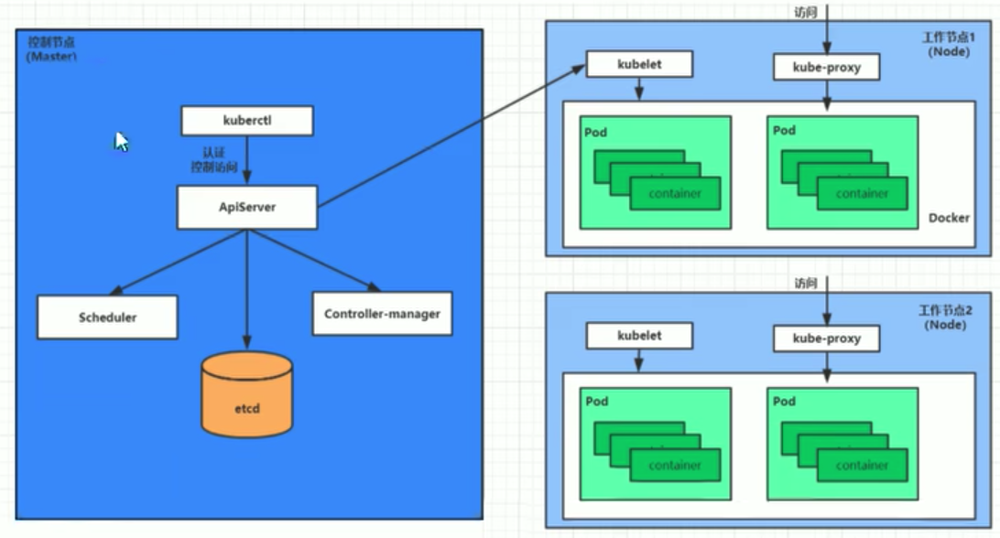
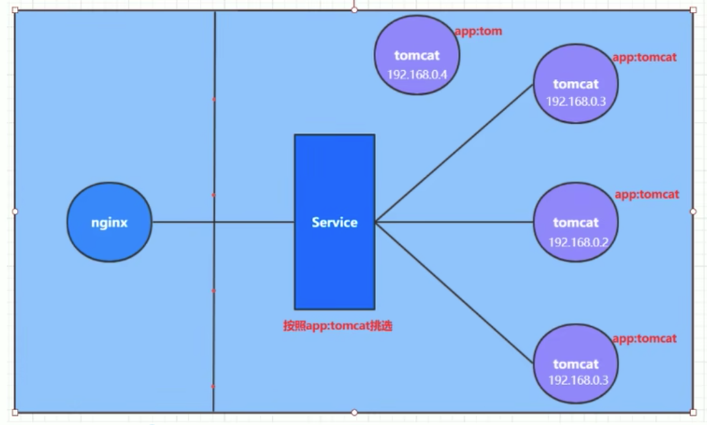

# k8s

## 一、 k8s简介

### 1. 为什么需要k8s?

因为采用容器部署，会出现如下问题：

- 一个容器故障停机了，怎么让另外一个容器去替补停机的容器
- 如果并发访问量突然增大，怎么横向扩展容器数量。访问量恢复正常之后，怎么恢复正常数目的容器数。

要解决这些问题，就需要用到容器编排软件。常见的容器编排工具有k8s，docker swarm。

### 2. k8s介绍

k8s本质是**一组服务器集群**，它提供了如下功能：

- 自我修复：一旦某一个容器崩溃，能够在1秒中左右迅速启动新的容器
- 弹性伸缩：可以根据需要，自动对集群中正在运行的容器数量进行调整。例如前面提到的请求突然增多，此时可以将容器数量增多。
- 服务发现：服务可以通过自动发现的形式找到它所依赖的服务。例如在集群中，web服务需要mysql和redis帮助，它可以在内部，以自动发现的形式，去寻找mysql和redis容器。
- 负载均衡：如果一个服务起动了多个容器，能够自动实现请求的负载均衡。注意：这个请求不仅仅只是web请求。
- 版本回退：如果发现新发布的程序版本有问题，可以立即回退到原来的版本。
- 存储编排：可以根据容器自身的需求自动创建存储卷。

### 3. k8s组件

k8s分为master和node



#### （1）master

master：集群的控制平面，负责集群的决策。通俗来说就是管理的。它有四大组件：

- ApiServer：资源操作的唯一入口，接收用户输入的命令，提供认证、授权、API注册和发现等机制。**可以在这里做鉴权等操作。**
- Scheduler：负责集群资源调度，按照预定的调度策略将Pod调度到相应的node节点上。通俗的说就是**由它来计算该谁干活**，因为ApiServer并不会去算。
- ControllerManager：负责维护集群的状态，比如程序部署安排、故障检测、自动扩展、滚动更新等。通俗的说就是**由它来安排该谁干活**，Scheduler只算不安排。
- Etcd：负责存储集群中各种资源对象的信息，它是一个数据库。通俗的说就是**它来记录现在谁在干活**，也可以用其他数据库mysql等，k8s默认是Etcd。

#### （2）node

node：集群的数据平面，负责为容器提供运行环境。通俗来说就是干活的。

- Kubelet：**负责维护容器的生命周期，即通过控制docker，来创建、更新、销毁容器**。通俗理解**它就是对接人，负责和master对接**，收到任务之后，它来把docker跑起来。  
- KubeProxy：负责提供集群内部的**服务发现和负载均衡**。需要注意的是，ApiServer是整个控制的访问入口，而KubeProxy是程序的入口。
- Docker：负责节点上容器的各种操作

#### （3）实例

下面是一个nginx部署实例来说明kubernetes系统各个组件调用关系：

1. k8s启动之后，master和node会将自身的信息存储到etcd数据库中。通俗来说，要通过记录数据库，知道自己管理多少人干活。
2. 一个nginx服务的安装请求会首先被发送到master节点的apiServer组件。
3. apiServer组件会调用scheduler组件来决定到底应该把这个服务安装到哪个node节点上。此时，scheduler会从etcd中读取各个node节点的信息，然后按一定的算法进行选择，并将结果告知apiServer
4. apiServer调用controller-manager去调度Node节点安装nginx服务。
5. kubelet接收到指令后，会通知docker，然后由docker来启动一个nginx的pod。pod是kubernetes的最小操作单元，容器必须跑在pod中。
6. 一个nginx服务就运行了，如果需要访问nginx，就需要通过kube-proxy来对pod产生访问的代理

这样，外界用户就可以访问集群中的nginx服务了

### 4. k8s基本概念

#### （1）Master

集群控制节点，每个集群需要至少一个master节点负责集群的管控

#### （2）Node

工作负载节点，由master分配容器到这些node工作节点上，然后node节点上的docker负责容器的运行

#### （3）Pod

kubernetes的最小控制单元，容器都是运行在pod中的，一个pod中可以有1个或者多个容器

#### （4）Controller

pod虽然是k8s的最小控制单元，但是k8s很少直接控制pod。而是通过控制器来实现对pod的管理，比如启动pod、停止pod、伸缩pod的数量等等。

#### （5）Service

pod对外服务的统一入口。例如下图中，**需要用到service，将外界的流量引进来**，交给tomcat，**通过service可以实现复杂均衡的效果**。



#### （6）Label

标签，用于对pod进行分类，同一类pod会拥有相同的标签。例如上图中，有三个pod是app:tomcat，**在service中，会定义一个选择器，根据标签对service进行选择**

#### （7）NameSpace

命名空间，用来隔离pod的运行环境。不同的namespace不能相互访问，类似于计算机网络中的vlan。

## 二、集群环境搭建

### 1. 部署方式

- minikube：快速搭建单节点k8s的工具
- kubeadm：搭建kubenetes集群的工具
- 二进制包：依次下载每个组件的二进制包

这里采用第二种方式，并且采用两台服务器，阿里云(centos)和腾讯云(centos)。

### 2. 环境初始化

- 主机名解析

  ```bash
  43.143.70.145 master
  121.41.55.89 node1
  ```

- 时间同步

  ```bash
  systemctl start chronyd
  systemctl enable chronyd
  date
  ```

- 禁用防火墙

  ```bash
  systemctl stop firewalld
  systemctl disable firewalld
  ```

- 禁用iptables

  ```bash
  systemctl stop iptables
  systemctl disable iptables
  ```

- 禁用selinux：它是linux系统的一个安全规则

  ```bash
  vim /etc/selinux/config
  # 修改
  SELINUX=disabled  
  ```

- 禁用swap分区

  ```bash
  # 注释掉swap分区
  # dev/mapper/centos-swap swap
  ```

- 修改linux内核参数

  ```bash
  net.bridge.bridge-nf-call-ip6tables = 1
  net.bridge.bridge-nf-call-iptables = 1
  net.ipv4.ip_forward = 1
  ```

### 3. 安装组件

- 安装docker

- 安装k8s组件

  ```bash
  # 使得 apt 支持 ssl 传输
  sudo apt-get update && sudo apt-get install -y apt-transport-https
  # 下载 gpg 密钥
  curl https://mirrors.aliyun.com/kubernetes/apt/doc/apt-key.gpg | sudo apt-key add -
  # 添加 k8s 镜像源 
  sudo tee /etc/apt/sources.list.d/kubernetes.list <<EOF 
  deb https://mirrors.aliyun.com/kubernetes/apt/ kubernetes-xenial main
  EOF
  # 更新源列表
  sudo apt-get update
  # 安装组件
  sudo apt-get install -y kubelet kubeadm kubectl
  ```

### 4. 启动k8s服务

```bash
systemctl start kubelet
systemctl enable kubelet
```

###  5. 集群安装

安装集群，就是安装前面所说的master的4个节点和node的两个节点。

先下载镜像，这些镜像由于在k8s仓库中，由于网络原因，无法连接，可以用下面的方案来解决。

```bash
# 分步执行，步骤1
images=(
    kube-apiserver:v1.27.1
    kube-controller-manager:v1.27.1
    kube-scheduler:v1.27.1
    kube-proxy:v1.27.1
    pause:3.9
    etcd:3.5.7-0 
    coredns:1.10.1 
)
# 步骤2
for imageName in ${images[@]};do
	docker pull registry.cn-hangzhou.aliyuncs.com/google_containers/$imageName 
	docker tag registry.cn-hangzhou.aliyuncs.com/google_containers/$imageName k8s.gcr.io/$imageName
  docker rmi registry.cn-hangzhou.aliyuncs.com/google_containers/$imageName 
done
```

集群初始化

```bash
sudo kubeadm init \
--kubernetes-version=v1.27.1 \
--pod-network-cidr=10.244.0.0/16 \
--service-cidr=10.96.0.0/12 \
--apiserver-advertise-address=43.143.70.145
```

## 二、资源管理

### 1. 资源管理介绍

kubernetes的本质上就是一个集群系统，用户可以在集群中部署各种服务，所谓的部署服务，其实就是在kubernetes集群中运行一个个的容器，并将指定的程序
跑在容器中。kubernetes的最小管理单元是pod而不是容器，所以只能将容器放在Pod中，而kubernetes一般也不会直接管理Pod，而是通过Pod控制器来管理
Pod的。Pod可以提供服务之后，就要考虑如何访问Pod中服务，kubernetes提供了Service 资源实现这个功能。当然，如果Pod中程序的数据需要持久化，
kubernetes还提供了各种存储系统。

### 2. 资源管理方式

#### （1）命令式

kubctl命令可以对集群本身进行管理，在集群上进行容器化应用的安装部署。

`kubectl [command] [type] [name] [flags]`
> 前两个参数必须，后两个可选

- command: 对资源执行的操作，例如create、get、delete
- type: 指定资源类型，比如deployment、pod、service
- name: 指定资源的名称，名称大小写敏感
- flags: 指定额外的可选参数

例如`kubectl get deployment`，得到的如下
```bash
NAME   READY   UP-TO-DATE   AVAILABLE   AGE
auth   2/2     2            2           23h
```
#### （2）常见操作

- create: 创建。连续执行两次相同的create会报错。
- apply: 资源没有，就是创建。资源如果有，就是更新。如果yaml文件不变，它不会执行任何操作。

#### （3）资源对象

Deployment、Service、Pod是k8s最核心的3个资源对象。
<div align=center></div>

- Pod: Pod是k8s进行管理的最小单元，**程序要运行必须部署在容器中，而容器必须部署在Pod中。** Pod是一个或多个容器的组合，这些容器共享存储、网络
和命名空间，以及如何运行的规范。
- Deployment: k8s中，Pod是最小的控制单元，**但是k8s很少直接控制Pod，一般都是通过Pod控制器来完成的**。Pod控制器用于pod的管理，确保pod资源
符合预期(例如想要三个pod运行nginx服务)的状态，当pod资源出现故障时，会尝试进行重启或重建pod。Deployment就是一种Pod控制器。
- Service: 虽然每个Pod都会分配一个单独的Pod IP，但是会存在两个问题，1) Pod IP随着Pod的重建而产生变化 2) Pod IP仅仅是集群内可见的虚拟IP，
外部无法访问。为了解决这个问题，k8s设计了Service来解决这个问题，Service通过标签选择器找到对应的Pod，请求过来后转发到对应的Pod。
- Namespace: 默认情况下，k8s中所有的pod是可以相互访问的，如果不想让两个pod相互访问，此时可以将它们放到两个pod中
- Label: 使用标签可以将具有相同属性的资源对象(例如都是属于后端的Pod或者Service)进行区分，方便我们对这些资源对象进行统一的操作，例如删除等。

## 三、pod详解

### 1. 一级属性

在k8s，基本所有资源的一级属性都是一样的，主要包含5部分：
- apiVersion: 版本，由kubernetes内部定义，版本号必须可以用kubectl api-versions查询到。
- kind: 类型，由kubernetes内部定义，版本号必须可以用kubectl api-resources查询到。
- metadata: 元数据，主要是资源标识和说明，常用的有name、namespace、labels等
- spec: 描述，这是配置中最重要的一部分，里面是对各种资源配置的详细描述
- status: 状态信息，里面的内容不需要定义，由kubernetes自动生成

### 2. spec

- containers: 容器列表，用于定义容器的详细信息
- nodeName: 根据nodeName的值将pod调度到指定的Node节点上。
- nodeSelector: 根据NodeSelector中定义的信息选择将该Pod调度到包含这些label的Node上
- hostNetwork: 是否使用主机网络模式，默认为false,如果设置为true,表示使用宿主机网络。一般很少改动，都不用宿主机模式。
- volumes: 存储卷，用于定义Pod上面挂在的存储信息
- restartPolicy: 重启策略，表示Pod在遇到故障的时候的处理策略


#### (1) containers

- name: 容器名称
- image: 镜像名称
- imagePullPolicy: 镜像拉取策略。
```bash
Always: 总是从远程拉. 如果镜像版本号是latest, 用的是这种策略
IfNotPresent: 本地有用本地的, 本地没有拉远程的. 如果镜像版本号是具体的, 用的是这种策略
Never: 总是从本地拉
```
- command: 容器启动时的命令
- args: 向command命令传递的参数
```bash
1. 如果command和args均没有写,那么用Dockerfi1e的配置.
2. 如果command写了,但args没有写,那么Dockerfile默认的配置会被忽略,执行输入的command
3. 如果command没写,但args写了,那么Dockerfiler中配置的ENTRYPOINT的命令会被执行,使用当前args的参数
4. 如果command和args都写了,那么Dockerfile的配置被忽略,执行command并追加上args参数
```
- env: 用于向容器传递环境变量. 键值对的形式. 更推荐用配置文件的形式来配置.
- ports: 暴露的端口号地址。
```bash
name: 端口名称,如果指定,必须保证name在pod中是唯一的
containerPort: 容器要监听的端口(0<x<65536)
hostPort: 容器要在主和上公开的端口. 如果设置,主机上只能运行容器的一个副本,一般省略
hostIP: 要将外端口绑定到的主机IP,一般省略
protocol: 端口协议, 必须是UDP, TCP或SCTP. 默认是TCP
```
- resources: 对容器做资源限制。如果不对资源做限制，那么它可能会吃掉大量的资源，导致其他的容器无法执行。
```bash
limits: 资源上限
requests: 资源下限
```

### 3. pod生命周期

