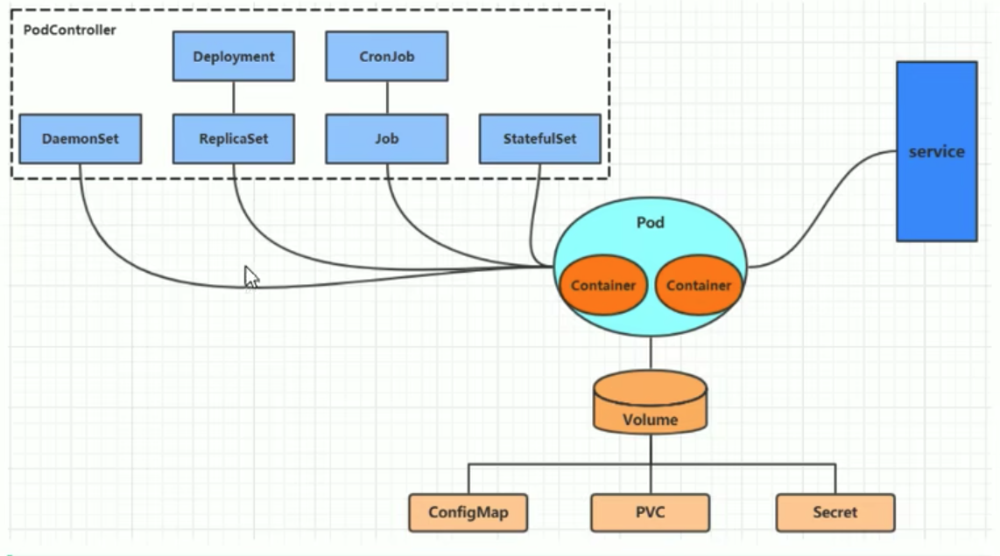

# k8s

## 一、 k8s简介

### 1. 为什么需要k8s?

因为采用容器部署，会出现如下问题：

- 一个容器故障停机了，怎么让另外一个容器去替补停机的容器
- 如果并发访问量突然增大，怎么横向扩展容器数量。访问量恢复正常之后，怎么恢复正常数目的容器数。

要解决这些问题，就需要用到容器编排软件。常见的容器编排工具有k8s，docker swarm。

### 2. k8s介绍

k8s本质是**一组服务器集群**，它提供了如下功能：

- 自我修复：一旦某一个容器崩溃，能够在1秒中左右迅速启动新的容器
- 弹性伸缩：可以根据需要，自动对集群中正在运行的容器数量进行调整。例如前面提到的请求突然增多，此时可以将容器数量增多。
- 服务发现：服务可以通过自动发现的形式找到它所依赖的服务。例如在集群中，web服务需要mysql和redis帮助，它可以在内部，以自动发现的形式，去寻找mysql和redis容器。
- 负载均衡：如果一个服务起动了多个容器，能够自动实现请求的负载均衡。注意：这个请求不仅仅只是web请求。
- 版本回退：如果发现新发布的程序版本有问题，可以立即回退到原来的版本。
- 存储编排：可以根据容器自身的需求自动创建存储卷。

### 3. k8s组件

k8s分为master和node


#### （1）控制节点master

master：集群的控制平面，负责集群的决策。通俗来说就是管理的。它有四大组件：

- ApiServer：资源操作的唯一入口，接收用户输入的命令，提供认证、授权、API注册和发现等机制。**可以在这里做鉴权等操作。**
- Scheduler：负责集群资源调度，按照预定的调度策略将Pod调度到相应的node节点上。通俗的说就是**由它来计算该谁干活**，因为ApiServer并不会去算。
- ControllerManager：负责维护集群的状态，比如程序部署安排、故障检测、自动扩展、滚动更新等。通俗的说就是**由它来安排该谁干活**，Scheduler只算不安排。
- Etcd：负责存储集群中各种资源对象的信息，它是一个数据库。通俗的说就是**它来记录现在谁在干活**，也可以用其他数据库mysql等，k8s默认是Etcd。

#### （2）工作节点node

node：集群的数据平面，负责为容器提供运行环境。通俗来说就是干活的。

- Kubelet：**负责维护容器的生命周期，即通过控制docker，来创建、更新、销毁容器**。通俗理解**它就是对接人，负责和master对接**，收到任务之后，它来把docker跑起来。  
- KubeProxy：负责提供集群内部的**服务发现和负载均衡**。需要注意的是，ApiServer是整个控制的访问入口，而KubeProxy是程序的入口。
- Docker：负责节点上容器的各种操作

#### （3）实例

下面是一个nginx部署实例来说明kubernetes系统各个组件调用关系：

1. k8s启动之后，master和node会将自身的信息存储到etcd数据库中。通俗来说，要通过记录数据库，知道自己管理多少人干活。
2. 一个nginx服务的安装请求会首先被发送到master节点的apiServer组件。
3. apiServer组件会调用scheduler组件来决定到底应该把这个服务安装到哪个node节点上。此时，scheduler会从etcd中读取各个node节点的信息，然后按一定的算法进行选择，并将结果告知apiServer
4. apiServer调用controller-manager去调度Node节点安装nginx服务。
5. kubelet接收到指令后，会通知docker，然后由docker来启动一个nginx的pod。pod是kubernetes的最小操作单元，容器必须跑在pod中。
6. 一个nginx服务就运行了，如果需要访问nginx，就需要通过kube-proxy来对pod产生访问的代理

这样，外界用户就可以访问集群中的nginx服务了

### 4. k8s基本概念

#### （1）Master

集群控制节点，每个集群需要至少一个master节点负责集群的管控

#### （2）Node

工作负载节点，由master分配容器到这些node工作节点上，然后node节点上的docker负责容器的运行

#### （3）Pod

kubernetes的最小控制单元，容器都是运行在pod中的，一个pod中可以有1个或者多个容器

#### （4）Controller

pod虽然是k8s的最小控制单元，但是k8s很少直接控制pod。而是通过控制器来实现对pod的管理，比如启动pod、停止pod、伸缩pod的数量等等。

#### （5）Service

pod对外服务的统一入口。例如下图中，**需要用到service，将外界的流量引进来**，交给tomcat，**通过service可以实现复杂均衡的效果**。


#### （6）Label

标签，用于对pod进行分类，同一类pod会拥有相同的标签。例如上图中，有三个pod是app:tomcat，**在service中，会定义一个选择器，根据标签对service进行选择**

#### （7）NameSpace

命名空间，用来隔离pod的运行环境。不同的namespace不能相互访问，类似于计算机网络中的vlan。

## 二、集群环境搭建

### 1. 部署方式

- minikube：快速搭建单节点k8s的工具
- kubeadm：搭建kubenetes集群的工具
- 二进制包：依次下载每个组件的二进制包

这里采用第二种方式，并且采用两台服务器，阿里云(centos)和腾讯云(centos)。

### 2. 环境初始化

- 主机名解析

  ```bash
  43.143.70.145 master
  121.41.55.89 node1
  ```

- 时间同步

  ```bash
  systemctl start chronyd
  systemctl enable chronyd
  date
  ```

- 禁用防火墙

  ```bash
  systemctl stop firewalld
  systemctl disable firewalld
  ```

- 禁用iptables

  ```bash
  systemctl stop iptables
  systemctl disable iptables
  ```

- 禁用selinux：它是linux系统的一个安全规则

  ```bash
  vim /etc/selinux/config
  # 修改
  SELINUX=disabled  
  ```

- 禁用swap分区

  ```bash
  vim /etc/fstab
  # 注释掉swap分区
  # dev/mapper/centos-swap swap
  ```

- 修改linux内核参数，`vim /etc/sysctl.d/kubernetes.conf`

  ```bash
  net.bridge.bridge-nf-call-ip6tables = 1
  net.bridge.bridge-nf-call-iptables = 1
  net.ipv4.ip_forward = 1
  ```

​		重新加载配置`sysctl -p`

​		加载网桥过滤模块`modprobe br_netfilter`

​        查看网桥过滤模块是否加载成功`lsmod | grep br_netfilter`

- 配置ipvs功能

  - 安装ipset和ipvsadmin: `yum install ipset ipvsadmin -y`

  - 需要加载的模块写入脚本文件

    ```bash
    # 写入文件
    cat <<EOF > /etc/sysconfig/modules/ipvs.modules
    #!/bin/bash
    modprobe -- ip_vs
    modprobe -- ip_vs_rr 
    modprobe -- ip_vs_wrr
    modprobe -- ip_vs_sh
    modprobe -- nf_conntrack_ipv4
    EOF
    # 修改权限
    chmod +x /etc/sysconfig/modules/ipvs.modules
    # 执行
    /bin/bash /etc/sysconfig/modules/ipvs.modules
    # 检查是否成功
    lsmod | grep -e ip_vs -e nf_conntrack_ipv4
    ```

### 3. 安装组件

- 安装docker

  ```bash
  # 下载docker源
  wget https://mirrors.aliyun.com/docker-ce/linux/centos/docker-ce.repo -O /etc/yum.repos.d/docker-ce.repo
  # 查看可以安装的docker版本
  yum list docker-ce--showduplicates
  # 安装docker
  yum install --setopt=obsoletes=0 docker-ce-18.06.3.ce-3.el7 -y
  # 创建文件夹
  mkdir /etc/docker
  # 新建文件
  cat <<EOF > /etc/docker/daemon.json
  {
  "exec-opts": ["native.cgroupdriver=systemd"],
  "registry-mirrors":["https://kn0t2bca.mirror.aliyuncs.com"]
  }
  EOF 
  # 重启docker
  systemctl restart docker
  # 开机自启动
  systemctl enable docker
  # 查看docker版本
  docker version
  ```

- 安装k8s组件

  ```bash
  # 编辑/etc/yum.repos.d/kubernets.repo
  [kubernetes]
  name=Kubernetes
  baseurl=http://mirrors.aliyun.com/kubernetes/yum/repos/kubernetes-el7-x86_64
  enabled=1
  gpgcheck=0
  repo_gpgcheck=0
  gpgkey=http://mirrors.aliyun.com/kubernetes/yum/doc/yum-key.gpg
         http://mirrors.aliyun.com/kubernetes/yum/doc/rpm-package-key.gpg
  # 软件安装
  yum install --setopt=obsoletes=0 kubeadm-1.17.4-0 kubelet-1.17.4-0 kubectl-1.17.4-0 -y
  # 修改配置文件,/etc/sysconfig/kubelet
  KUBELET_EXTRA_ARGS="--cgroup-driver=systemd"
  KUBE_PROXY_MODE="ipvs"
  # 设置开机自启动
  systemctl enable kubelet
  ```

###  4. 集群安装

安装集群，就是安装前面所说的master的4个节点和node的两个节点。

先下载镜像，这些镜像由于在k8s仓库中，由于网络原因，无法连接，可以用下面的方案来解决。

```bash
# 查看需要的镜像版版
kubeadm config images list
# 分步执行，步骤1
images=(
    kube-apiserver:v1.17.4
    kube-controller-manager:v1.17.4
    kube-scheduler:v1.17.4
    kube-proxy:v1.17.4
    pause:3.1
    etcd:3.4.3-0 
    coredns:1.6.5 
)
# 步骤2
for imageName in ${images[@]};do
	docker pull registry.cn-hangzhou.aliyuncs.com/google_containers/$imageName 
	docker tag registry.cn-hangzhou.aliyuncs.com/google_containers/$imageName registry.k8s.io/$imageName
  docker rmi registry.cn-hangzhou.aliyuncs.com/google_containers/$imageName 
done
```

集群初始化

```bash
kubeadm init \
--kubernetes-version=v1.17.4 \
--pod-network-cidr=10.244.0.0/16 \
--service-cidr=10.96.0.0/12 \
--apiserver-advertise-address=172.16.94.130
--ignore-preflight-errors=all
```

可能会存在如下问题

```bash
yum install containerd -y
# https://github.com/containerd/containerd/issues/8139
# https://www.cnblogs.com/immaxfang/p/16721407.html
```

> 部署集群花费时间较多，一直报错Initial timeout of 40s passed，暂时先部署minikube。后续可以参考下面的文档来部署。
>
> https://wiki.datagrand.com/pages/viewpage.action?pageId=123765862
>
> https://www.cnblogs.com/lei0213/p/15521526.html

## 三、资源管理

### 1. 什么是资源？

**在k8s中，所有的内容都抽象为资源，用户需要通过操作资源来管理k8s**。

k8s的本质是一个集群系统，用户可以在集群中部署各种服务，**所谓的部署服务，其实就是在k8s集群中运行一个个的容器**，并将指定的程序跑在容器中。

**k8s的最小管理单元是pod而不是容器**，所以只能将容器放在Pod中，**而k8s一般也不会直接管理Pod**，而是通过**Pod控制器**(例如下图中的6种控制器)来管Pod。

Pod可以提供服务之后，就要考虑如何访问Pod中服务，k8s提供了**Service资源**实现这个功能。



### 2. yaml语言

yaml语言是一个类似于json，xml的标记性语言。yaml语言需要注意以下几点:

- 大小写敏感
- 使用缩进表示层级关系，**缩进的空格数不重要，只要相同的层级的元素左对齐即可**

yaml支持以下几种数据类型：

- 纯量：单个的，不可再分的值。

  - 字符串：直接写值。如果有特殊字符，用双引号或者单引号包裹。
  - 布尔值：`true`或者`True`
  - 整数：`234`
  - 浮点数：`3.14`
  - Null：使用`~`表示Null
  - 时间：`2023-05-01`,`yyyy-MM-dd`格式
  - 日期：`2023-05-01T15:03:01`

- 对象：键值对的集合

  ```yaml
  heima
  	age: 15
  	addr: Beijing
  ```

- 数组：一组按次序排列的值

  ```
  heima
  	age: 15
  	addr: 
  	   - Beijing
  	   - Shenzhen
  ```

yaml语言可以和json相互转换，见<https://www.json2yaml.com/>

### 3. 资源管理方式

#### （1）命令式对象管理

直接使用命令去操作k8s资源。`kubectl`是k8s集群的命令行工具，通过它可以对集群进行管理，并在集群上进行容器化的安装部署。

```bash
# 前两个参数必须，后两个可选
kubectl [command] [type] [name] [flags]
```

- command: 对资源执行的操作。
  - 基本命令
    - create：创建一个资源
    - get：获取一个资源
    - patch：更新一个资源
    - delete：删除一个资源
    - explain：展示资源文档
  - 运行和调试
    - run：在集群中运行一个指定的镜像
    - expose：暴露资源位Service
    - **describe**：显示资源内部信息。
    - logs：输出容器在pod中的日志
    - attach：进入运行中的容器
    - exec：执行容器中的一个命令
    - **scale**：扩充pod的数量
  - 高级命令
    - apply：通过文件对资源进行配置
    - label：更新资源上的标签
  - 其他命令
    - version：查看版本
    - cluster-info：集群信息
- type: 指定资源类型
  - 集群级别资源
    - nodes：集群组成部分
    - namespaces：隔离pod
  - pod资源
    - pods：装载容器
  - pod资源控制器
    - deployments
    - replicasets
    - jobs
  - 服务发现资源
    - services：统一pod对外接口
    - ingress：统一pod对外接口
  - 存储资源
    - persistentvolumes：存储
  - 配置资源
    - configmaps：配置
    - secrets：配置
- name: 指定资源的名称，名称大小写敏感
- flags: 指定额外的可选参数

#### （2）命令式对象配置

通过命令配置和配置文件去操作k8s资源。

例子：

```yaml
apiVersion: v1
kind: Namespace
metadata:
	name: dev
	
--- 

apiVersion: v1
kind: Pod
metadata:
	name: nginxpod
	namespace: dev
spec:
	containers:
		- name: nginx-containers
			image: nginx:1.17.1
```

- 创建：`kubectl create -f nginx-pod.yaml`，创建一个namespace和一个pod。
- 删除：`kubectl delete -f nginx-pod.yaml`，删除namespace和一个pod。

这种方式可以认为是`命令+yaml文件`

#### （3）声明式对象配置

通过**`apply`命令**和配置文件去操作k8s资源，这种方式仅用于新增和更新。

- 首先执行`kubectl apply -f nginx-pod.yaml`，发现创建了资源。
- 然后再次执行`kubectl apply -f nginx-pod.yaml`，**发现说资源没有变动**。如果我们修改yaml文件里面的内容，此时会提示已更新。

总结：**当资源不存在时，`apply`命令相当于创建，等于`create`。如果资源存在，就更新，相当于`patch`**。

#### （4）总结

- 创建/更新资源，使用声明式对象配置，采用`kubectl apply -f XXX.yaml`
- 删除资源，采用命令式对象配置，`kubectl delete -f XXX.yaml`
- 查询资源，采用命令式对象管理，`kubectl get 资源名称`

## 四、实战入门

### 1. Namespace

#### （1）作用

主要作用是实现多套环境的资源隔离。 默认情况下，k8s中所有的pod是可以相互访问的，如果不想让两个pod相互访问，此时可以将它们放到两个Namespace中。


```bash
# kubectl get ns                  
NAME              STATUS   AGE
default           Active   28d
dev               Active   14m
ingress-nginx     Active   26d
kube-node-lease   Active   28d
kube-public       Active   28d
kube-system       Active   28d  # 所有集群组件会在这里
```

所有**未指定Namespace的对象都会被分配到default的Namespace中**。例如如果我们创建一个pod，没有指定namespace，那么它会自动分配给default，因此**每个pod都有namespace**。

#### （2）查看Namespace

```bash
kubectl get ns default  # 查看命名空间
kubectl describe ns default  # 描述命名空间
```

#### （3）创建Namespace

```
kubectl create ns default
```

#### （4）删除Namespace

```
kubectl delete ns default
```

### 2. Pod

#### （1）作用 

Pod是k8s进行管理的最小单元，**程序要运行必须部署在容器中，而容器必须部署在Pod中， Pod是一个或多个容器的组合**，这些容器共享存储、网络和命名空间，以及如何运行的规范。


k8s在集群启动之后，集群中的各个组件也是以pod方式运行的。

```bash
➜  # kubectl get pod -n kube-system
NAME                               READY   STATUS    RESTARTS       AGE
coredns-787d4945fb-46tj7           1/1     Running   12 (85m ago)   28d
etcd-master                        1/1     Running   13 (85m ago)   28d
kube-apiserver-master              1/1     Running   14             28d
kube-controller-manager-master     1/1     Running   13 (85m ago)   28d
kube-proxy-5xprh                   1/1     Running   13 (85m ago)   28d
kube-scheduler-master              1/1     Running   12 (85m ago)   28d
storage-provisioner                1/1     Running   23 (85m ago)   28d
```

可以看到第一节介绍的apiserver，controller-manager，scheduler等组件。

#### （2）创建并运行pod

k8s没有单独命令来单独运行pod的命令，都是通过pod控制器来实现的。# todo，后面把这里的意思补充一下。

```bash
# 前面介绍过，run是在集群中运行一个指定的镜像
kubectl run nginx --image=nginx:1.17.1 --port=80 --namespace dev
```

#### （3）查看pod

```bash
kubectl get pods -n dev # 查看pod
kubectl get pods -n dev -o wide # 查看pod更详细的信息
kubectl describe pod nginxpod -n dev  # 描述信息,启动的时候如果有报错，可以通过这个命令看到
```

> 注意都要指定namespace，即加上`-n`参数 

#### （4）访问pod

一个正在跑的程序如果无法访问，是没有任何意义的。`kubectl get pods -n dev -o wide`可以拿到pod的ip地址

```bash
➜  # kubectl get pods -n dev -o wide     
NAME       READY   STATUS    RESTARTS   AGE   IP             NODE       NOMINATED NODE   READINESS GATES
nginx      1/1     Running   0          12m   10.244.0.144   minikube   <none>           <none>
nginxpod   1/1     Running   0          53m   10.244.0.143   minikube   <none>           <none>
```

访问的时候，可以通过`curl 10.244.0.144:80`来实现

#### （5）删除pod

```bash
kubectl delete pod nginx -n dev
```

### 3. Label

### 4. Deployment

### 5. Service


#### （2）常见操作

- create: 创建。连续执行两次相同的create会报错。
- apply: 资源没有，就是创建。资源如果有，就是更新。如果yaml文件不变，它不会执行任何操作。

#### （3）资源对象

Deployment、Service、Pod是k8s最核心的3个资源对象。
- Pod: Pod是k8s进行管理的最小单元，**程序要运行必须部署在容器中，而容器必须部署在Pod中。** Pod是一个或多个容器的组合，这些容器共享存储、网络
和命名空间，以及如何运行的规范。
- Deployment: k8s中，Pod是最小的控制单元，**但是k8s很少直接控制Pod，一般都是通过Pod控制器来完成的**。Pod控制器用于pod的管理，确保pod资源
符合预期(例如想要三个pod运行nginx服务)的状态，当pod资源出现故障时，会尝试进行重启或重建pod。Deployment就是一种Pod控制器。
- Service: 虽然每个Pod都会分配一个单独的Pod IP，但是会存在两个问题，1) Pod IP随着Pod的重建而产生变化 2) Pod IP仅仅是集群内可见的虚拟IP，
外部无法访问。为了解决这个问题，k8s设计了Service来解决这个问题，Service通过标签选择器找到对应的Pod，请求过来后转发到对应的Pod。
- Namespace: 默认情况下，k8s中所有的pod是可以相互访问的，如果不想让两个pod相互访问，此时可以将它们放到两个pod中
- Label: 使用标签可以将具有相同属性的资源对象(例如都是属于后端的Pod或者Service)进行区分，方便我们对这些资源对象进行统一的操作，例如删除等。

## 三、pod详解

### 1. 一级属性

在k8s，基本所有资源的一级属性都是一样的，主要包含5部分：
- apiVersion: 版本，由kubernetes内部定义，版本号必须可以用kubectl api-versions查询到。
- kind: 类型，由kubernetes内部定义，版本号必须可以用kubectl api-resources查询到。
- metadata: 元数据，主要是资源标识和说明，常用的有name、namespace、labels等
- spec: 描述，这是配置中最重要的一部分，里面是对各种资源配置的详细描述
- status: 状态信息，里面的内容不需要定义，由kubernetes自动生成

### 2. spec

- containers: 容器列表，用于定义容器的详细信息
- nodeName: 根据nodeName的值将pod调度到指定的Node节点上。
- nodeSelector: 根据NodeSelector中定义的信息选择将该Pod调度到包含这些label的Node上
- hostNetwork: 是否使用主机网络模式，默认为false,如果设置为true,表示使用宿主机网络。一般很少改动，都不用宿主机模式。
- volumes: 存储卷，用于定义Pod上面挂在的存储信息
- restartPolicy: 重启策略，表示Pod在遇到故障的时候的处理策略


#### (1) containers

- name: 容器名称
- image: 镜像名称
- imagePullPolicy: 镜像拉取策略。
```bash
Always: 总是从远程拉. 如果镜像版本号是latest, 用的是这种策略
IfNotPresent: 本地有用本地的, 本地没有拉远程的. 如果镜像版本号是具体的, 用的是这种策略
Never: 总是从本地拉
```
- command: 容器启动时的命令
- args: 向command命令传递的参数
```bash
1. 如果command和args均没有写,那么用Dockerfi1e的配置.
2. 如果command写了,但args没有写,那么Dockerfile默认的配置会被忽略,执行输入的command
3. 如果command没写,但args写了,那么Dockerfiler中配置的ENTRYPOINT的命令会被执行,使用当前args的参数
4. 如果command和args都写了,那么Dockerfile的配置被忽略,执行command并追加上args参数
```
- env: 用于向容器传递环境变量. 键值对的形式. 更推荐用配置文件的形式来配置.
- ports: 暴露的端口号地址。
```bash
name: 端口名称,如果指定,必须保证name在pod中是唯一的
containerPort: 容器要监听的端口(0<x<65536)
hostPort: 容器要在主和上公开的端口. 如果设置,主机上只能运行容器的一个副本,一般省略
hostIP: 要将外端口绑定到的主机IP,一般省略
protocol: 端口协议, 必须是UDP, TCP或SCTP. 默认是TCP
```
- resources: 对容器做资源限制。如果不对资源做限制，那么它可能会吃掉大量的资源，导致其他的容器无法执行。
```bash
limits: 资源上限
requests: 资源下限
```

### 3. pod生命周期

