# k8s

## 一、 k8s简介

### 1. 为什么需要k8s?

因为采用容器部署，会出现如下问题：

- 一个容器故障停机了，怎么让另外一个容器去替补停机的容器
- 如果并发访问量突然增大，怎么横向扩展容器数量。访问量恢复正常之后，怎么恢复正常数目的容器数。

要解决这些问题，就需要用到容器编排软件。常见的容器编排工具有k8s，docker swarm。

### 2. k8s介绍

k8s本质是**一组服务器集群**，它提供了如下功能：

- 自我修复：一旦某一个容器崩溃，能够在1秒中左右迅速启动新的容器
- 弹性伸缩：可以根据需要，自动对集群中正在运行的容器数量进行调整。例如前面提到的请求突然增多，此时可以将容器数量增多。
- 服务发现：服务可以通过自动发现的形式找到它所依赖的服务。例如在集群中，web服务需要mysql和redis帮助，它可以在内部，以自动发现的形式，去寻找mysql和redis容器。
- 负载均衡：如果一个服务起动了多个容器，能够自动实现请求的负载均衡。注意：这个请求不仅仅只是web请求。
- 版本回退：如果发现新发布的程序版本有问题，可以立即回退到原来的版本。
- 存储编排：可以根据容器自身的需求自动创建存储卷。

### 3. k8s组件

k8s分为master和node


#### （1）控制节点master

master：集群的控制平面，负责集群的决策。通俗来说就是管理的。它有四大组件：

- ApiServer：资源操作的唯一入口，接收用户输入的命令，提供认证、授权、API注册和发现等机制。**可以在这里做鉴权等操作。**
- Scheduler：负责集群资源调度，按照预定的调度策略将Pod调度到相应的node节点上。通俗的说就是**由它来计算该谁干活**，因为ApiServer并不会去算。
- ControllerManager：负责维护集群的状态，比如程序部署安排、故障检测、自动扩展、滚动更新等。通俗的说就是**由它来安排该谁干活**，Scheduler只算不安排。
- Etcd：负责存储集群中各种资源对象的信息，它是一个数据库。通俗的说就是**它来记录现在谁在干活**，也可以用其他数据库mysql等，k8s默认是Etcd。

#### （2）工作节点node

node：集群的数据平面，负责为容器提供运行环境。通俗来说就是干活的。

- Kubelet：**负责维护容器的生命周期，即通过控制docker，来创建、更新、销毁容器**。通俗理解**它就是对接人，负责和master对接**，收到任务之后，它来把docker跑起来。  
- KubeProxy：负责提供集群内部的**服务发现和负载均衡**。需要注意的是，ApiServer是整个控制的访问入口，而KubeProxy是程序的入口。
- Docker：负责节点上容器的各种操作

#### （3）实例

下面是一个nginx部署实例来说明kubernetes系统各个组件调用关系：

1. k8s启动之后，master和node会将自身的信息存储到etcd数据库中。通俗来说，要通过记录数据库，知道自己管理多少人干活。
2. 一个nginx服务的安装请求会首先被发送到master节点的apiServer组件。
3. apiServer组件会调用scheduler组件来决定到底应该把这个服务安装到哪个node节点上。此时，scheduler会从etcd中读取各个node节点的信息，然后按一定的算法进行选择，并将结果告知apiServer
4. apiServer调用controller-manager去调度Node节点安装nginx服务。
5. kubelet接收到指令后，会通知docker，然后由docker来启动一个nginx的pod。pod是kubernetes的最小操作单元，容器必须跑在pod中。
6. 一个nginx服务就运行了，如果需要访问nginx，就需要通过kube-proxy来对pod产生访问的代理

这样，外界用户就可以访问集群中的nginx服务了

### 4. k8s组件简介

- Master：集群控制节点，每个集群需要至少一个master节点负责集群的管控
- Node：工作负载节点，由master分配容器到这些node工作节点上，然后node节点上的docker负责容器的运
- Pod：kubernetes的最小控制单元，容器都是运行在pod中的，一个pod中可以有1个或者多个容器
- Controller：**pod虽然是k8s的最小控制单元，但是k8s很少直接控制pod，而是通过控制器来实现对pod的管理**。比如启动pod、停止pod、伸缩pod的数量等等。k8s中最常见的控制器是：Deployment
- Service：pod对外服务的统一入口。例如下图中，**需要用到service，将外界的流量引进来**，交给tomcat，**通过service可以实现负载均衡的效果**。


- Label：标签，用于对pod进行分类，同一类pod会拥有相同的标签。例如上图中，有三个pod是app:tomcat，**在service中，会定义一个选择器，根据标签对service进行选择**
- NameSpace：命名空间，用来隔离pod的运行环境。不同的namespace不能相互访问，类似于计算机网络中的vlan。

## 二、集群环境搭建

### 1. 部署方式

- minikube：快速搭建单节点k8s的工具
- kubeadm：搭建kubenetes集群的工具
- 二进制包：依次下载每个组件的二进制包

这里采用虚拟机来安装，两台虚拟机，2核，2GB的内存，50GB的硬盘，虚拟机安装的是Centos7操作系统

### 2. 环境初始化

> 以下所有命令需要在master和node节点上执行

#### （1）检查操作系统的版本

```bash
# 此方式下安装kubernetes集群要求Centos版本要在7.5或之上
[root@master ~]# cat /etc/redhat-release
Centos Linux 7.5.1804 (Core)
```

#### （2）主机名解析

为了方便集群节点间的直接调用，在这个配置一下主机名解析，企业中推荐使用内部DNS服务器

```bash
# 主机名成解析 编辑三台服务器的/etc/hosts文件，添加下面内容
192.168.157.100 master
192.168.157.101 node01
```

#### （3）时间同步

kubernetes要求集群中的节点时间必须精确一直，这里使用chronyd服务从网络同步时间

企业中建议配置内部的时间同步服务器。如果没有的话，需要先安装`yum install chrony -y`

```bash
# 启动chronyd服务
[root@master ~]# systemctl start chronyd
# 开机自启动chronyd服务
[root@master ~]# systemctl enable chronyd
[root@master ~]# date
```

#### （4） 禁用iptable和firewalld服务

kubernetes和docker 在运行的中会产生大量的iptables规则，为了不让系统规则跟它们混淆，直接关闭系统的规则

```bash
# 关闭firewalld服务
[root@master ~]# systemctl stop firewalld
# 检查firewalld是否关闭
[root@master ~]# systemctl status firewalld
# 防止开机自启动服务
[root@master ~]# systemctl disable firewalld
# 2 关闭iptables服务
[root@master ~]# yum install iptables iptables-services
[root@master ~]# systemctl stop iptables
[root@master ~]# systemctl disable iptables
```

#### （5）禁用selinux

selinux是linux系统下的一个安全服务，如果不关闭它，在安装集群中会产生各种各样的奇葩问题

```bash
# 编辑 /etc/selinux/config 文件，修改SELINUX的值为disable
# 注意修改完毕之后需要重启linux服务
SELINUX=disabled
```

#### （6）禁用swap分区

swap分区指的是虚拟内存分区，它的作用是物理内存使用完，之后将磁盘空间虚拟成内存来使用，启用swap设备会对系统的性能产生非常负面的影响，因此kubernetes要求每个节点都要禁用swap设备，但是如果因为某些原因确实不能关闭swap分区，就需要在集群安装过程中通过明确的参数进行配置说明

```bash
# 编辑分区配置文件/etc/fstab，注释掉swap分区一行
# 注意修改完毕之后需要重启linux服务
vim /etc/fstab
注释掉 /dev/mapper/centos-swap swap
# /dev/mapper/centos-swap swap
```

#### （7）修改linux的内核参数

```bash
# 修改linux的内核采纳数，添加网桥过滤和地址转发功能
# 编辑/etc/sysctl.d/kubernetes.conf文件，添加如下配置：
net.bridge.bridge-nf-call-ip6tables = 1
net.bridge.bridge-nf-call-iptables = 1
net.ipv4.ip_forward = 1

# 重新加载配置
[root@master ~]# sysctl -p
# 加载网桥过滤模块
[root@master ~]# modprobe br_netfilter
# 查看网桥过滤模块是否加载成功
[root@master ~]# lsmod | grep br_netfilter
```

#### （8）配置ipvs功能

在Kubernetes中Service有两种带来模型，一种是基于iptables的，一种是基于ipvs的两者比较的话，ipvs的性能明显要高一些，但是如果要使用它，需要手动载入ipvs模块

```bash
# 1.安装ipset和ipvsadm
[root@master ~]# yum install ipset ipvsadm -y
# 2.添加需要加载的模块写入脚本文件
[root@master ~]# cat <<EOF> /etc/sysconfig/modules/ipvs.modules
#!/bin/bash
modprobe -- ip_vs
modprobe -- ip_vs_rr
modprobe -- ip_vs_wrr
modprobe -- ip_vs_sh
modprobe -- nf_conntrack_ipv4
EOF
# 3.为脚本添加执行权限
[root@master ~]# chmod +x /etc/sysconfig/modules/ipvs.modules
# 4.执行脚本文件
[root@master ~]# /bin/bash /etc/sysconfig/modules/ipvs.modules
# 5.查看对应的模块是否加载成功
[root@master ~]# lsmod | grep -e ip_vs -e nf_conntrack_ipv4
```

### 3. 安装组件

#### （1）安装docker

```bash
# 1、切换镜像源
[root@master ~]# wget https://mirrors.aliyun.com/docker-ce/linux/centos/docker-ce.repo -O /etc/yum.repos.d/docker-ce.repo

# 2、查看当前镜像源中支持的docker版本
[root@master ~]# yum list docker-ce --showduplicates

# 3、安装特定版本的docker-ce
# 必须制定--setopt=obsoletes=0，否则yum会自动安装更高版本
[root@master ~]# yum install --setopt=obsoletes=0 docker-ce-18.06.3.ce-3.el7 -y

# 4、添加一个配置文件
#Docker 在默认情况下使用Vgroup Driver为cgroupfs，而Kubernetes推荐使用systemd来替代cgroupfs
[root@master ~]# mkdir /etc/docker
[root@master ~]# cat <<EOF> /etc/docker/daemon.json
{
	"exec-opts": ["native.cgroupdriver=systemd"],
	"registry-mirrors": ["https://kn0t2bca.mirror.aliyuncs.com"]
}
EOF

# 5、启动dokcer
[root@master ~]# systemctl restart docker
[root@master ~]# systemctl enable docker
```

#### （2）安装Kubernetes组件

```bash
# 1、由于kubernetes的镜像在国外，速度比较慢，这里切换成国内的镜像源
# 2、编辑/etc/yum.repos.d/kubernetes.repo,添加下面的配置
[kubernetes]
name=Kubernetes
baseurl=http://mirrors.aliyun.com/kubernetes/yum/repos/kubernetes-el7-x86_64
enabled=1
gpgchech=0
repo_gpgcheck=0
gpgkey=http://mirrors.aliyun.com/kubernetes/yum/doc/yum-key.gpg
			http://mirrors.aliyun.com/kubernetes/yum/doc/rpm-package-key.gpg

# 3、安装kubeadm、kubelet和kubectl
[root@master ~]# yum install --setopt=obsoletes=0 kubeadm-1.17.4-0 kubelet-1.17.4-0 kubectl-1.17.4-0 -y

# 4、配置kubelet的cgroup
#编辑/etc/sysconfig/kubelet, 添加下面的配置
KUBELET_CGROUP_ARGS="--cgroup-driver=systemd"
KUBE_PROXY_MODE="ipvs"

# 5、设置kubelet开机自启
[root@master ~]# systemctl enable kubelet
```

### 4. 集群安装

#### （1）准备集群镜像

在安装kubernetes集群之前，必须要提前准备好集群需要的镜像，所需镜像可以通过下面命令查看

```bash
[root@master ~]# kubeadm config images list
```

替换镜像

```bash
[root@manager ~]$ vim kubeadm-config-image.yaml
apiVersion: kubeadm.k8s.io/v1beta2
kind: ClusterConfiguration
imageRepository: registry.aliyuncs.com/google_containers
```

检查是否替换成功

```bash
[root@manager ~]$ kubeadm config images list --config kubeadm-config-image.yaml
registry.aliyuncs.com/google_containers/kube-apiserver:v1.22.17
registry.aliyuncs.com/google_containers/kube-controller-manager:v1.22.17
registry.aliyuncs.com/google_containers/kube-scheduler:v1.22.17
registry.aliyuncs.com/google_containers/kube-proxy:v1.22.17
registry.aliyuncs.com/google_containers/pause:3.5
registry.aliyuncs.com/google_containers/etcd:3.5.0-0
registry.aliyuncs.com/google_containers/coredns:v1.8.4
```

拉取镜像

```bash
[root@manager ~]$ kubeadm config images pull --config kubeadm-config-image.yaml
```

#### （2）集群初始化

> 下面的操作只需要在master节点上执行即可

```bash
# 创建集群
[root@master ~]# kubeadm init \
	--apiserver-advertise-address=192.168.157.100 \
	--kubernetes-version=v1.17.4 \
	--service-cidr=10.96.0.0/12 \
	--pod-network-cidr=10.244.0.0/16
	--
# 创建必要文件
[root@master ~]# mkdir -p $HOME/.kube
[root@master ~]# sudo cp -i /etc/kubernetes/admin.conf $HOME/.kube/config
[root@master ~]# sudo chown $(id -u):$(id -g) $HOME/.kube/config
```

> 下面的操作只需要在node节点上执行即可

```bash
kubeadm join 192.168.0.100:6443 --token awk15p.t6bamck54w69u4s8 \
    --discovery-token-ca-cert-hash sha256:a94fa09562466d32d29523ab6cff122186f1127599fa4dcd5fa0152694f17117 
```

在master上查看节点信息

```bash
[root@master ~]# kubectl get nodes
NAME    STATUS   ROLES     AGE   VERSION
master  NotReady  master   6m    v1.17.4
node01   NotReady   <none>  22s   v1.17.4
```

#### （3） 安装网络插件

> 只在master节点操作即可

```bash
[root@master ~]# wget https://raw.githubusercontent.com/coreos/flannel/master/Documentation/kube-flannel.yml
[root@master ~]# kubectl create -f kube-flannel.yml
```

此时再查看节点信息

```bash
[root@master ~]# kubectl get nodes
NAME    STATUS   ROLES     AGE   VERSION
master  Ready  master   6m    v1.17.4
node01  Ready   <none>  22s   v1.17.4
```

### 5. 环境测试

- 部署nginx

```bash
kubectl create Deployment nginx --image=nginx:1.14-alpne
```

- 暴露端口

```bash
kubectl expose Deployment nginx --port=80 --type=NodePort
```

- 查看服务状态

```bash
# 注意","两边不要有空格
[haojie@manager ~]$ kubectl get pods,service
NAME                         READY   STATUS    RESTARTS   AGE
pod/nginx-65c4bffcb6-872tv   1/1     Running   0          2d4h

NAME                 TYPE        CLUSTER-IP      EXTERNAL-IP   PORT(S)        AGE
service/kubernetes   ClusterIP   10.96.0.1       <none>        443/TCP        2d18h
service/nginx        NodePort    10.102.148.40   <none>        80:31724/TCP   2d4h
```

- 在页面上查看nginx服务

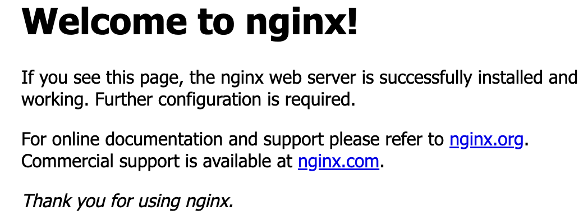

### 6. 完全卸载

- 停掉k8s相关服务

```bash
sudo kubeadm reset -f
```

- 删除配置文件

```bash
sudo rm -rf /etc/cni /etc/kubernetes /var/lib/dockershim /var/lib/etcd /var/lib/kubelet /var/run/kubernetes ~/.kube/*
```

- 删除iptables

```bash
sudo iptables -F && sudo iptables -X
sudo iptables -t nat -F && sudo iptables -t nat -X
sudo iptables -t raw -F && sudo iptables -t raw -X
sudo iptables -t mangle -F && sudo iptables -t mangle -X
```

- 删除组件

```bash
sudo yum remove kubeadm kubectl kubelet kubernetes-cni kube*
sudo yum autoremove
```

- 重启

```bash
sudo reboot
```

## 三、yaml和命令行

### 1. yaml语言介绍

yaml语言是一个类似于json，xml的标记性语言。yaml语言需要注意以下几点:

- 大小写敏感
- 使用缩进表示层级关系，**缩进的空格数不重要，只要相同的层级的元素左对齐即可**，注意不要使用tab键

### 2. yaml数据类型

yaml支持以下几种数据类型：

- 纯量：单个的，不可再分的值。

  - 字符串：直接写值。如果有特殊字符，用双引号或者单引号包裹。
  - 布尔值：`true`或者`True`
  - 整数：`234`
  - 浮点数：`3.14`
  - Null：使用`~`表示Null
  - 时间：`2023-05-01`,`yyyy-MM-dd`格式
  - 日期：`2023-05-01T15:03:01`

- 对象：键值对的集合

  ```yaml
  heima:
    age: 15
    addr: Beijing
  ```

- 数组：一组按次序排列的值

  ```yaml
  heima:
  	age: 15
  	addr: 
  	   - Beijing
  	   - Shenzhen
  ```

yaml语言可以和json相互转换，见<https://www.json2yaml.com/>

### 3. 命令行

直接使用命令去操作k8s资源。`kubectl`是k8s集群的命令行工具，通过它可以对集群进行管理，并在集群上进行容器化的安装部署。

```bash
# 前两个参数command和type必须，后两个可选
kubectl [command] [type] [name] [flags]
```

（1）command: 对资源执行的操作。
- 基本命令：增删改查
  - create：创建一个资源
  - get：获取一个资源
  - patch：更新一个资源
  - delete：删除一个资源
  - explain：展示资源文档
- 运行和调试
  - run：在集群中运行一个指定的镜像
  - expose：暴露资源位Service
  - **describe**：显示资源内部信息。
  - logs：输出容器在pod中的日志
  - attach：进入运行中的容器
  - exec：执行容器中的一个命令
  - **scale**：扩充pod的数量
- 高级命令
  - apply：通过文件对资源进行配置
  - label：更新资源上的标签
- 其他命令
  - version：查看版本
  - cluster-info：集群信息

（2）type: 指定资源类型
- 集群级别资源
  - nodes：集群组成部分
  - namespaces：隔离pod
- pod资源
  - pods：装载容器
- pod资源控制器
  - Deployments
  - replicasets
  - jobs
- 服务发现资源
  - services：统一pod对外接口
  - ingress：统一pod对外接口
- 存储资源
  - persistentvolumes：存储
- 配置资源
  - configmaps：配置
  - secrets：配置

（3）name: 指定资源的名称，名称大小写敏感

（4）flags: 指定额外的可选参数

### 4. 命令行+yaml

通过命令配置和配置文件去操作k8s资源。

例子：

```yaml
apiVersion: v1
kind: Namespace
metadata:
	name: dev
	
--- 

apiVersion: v1
kind: Pod
metadata:
	name: nginxpod
	namespace: dev
spec:
	containers:
		- name: nginx-containers
			image: nginx:1.17.1
```

- 创建：`kubectl create -f nginx-pod.yaml`，创建一个namespace和一个pod。
- 删除：`kubectl delete -f nginx-pod.yaml`，删除namespace和一个pod。

这种方式可以认为是`命令+yaml文件`

### 5. apply命令

还通过**`apply`命令**和配置文件去操作k8s资源，这种方式仅用于新增和更新。

- 首先执行`kubectl apply -f nginx-pod.yaml`，发现创建了资源。
- 然后再次执行`kubectl apply -f nginx-pod.yaml`，**发现说资源没有变动**。如果我们修改yaml文件里面的内容，此时会提示已更新。

总结：**当资源不存在时，`apply`命令相当于创建，等于`create`。如果资源存在，就更新，相当于`patch`**。

### 6. 总结

- 创建/更新资源，使用声明式对象配置，采用`kubectl apply -f XXX.yaml`
- 删除资源，采用命令式对象配置，`kubectl delete -f XXX.yaml`
- 查询资源，采用命令式对象管理，`kubectl get 资源名称`

## 四、资源类型

### 1. Namespace

> Namespace 可以简写为ns

#### （1）作用

主要作用是实现多套环境的资源隔离。 默认情况下，k8s中所有的pod是可以相互访问的，如果不想让两个pod相互访问，此时可以将它们放到两个Namespace中。

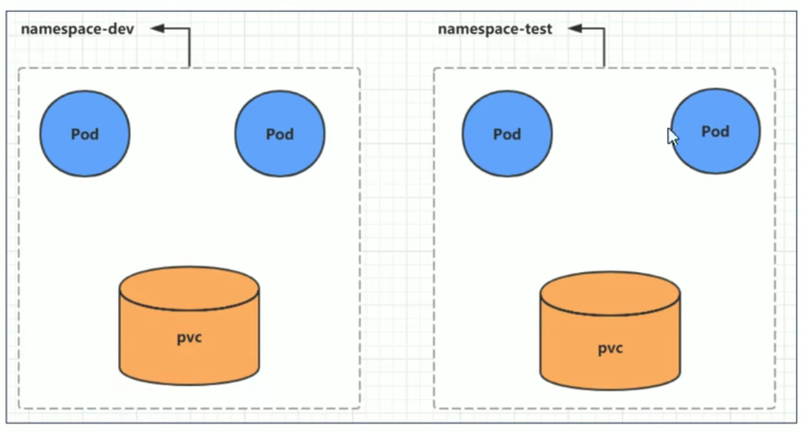

```bash
# kubectl get ns                  
NAME              STATUS   AGE
default           Active   28d
dev               Active   14m
ingress-nginx     Active   26d
kube-node-lease   Active   28d
kube-public       Active   28d
kube-system       Active   28d  # 所有集群组件会在这里
```

所有**未指定Namespace的对象都会被分配到default的Namespace中**。例如如果我们创建一个pod，没有指定namespace，那么它会自动分配给default，因此**每个pod都有namespace**。

#### （2）增删改查

> 1、查看namespace

```bash
kubectl get ns default  # 查看命名空间
kubectl describe ns default  # 描述命名空间
```

> 2、新增namespace

```
kubectl create ns default
```

> 3、删除namespace

```
kubectl delete ns default
```

> 4、指定namespace

当我们查询资源时，如果不指定`-n namespace`，**那么它默认使用的是default这个namespace**

```bash
[haojie@manager ~]$ kubectl get pods
NAME                     READY   STATUS    RESTARTS   AGE
nginx-6799fc88d8-vljg6   1/1     Running   0          12m
[haojie@manager ~]$ kubectl get pods -n default
NAME                     READY   STATUS    RESTARTS   AGE
nginx-6799fc88d8-vljg6   1/1     Running   0          15m
```

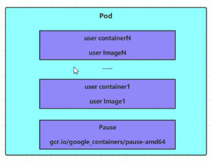

### 2. Label

#### （1）作用

在资源上添加标识，用来对资源进行区分和选择，方便我们对这些资源对象进行统一的操作，例如删除等。和Namespace不同的是，**不同的Namespace之间不能相互访问，但是不同的标签之间可以相互访问**。Label的特点：

- 以键值对的形式附加到对象上，例如`"version":"release"`
- 一个资源对象可以定义多个Label，一个Label可以被添加到任意数量的资源对象上

#### （2）Label选择器

标签定义完成后，还要考虑到标签的选择，可以用到Label Selector，k8s目前有两种Label Selector

- 基于等式的：`name=slave`，选择所有`key=name`和`value=slave`的对象
- 基于集合的：`name in (master, slave)`，选择所有`key=name`和`value=slave`或者`value=master`的对象。

#### （3）增删改查

> 1、新增Label

```bash
# version=1.0，标签名称
[haojie@manager ~]$ kubectl label pod nginx -n dev version=1.0
pod/nginx labeled
```

> 2、查看Label

```bash
[haojie@manager ~]$ kubectl get pod nginx -n dev --show-labels
NAME    READY   STATUS    RESTARTS   AGE   LABELS
nginx   1/1     Running   0          78m   run=nginx,version=1.0
```

> 3、更新Label

```bash
[haojie@manager ~]$ kubectl label pod nginx -n dev version=2.0 --overwrite
pod/nginx labeled
[haojie@manager ~]$ kubectl get pod nginx -n dev --show-labels
NAME    READY   STATUS    RESTARTS   AGE   LABELS
nginx   1/1     Running   0          78m   run=nginx,version=2.0
```

如果是新增一个key-value，直接用打标签的命令即可，不用加`--overwrite`

```bash
[haojie@manager ~]$ kubectl label pod nginx -n dev name=backend
pod/nginx labeled
[haojie@manager ~]$ kubectl get pod nginx -n dev --show-labels
NAME    READY   STATUS    RESTARTS   AGE   LABELS
nginx   1/1     Running   0          80m   name=backend,run=nginx,version=2.0
```

> 4、筛选Label

```bash
[haojie@manager ~]$ kubectl get pods -l "version=2.0" -n dev --show-labels
NAME    READY   STATUS    RESTARTS   AGE   LABELS
nginx   1/1     Running   0          81m   name=backend,run=nginx,version=2.0
```

> 5、删除Label

```bash
# 删除掉nginxpod这个pod的name标签, "name"加上“-”符号
[haojie@manager ~]$ kubectl label pod nginx -n dev name-
pod/nginx labeled
[haojie@manager ~]$ kubectl get pods -l "version=2.0" -n dev --show-labels
NAME    READY   STATUS    RESTARTS   AGE   LABELS
nginx   1/1     Running   0          84m   run=nginx,version=2.0
```

## 五、pod详解

### 1. Pod介绍

Pod是k8s进行管理的最小单元，**程序要运行必须部署在容器中，而容器必须部署在Pod中， Pod是一个或多个容器的组合**，这些容器共享存储、网络和命名空间，以及如何运行的规范。


k8s在集群启动之后，集群中的各个组件也是以pod方式运行的。

```bash
[haojie@manager ~]$ kubectl get pod -n kube-system
NAME                                       READY   STATUS    RESTARTS          AGE
etcd-manager                               1/1     Running   1                 7d12h
kube-apiserver-manager                     1/1     Running   320 (2d15h ago)   7d12h
kube-controller-manager-manager            1/1     Running   5 (3d23h ago)     7d12h
kube-proxy-4sv7s                           1/1     Running   0                 7d12h
kube-proxy-dtj72                           1/1     Running   0                 7d11h
kube-scheduler-manager                     1/1     Running   5 (3d23h ago)     7d12h
```

可以看到第一节介绍的apiserver，controller-manager，scheduler等组件。

### 2. 增删改查

#### （1）新增pod

和其他组件不同的是，创建pod并不是`kubectl create pod`命令来创建pod的，而是`kubectl run (pod名称)`来创建的。

```bash
[haojie@manager ~]$ kubectl create ns dev
namespace/dev created
# 命令格式 kubectl run (pod名称) [参数]
[haojie@manager ~]$ kubectl run nginx --image=nginx:1.17.1 --port=80 --namespace dev
pod/nginx created
```

#### （2）查看pod

```bash
# RESTARTS: 重启次数
[haojie@manager ~]$ kubectl get pods -n dev
NAME    READY   STATUS    RESTARTS   AGE
nginx   1/1     Running   0          22m
# 查看pod更详细的信息
[haojie@manager ~]$ kubectl get pods -n dev -o wide
NAME    READY   STATUS    RESTARTS   AGE   IP                NODE     NOMINATED NODE   READINESS GATES
nginx   1/1     Running   0          23m   192.168.196.137   node01   <none>           <none>
# 查看更加详细的信息，启动的时候如果有报错，可以通过这个命令看到
[haojie@manager ~]$ kubectl describe pod nginx -n dev
Name:         nginx
Namespace:    dev
......
Events:
  Type    Reason     Age   From               Message
  ----    ------     ----  ----               -------
  Normal  Scheduled  29m   default-scheduler  Successfully assigned dev/nginx to node01
  Normal  Pulled     29m   kubelet            Container image "nginx:1.17.1" already present on machine
  Normal  Created    29m   kubelet            Created container nginx
  Normal  Started    29m   kubelet            Started container nginx
```

在这里可以看到容器id，镜像id等信息

#### （3）删除pod

```bash
kubectl delete pod nginx -n dev
```

### 3. pod结构

每个Pod都可以包含一个或多个容器，这些容器分为两类

- 用户程序所在的容器，数量可多可少
- Pause容器，这是每个Pod都有的根容器，它有两个作用
  1. 以它为依据，评估Pod的健康状态。
  2. 在根容器上设置ip，Pod内其他容器都使用此ip，**pod里的容器共享同一ip。**

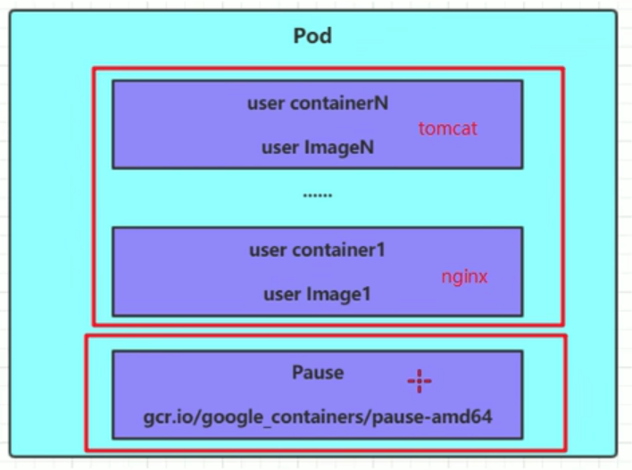

在前面Deployment部分，我们用`kubectl describe Deployment`可以看到两个容器

```bash
[haojie@manager ~]$ kubectl describe pod nginx-5d5dd5dd49-94ddr -n dev
......
Annotations:  cni.projectcalico.org/containerID: f6325f62f64fc0ef0d4c941480b72e60c4eb257e0e7fe47cce2f9813b2df5d1c
              cni.projectcalico.org/podIP: 192.168.196.144/32
              cni.projectcalico.org/podIPs: 192.168.196.144/32
Containers:
  nginx:
    Container ID:   docker://55b9c7a683caa90fbc03d0b21e097bd146a6991a05b30b67a77329acc8879c6a
    Image:          nginx:1.17.1
    Image ID:       docker-pullable://nginx@sha256:b4b9b3eee194703fc2fa8afa5b7510c77ae70cfba567af1376a573a967c03dbb
```

很明显，前面一个是pause的容器id，后面一个是用户自定义的容器id。在对应的node下查看也可以看到。

```bash
[haojie@node01 ~]$ docker ps | grep minutes
55b9c7a683ca   98ebf73aba75                                         "nginx -g 'daemon of…"   3 minutes ago   Up 3 minutes             k8s_nginx_nginx-5d5dd5dd49-94ddr_dev_e1cb38cb-b15c-4b88-bf56-f21f548ab196_0
f6325f62f64f   registry.aliyuncs.com/google_containers/pause:3.5    "/pause"                  3 minutes ago   Up 3 minutes             k8s_POD_nginx-5d5dd5dd49-94ddr_dev_e1cb38cb-b15c-4b88-bf56-f21f548ab196_0
```

### 4. pod定义

下面是一个较为完整的定义pod的yaml文件

```yaml
apiVersion: v1 # 必选, 版本号, 例如v1
kind: Pod # 必选, 资源类型，例如 Pod
metadata: # 必选, 元数据
  name: string # 必选, Pod名称
  namespace: string # Pod所属的命名空间，默认为"default"
  labels: 
    - name: string #自定义标签列表
spec: # 必选, Pod中容器的详细定义
  containers: #必选，Pod中容器列表
  - name: string #必选，容器名称
    image: string #必选，容器的镜像名称
    imagePullPolicy: [ Always|Never|IfNotPresent ] #获取镜像的策略
    command: [string] #容器的启动命令列表，如不指定，使用打包时使用的启动命令
    args: [string] #容器的启动命令参数列表
    workingDir: string #容器的工作目录
    volumeMounts: #挂载到容器内部的存储卷配置
    - name: string #引用pod定义的共享存储卷的名称，需用volumes[]部分定义的的卷名
      mountPath: string #存储卷在容器内mount的绝对路径，应少于512字符
      readOnly: boolean #是否为只读模式
    ports: #需要暴露的端口库号列表
    - name: string #端口的名称
      containerPort: int #容器需要监听的端口号
      hostPort: int #容器所在主机需要监听的端口号，默认与Container相同
      protocol: string #端口协议，支持TCP和UDP，默认TCP
    env:   #容器运行前需设置的环境变量列表
    - name: string  #环境变量名称
      value: string #环境变量的值
    resources: #资源限制和请求的设置
      limits:  #资源限制的设置
        cpu: string     #Cpu的限制，单位为core数，将用于docker run --cpu-shares参数
        memory: string  #内存限制，单位可以为Mib/Gib，将用于docker run --memory参数
      requests: #资源请求的设置
        cpu: string    #Cpu请求，容器启动的初始可用数量
        memory: string #内存请求,容器启动的初始可用数量
    lifecycle: #生命周期钩子
        postStart: #容器启动后立即执行此钩子,如果执行失败,会根据重启策略进行重启
        preStop: #容器终止前执行此钩子,无论结果如何,容器都会终止
    livenessProbe:  #对Pod内各容器健康检查的设置，当探测无响应几次后将自动重启该容器
      exec:       　 #对Pod容器内检查方式设置为exec方式
        command: [string]  #exec方式需要制定的命令或脚本
      httpGet:       #对Pod内个容器健康检查方法设置为HttpGet，需要制定Path、port
        path: string
        port: number
        host: string
        scheme: string
        HttpHeaders:
        - name: string
          value: string
      tcpSocket:     #对Pod内个容器健康检查方式设置为tcpSocket方式
         port: number
       initialDelaySeconds: 0       #容器启动完成后首次探测的时间，单位为秒
       timeoutSeconds: 0    　　    #对容器健康检查探测等待响应的超时时间，单位秒，默认1秒
       periodSeconds: 0     　　    #对容器监控检查的定期探测时间设置，单位秒，默认10秒一次
       successThreshold: 0
       failureThreshold: 0
       securityContext:
         privileged: false
  restartPolicy: [Always | Never | OnFailure]  #Pod的重启策略
  nodeName: <string> #设置NodeName表示将该Pod调度到指定到名称的node节点上
  nodeSelector: obeject #设置NodeSelector表示将该Pod调度到包含这个label的node上
  imagePullSecrets: #Pull镜像时使用的secret名称，以key：secretkey格式指定
  - name: string
  hostNetwork: false   #是否使用主机网络模式，默认为false，如果设置为true，表示使用宿主机网络
  volumes:   #在该pod上定义共享存储卷列表
  - name: string    #共享存储卷名称 （volumes类型有很多种）
    emptyDir: {}       #类型为emtyDir的存储卷，与Pod同生命周期的一个临时目录。为空值
    hostPath: string   #类型为hostPath的存储卷，表示挂载Pod所在宿主机的目录
      path: string      　　        #Pod所在宿主机的目录，将被用于同期中mount的目录
    secret:       　　　#类型为secret的存储卷，挂载集群与定义的secret对象到容器内部
      scretname: string  
      items:     
      - key: string
        path: string
    configMap:         #类型为configMap的存储卷，挂载预定义的configMap对象到容器内部
      name: string
      items:
      - key: string
        path: string
```

由于上述文件内容实在较多，当记不住时，可以通过`kubectl explain`来查看每种资源的可配置项

```bash
# 查看pod的一级属性
[haojie@manager ~]$ kubectl explain pod
FIELDS:
	 ......
   metadata	<Object>
     Standard object's metadata. More info:
     https://git.k8s.io/community/contributors/devel/sig-architecture/api-conventions.md#metadata
   ......
     
# 查看pod的medadata，二级属性
[haojie@manager ~]$ kubectl explain pod.metadata
FIELDS:
	 ......
   name	<string>
     Name must be unique within a namespace. Is required when creating
     resources, although some resources may allow a client to request the
     generation of an appropriate name automatically. Name is primarily intended
     for creation idempotence and configuration definition. Cannot be updated.
     More info: http://kubernetes.io/docs/user-guide/identifiers#names
   ......
```

### 5. containers的属性

在k8s，基本所有资源的一级属性都是一样的，主要包含5部分：
- apiVersion: 版本，由kubernetes内部定义，版本号必须可以用`kubectl api-versions`查询到。
- kind: 类型，由kubernetes内部定义，版本号必须可以用`kubectl api-resources`查询到。
- metadata: 元数据，主要是资源标识和说明，常用的有name、namespace、labels等
- spec: 描述，**这是配置中最重要的一部分**，里面是对各种资源配置的详细描述
- status: 状态信息，里面的内容不需要定义，由kubernetes自动生成

上面中，最重要的就是spec属性。spec有如下常用的属性

- containers <[]Object> : 容器列表，用于定义容器的详细信息
- nodeName <string>: 当前pod调度到哪个node节点上
- nodeSelector <map[]> : 根据标签进行调度，将pod调度到包含这些label的node上
- hostNetwork <boolean> : 是否使用主机网络模式，默认为false。如果设置为true，表示使用宿主机网络。一般很少改动，都不用宿主机模式。
- volumes <[]Object>: 存储卷，用于定义Pod上面挂在的存储信息
- restartPolicy <string>: 重启策略，表示Pod在遇到故障的时候的处理策略。

其中最重要的是container属性，可以看一下它包含的基本属性

```bash
[haojie@manager ~]$ kubectl explain pod.spec.containers
KIND:     Pod
VERSION:  v1
RESOURCE: containers <[]Object>   # 数组，代表可以有多个容器
FIELDS:
   name  <string>     # 容器名称
   image <string>     # 容器需要的镜像地址
   imagePullPolicy  <string> # 镜像拉取策略 
   command  <[]string> # 容器的启动命令列表，如不指定，使用打包时使用的启动命令
   args     <[]string> # 容器的启动命令需要的参数列表
   env      <[]Object> # 容器环境变量的配置
   ports    <[]Object>     # 容器需要暴露的端口号列表
   resources <Object>      # 资源限制和资源请求的设置
```

#### （1）基本配置(name, image)

创建一个yaml文件，内容如下

```yaml
apiVersion: v1
kind: Pod
metadata:
  name: pod-base
  namespace: dev
  labels:
    user: heima
spec:
  containers:
  - name: nginx
    image: nginx:1.17.1
  - name: busybox
    image: busybox:1.30
```

创建之后，可以查看基本信息

```bash
# 查看Pod状况
# READY 1/2 : 表示当前Pod中有2个容器，其中1个准备就绪，1个未就绪
# RESTARTS  : 重启次数，因为有1个容器故障了，Pod一直在重启试图恢复它
[haojie@manager ~]$ kubectl get pod -n dev
NAME       READY   STATUS    RESTARTS   AGE
pod-base   1/2     Running   4          95s

# 可以通过describe查看内部的详情
# 此时已经运行起来了一个基本的Pod，虽然它暂时有问题
[haojie@manager ~]$ kubectl describe pod pod-base -n dev
```

#### （2）镜像拉取(imagePullPolicy)

创建pod-imagepullpolicy.yaml文件，内容如下：

```yaml
apiVersion: v1
kind: Pod
metadata:
  name: pod-imagepullpolicy
  namespace: dev
spec:
  containers:
  - name: nginx
    image: nginx:1.17.1
    imagePullPolicy: Always # 用于设置镜像拉取策略
  - name: busybox
    image: busybox:1.30
```

imagePullPolicy，用于设置镜像拉取策略，kubernetes支持配置三种拉取策略：

- Always: 默认值，总是从远程拉取镜像。 **如果镜像版本号是latest, 默认用的是这种策略**
- IfNotPresent: 本地有用本地的, 本地没有拉远程的。**如果镜像版本号是具体的, 默认用的是这种策略**
- Never: 总是从本地拉。本地有镜像的话，这种方式最快。

#### （3）启动命令(command, args)

在前面的案例中，busybox容器一直没有成功运行，这是因为busybox并不是一个程序，而是类似于一个工具类的集合，k8s集群启动管理后，它会自动关闭。解决方法就是让其一直在运行，这就用到了command配置。

创建pod-command.yaml文件，内容如下：

```yaml
apiVersion: v1
kind: Pod
metadata:
  name: pod-command
  namespace: dev
spec:
  containers:
  - name: nginx
    image: nginx:1.17.1
  - name: busybox
    image: busybox:1.30
    command: ["/bin/sh","-c","touch /tmp/hello.txt;while true;do /bin/echo $(date +%T) >> /tmp/hello.txt; sleep 3; done;"]
```

kubectl命令可以进入pod的某个容器，`kubectl exec pod名称 -n 命名空间 -it -c 容器名称 /bin/sh`

```bash
# 进入容器
[root@k8s-master01 pod]# kubectl exec pod-command -n dev -it -c busybox /bin/sh
# 容器内
/ # tail -f /tmp/hello.txt
14:44:19
14:44:22
14:44:25
```

通过上面发现command已经可以完成启动命令和传递参数的功能，但是k8s为什么要提供一个args选项呢？用于传递参数呢?这是因为k8s中的command、args两项其实是实现覆盖Dockerfile中ENTRYPOINT的功能。

- 如果command和args均没有写，那么用Dockerfile的配置。
- 如果command写了，但args没有写，那么Dockerfile默认的配置会被忽略，执行输入的command
- 如果command没写，但args写了，那么Dockerfile中配置的ENTRYPOINT的命令会被执行，使用当前args的参数
- 如果command和args都写了，那么Dockerfile的配置被忽略，执行command并追加上args参数

#### （4）环境变量(env)

用于向容器传递环境变量。

```yaml
apiVersion: v1
kind: Pod
metadata:
  name: pod-env
  namespace: dev
spec:
  containers:
  - name: busybox
    image: busybox:1.30
    command: ["/bin/sh","-c","while true;do /bin/echo $(date +%T);sleep 60; done;"]
    env: # 设置环境变量列表
    - name: "username"
      value: "admin"
    - name: "password"
      value: "123456"
```

一般在pod中不推荐直接写环境变量，更推荐将这些配置单独存储在配置文件中。

#### （5）端口设置(ports)

容器需要暴露的端口号地址

```bash
[root@k8s-master01 ~]# kubectl explain pod.spec.containers.ports
KIND:     Pod
VERSION:  v1
RESOURCE: ports <[]Object>
FIELDS:
   name         <string>  # 端口名称，如果指定，必须保证name在pod中是唯一的		
   containerPort<integer> # 容器要监听的端口(0<x<65536)
   hostPort     <integer> # 容器要在主机上公开的端口，如果设置，主机上只能运行容器的一个副本(一般省略) 
   hostIP       <string>  # 要将外部端口绑定到的主机IP(一般省略)
   protocol     <string>  # 端口协议。必须是UDP、TCP或SCTP。默认为“TCP”。
```
接下来，创建`pod-ports.yaml`

```yaml
apiVersion: v1
kind: Pod
metadata:
  name: pod-ports
  namespace: dev
spec:
  containers:
  - name: nginx
    image: nginx:1.17.1
    ports: # 设置容器暴露的端口列表
    - name: nginx-port
      containerPort: 80  # 容器监听的端口
      protocol: TCP
```

访问容器中的程序需要使用的是`Podip:containerPort`

#### （6）资源配额(resources)

对容器做资源限制。如果不对资源做限制，那么它可能会吃掉大量的资源，导致其他的容器无法执行。

- limits：用于限制运行时容器的最大占用资源，当容器占用资源超过limits时会被终止，并进行重启
- requests ：用于设置容器需要的最小资源，如果环境资源不够，容器将无法启动

接下来，创建pod-resources.yaml

```bash
apiVersion: v1
kind: Pod
metadata:
  name: pod-resources
  namespace: dev
spec:
  containers:
  - name: nginx
    image: nginx:1.17.1
    resources: # 资源配额
      limits:  # 限制资源（上限）
        cpu: "2" # CPU限制，单位是core数
        memory: "10Gi" # 内存限制
      requests: # 请求资源（下限）
        cpu: "1"  # CPU限制，单位是core数
        memory: "10Mi"  # 内存限制
```

## 六、pod控制器

### 0. 概述

k8s中，Pod是最小的控制单元，**但是k8s很少直接控制Pod，一般都是通过Pod控制器来完成的**。Pod控制器用于pod的管理，确保pod资源符合预期的状态，当pod资源出现故障时，会尝试进行重启或重建pod。

按照类型分类，pod控制器可以分为如下四类

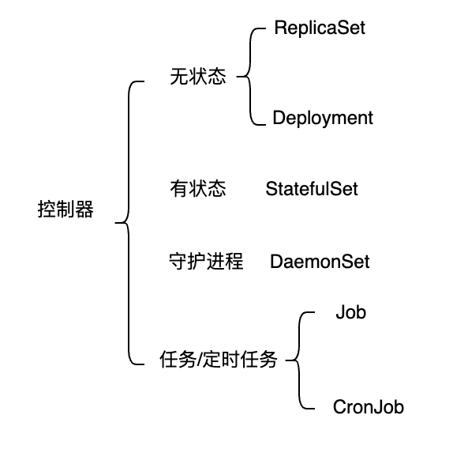

### 1. ReplicaSet

#### （1）作用

按照官网的解释，https://kubernetes.io/docs/concepts/workloads/controllers/replicaset/，ReplicaSet 的目的是在任何给定时间维护一组稳定运行的副本Pod（**注意：不能直接在pod中设置副本数**）。因此，它通常用于保证指定数量的相同Pod的可用性。

需要注意的是，**在ReplicaSet中，我们对容器所做的更新是不会更新过来的**，ReplicaSet仅仅只是去更新副本数，例如在SO答案https://stackoverflow.com/a/72448929/10844937中说的，在ReplicaSet中去更新容器的镜像，并不会生效。

#### （2）创建ReplicaSet

ReplicaSet的增删改查，和Deployment差不多，这里不重点介绍，参考后面Deployment部分

### 2. Deployment

#### （1）作用

Deployment是一种更高的抽象，**它管理一个或多个ReplicaSet**。前面我们知道ReplicaSet是用来维护集群中运行的 Pod数量的，但是在实际操作的时候我们不会去直接使用 RS，而是会使用更上层的控制器，例如Deployment。

Deployment相比ReplicaSet有两大优势：

- ReplicaSet中，我们对容器所做的更新是不会更新过来的，而Deployment可以。
- 滚动更新：当我们更新镜像时，Deployment会用滚动更新（Rolling Update）的方式来升级Pod，滚动更新对于线上服务需要做到不中断服务是非常重要的。

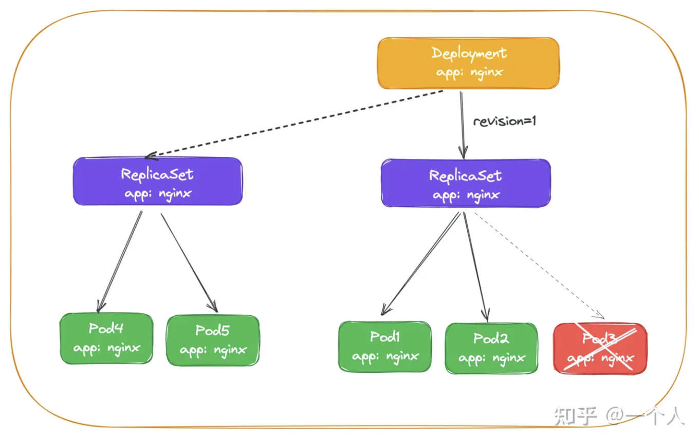

#### （2）新增Deployment

yaml文件创建Deployment

```yaml
# Deployment的配置
apiVersion: apps/v1
kind: Deployment
metadata:
  name: nginx
  namespace: dev
# 相当于命令行后面的--，额外参数
spec:  
  replicas: 3  # 副本数
  selector:  # 选择器
    matchLabels:
      run: nginx  # 使用这个标签选择来和下面的pod建立对应关系
  template:  # pod模板, 下面都是定义pod的一些参数
    metadata:
      labels:
        run: nginx  # 和上面的matchLabels对应
    spec:  # 容器, 定义容器的一些参数
      containers:
      - image: nginx:1.17.1
        name: nginx
        ports:
        - containerPort: 80
          protocol: TCP
```

注意上面的template，这个是pod模板。采用`kubectl create -f nginxpod.yaml`即可创建Deployment。

```bash
[haojie@manager ~]$ kubectl create -f nginx.yml
Deployment.apps/nginx created
[haojie@manager ~]$ kubectl get deploy,pods -n dev
NAME                    READY   UP-TO-DATE   AVAILABLE   AGE
Deployment.apps/nginx   3/3     3            3           29s

NAME                         READY   STATUS    RESTARTS   AGE
pod/nginx-66ffc897cf-4svpr   1/1     Running   0          29s
pod/nginx-66ffc897cf-8zsjm   1/1     Running   0          29s
pod/nginx-66ffc897cf-t9lhb   1/1     Running   0          29s
```

#### （3）查看Deployment

```bash
[haojie@manager ~]$ kubectl get Deployment -n dev
NAME    READY   UP-TO-DATE   AVAILABLE   AGE
nginx   3/3     3            3           37s
```

也可以一起看Deployment和pod，更好理解这种关系

```bash
[haojie@manager ~]$ kubectl get Deployment,pod -n dev
NAME                    READY   UP-TO-DATE   AVAILABLE   AGE
Deployment.apps/nginx   3/3     3            3           4m54s

NAME                         READY   STATUS    RESTARTS   AGE
pod/nginx-5d5dd5dd49-446fc   1/1     Running   0          4m53s
pod/nginx-5d5dd5dd49-f25kk   1/1     Running   0          4m53s
pod/nginx-5d5dd5dd49-p7dn9   1/1     Running   0          4m53s
```

在创建Deployment的时候，**创建出来的三个pod其实是有相同的标签选择器**

```bash
[haojie@manager ~]$ kubectl get pods -n dev --show-labels
NAME                     READY   STATUS    RESTARTS   AGE     LABELS
nginx-5d5dd5dd49-446fc   1/1     Running   0          9m28s   app=nginx,pod-template-hash=5d5dd5dd49
nginx-5d5dd5dd49-f25kk   1/1     Running   0          9m28s   app=nginx,pod-template-hash=5d5dd5dd49
nginx-5d5dd5dd49-p7dn9   1/1     Running   0          9m28s   app=nginx,pod-template-hash=5d5dd5dd49
```

#### （4）删除Deployment

```bash
# Deployment可以简写为deploy
[haojie@manager ~]$ kubectl delete deploy nginx -n dev
Deployment.apps "nginx" deleted
```

删除Deployment的时候，对应的pod也会被删除

```bash
[haojie@manager ~]$ kubectl get pods -n dev
No resources found in dev namespace.
```

### 3. StatefulSet

#### （1）为什么需要无状态？

参考https://spacelift.io/blog/statefulset-vs-deployment

假设在k8s中运行mysql数据库，并且副本数为3，其中第一个pod为主要角色（primary role），处理读写操作，其余两个Pod 作为 MySQL只读副本。连接到数据库的应用程序需要连接primary role的Pod才能接收读写访问权限。如果使用 Deployment 或 ReplicaSet，是不可能完成的，因为调度或复制更改会生成新的 Pod 标识，应用程序无法知道哪个 Pod 是主 MySQL 实例。

而StatefulSet则可以解决这个问题，因为部署的三个pod会被分配一个可预知并且连续的网络标识，格式为 `<statefulset-name>-<pod-ordinal-index>`. 因此三个pod会被命名为

- `mysql-0` – 第一个pod，primary role
- `mysql-1` – 只读副本
- `mysql-2` – 只读副本

其他程序访问的时候，可以通过 `mysql-0` 来访问primary role。此外，这个方式还有个好处是， `mysql-0` 这个pod只有在副本数将为0时才会被删除，副本数被降为1或者2不会被删除，因为**StatefulSet的创建顺序是由小到大，删除顺序是由大到小**。

#### （2）创建StatefulSet

注意创建StatefulSet需要加上serviceName这个参数

```yaml
apiVersion: apps/v1
kind: StatefulSet
metadata:
  name: mysql
  namespace: mp3
spec:
  selector:
    matchLabels:
      app: mysql
  serviceName: "mysql"  # 注意，需要这个参数
  replicas: 1
  template:
    metadata:
      labels:
        app: mysql
    spec:
      containers:
        - name: mysql
          image: mysql:latest
          imagePullPolicy: Never
          volumeMounts:
            - name: mysql-volume
              mountPath: /var/lib/mysql
              subPath: mysql
      volumes:
      - name: mysql-volume
        persistentVolumeClaim:
          claimName: my-pvc
```

查看StatefulSet

```bash
[root@vm1022 microservices-python]# kubectl get sts -n mp3

NAME  READY  AGE

mysql  1/1   2m30s
```

### 4. DaemonSet

### 5. Job

### 6. CronJob

## 七、k8s网络

### 1. Service

> service 可以简写为svc

#### （1）作用

利用Deployment可以创建一组pod来提供高可用的服务，但是却存在如下问题

-  Pod IP会随着Pod的重建产生变化。例如重启后，Pod IP就会变更。
-  Pod IP仅仅是集群内可见的虚拟IP，外部无法访问。集群外部：任务不在k8s集群内的，都是集群外部。

针对这两个问题，k8s设计了Service来解决这个问题。Service是一组同类Pod**对外的访问接口**，借助Service，应用可以方便地实现服务发现和负载均衡。

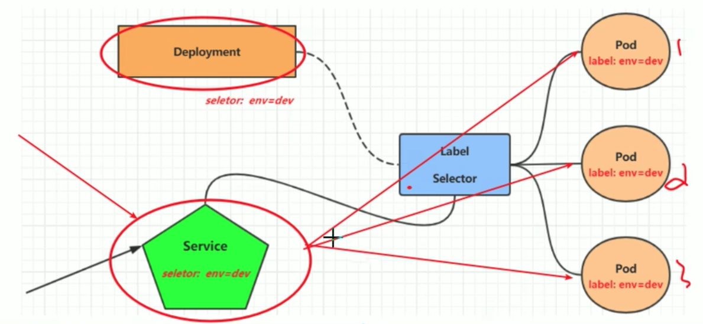

如上图所示，Deployment创建了三个Pod，当外部请求进来的时候，请求会首先到达Service，Service根据标签选择器，去选择对应的Pod来处理。**在Service的整个生命周期，其IP地址都不会变。**

#### （2）暴露Service

- 命令行创建

```bash
# --name: svc名称
# --port: Service监听的端口
# --target-port: 转发给pod的端口
# --type: ip类型
[haojie@manager ~]$ kubectl expose Deployment nginx --name=svc-nginx1 --type=ClusterIP --port=80 --target-port=80 -n dev
service/svc-nginx1 exposed
```

这里是对nginx这个Deployment来进行Service暴露。**另外`type=ClusterIP`，是只有集群内的机器可以访问，如果想要机器外的可以访问，需要设置为`type=NodePort`类型。**

```bash
[haojie@manager ~]$ kubectl expose Deployment nginx --name=svc-nginx2 --type=NodePort --port=80 --target-port=80 -n dev
service/svc-nginx2 exposed
```

此时在集群外，可以通过**节点IP+端口**进行访问，注意不是CLUSTER-IP+端口。

- yaml文件创建

```yaml
# svc的配置
apiVersion: v1  # 注意这个是v1
kind: Service
metadata:
  name: svc-nginx
  namespace: dev
# 相当于命令行后面的--，额外参数
spec:
  ports:
  - port: 80
    protocol: TCP
    targetPort: 80
  selector:
    run: nginx
  type: ClusterIP  
```

创建的命令和之前的一样

```bash
[haojie@manager ~]$ kubectl create -f svc.yml
service/svc-nginx created
[haojie@manager ~]$ kubectl get svc -n dev
NAME        TYPE        CLUSTER-IP    EXTERNAL-IP   PORT(S)   AGE
svc-nginx   ClusterIP   10.97.50.53   <none>        80/TCP    11s
```

#### （3）查看Service

```bash
[haojie@manager ~]$ kubectl get svc -n dev
NAME         TYPE        CLUSTER-IP       EXTERNAL-IP   PORT(S)        AGE
svc-nginx1   ClusterIP   10.109.193.239   <none>        80/TCP         112s
svc-nginx2   NodePort    10.106.229.214   <none>        80:30183/TCP   67s
```

此时通过前端访问到nginx服务

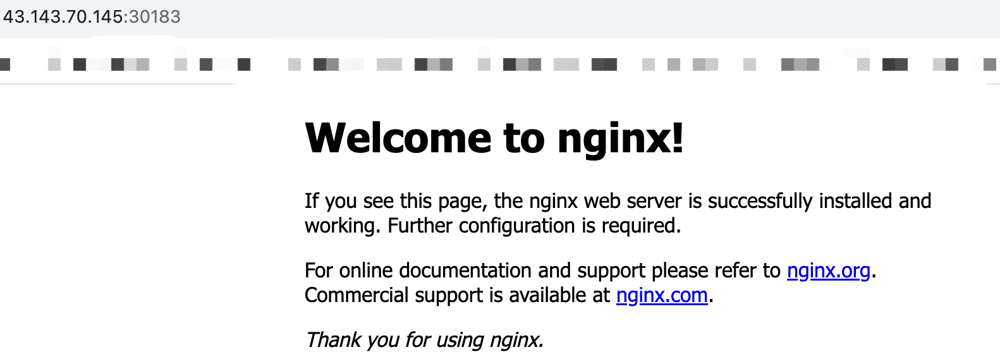

#### （4）访问Service

集群内`type=ClusterIP`

```bash
curl 10.99.53.1:80
```

集群外`type=NodePort`

```bash
curl 10.103.78.97:31667
```

#### （5）删除Service

```bash
[haojie@manager ~]$ kubectl delete svc svc-nginx1 -n dev
service "svc-nginx1" deleted
[haojie@manager ~]$ kubectl delete svc svc-nginx2 -n dev
service "svc-nginx2" deleted
```

### 2. Ingress

### 3. NodeIP, PodIP, ClusterIP

k8s中存在着几个IP，分别为NodeIP，PodIP，ClusterIP

- Node IP：Node节点的IP地址，即物理网卡的IP地址。
- Pod IP：Pod的IP地址，即docker容器的IP地址，此为虚拟IP地址。
- Cluster IP：Service的IP地址，此为虚拟IP地址。

1、NodeIP

Node节点的IP地址，即物理网卡的IP地址。

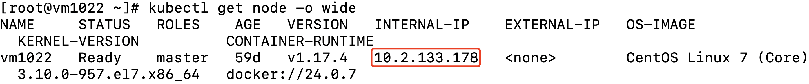

2、Pod IP

Pod IP是每个Pod的IP地址，他是Docker Engine根据docker网桥的IP地址段进行分配的，通常是一个虚拟的二层网络

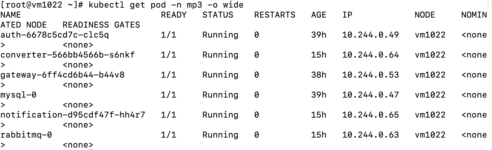

- 同Service下的pod可以直接根据PodIP相互通信
- 不同Service下的pod在集群间pod通信要借助于 cluster ip
- pod和集群外通信，要借助于node ip

3、Cluster IP


### 4. DNS


## 八、k8s存储

参考https://yuminlee2.medium.com/kubernetes-storage-fe5363d88d42

### 1. 卷和挂载

按照k8s官方文档的说法，卷(volumes)的本质是一个目录，其中可能包含一些数据，Pod 中的容器可以访问该目录。卷(volumes)和挂载(volumeMounts)的关系可以理解为：卷是一个光驱，挂载则是把这个光驱给加载进来。

在yaml文件中，`volume` 字段用于定义一个卷，指定了存储数据的类型和配置。使用 `volumeMounts` 字段来指定将哪个卷挂载到容器的哪个路径上。例如下面的例子，定义了一个名为data-volume的卷，类型为hostPath，使用的是主机上的/mnt/data这个路径。

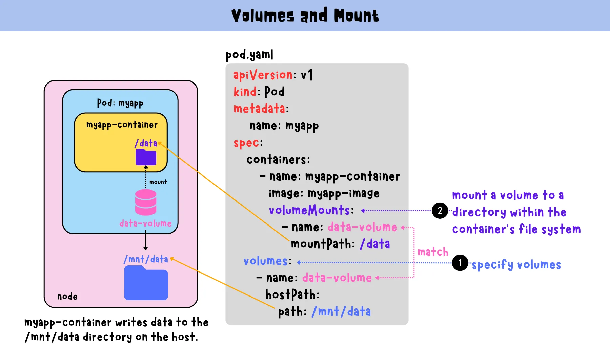

相比PV和PVC，直接使用Volume的主要劣势在于：

1. 会增加应用程序的复杂性，因为它们需要单独管理每个 Pod 的存储要求。

### 2. pv和pvc

#### （1）pv和pvc概念

PV(PersistentVolume)持久化卷，PVC(PersistentVolumeClaim)。

PV是集群中配置的存储资源，它具有独立于使用它的 Pod 的生命周期，**即使 Pod 被删除，数据也可以保留**， PV 可以是物理磁盘或基于云的存储资源。

PVC是用户对存储的请求，**使用的时候只需要发出PVC请求，而无需知道存储来自何处的详细信息，k8s控制平面找到满足声明要求的可用 PV，并将声明绑定到 PV**。

通俗理解，pv就是存储资源，例如硬盘、云存储等等，而pvc则负责“报价”即可：我需要的存储是多少。例如下图中的my-pvc，它的要求是存储为5Gi，此时k8s会从所有的存储资源中找合适的pv来满足它的要求。

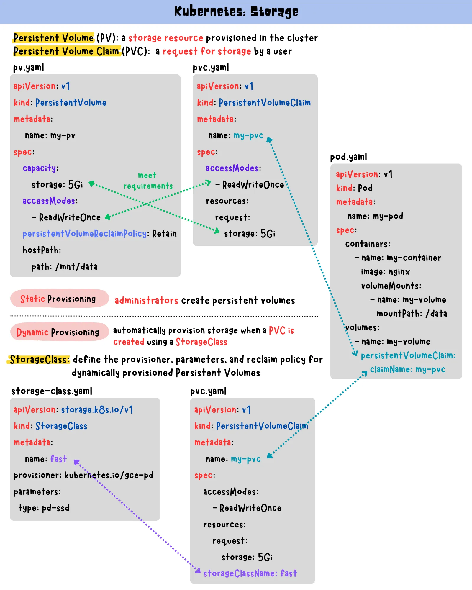

 k8s中PV和PVC之间是一对一的关系。一旦PVC绑定到PV，其他PVC就不能绑定到同一PV。

#### （2）pv和pvc参数

1、volumeMode：用于指定挂载到Pod中的Volume的模式，有两个选项

- Filesystem：默认是这个，表示Volume将以文件系统的形式挂载到Pod中。

- Block：以块设备的形式。

2、accessModes：用于指定访问PV/PVC的模式

- ReadWriteOnce：表示该存储可以被单个节点挂载为读写模式
- ReadOnlyMany：表示该存储可以被多个节点挂载为只读模式
- ReadWriteMany：表示该存储可以被多个节点挂载为读写模式

3、persistentVolumeReclaimPolicy：用于指定PV回收策略的参数，当PV释放后应该如何处理PV中的数据。

- Retain: 表示当PV释放后，保留其数据。PV的数据不会被删除，需要管理员手动处理。这个选项通常用于需要手动审查和清理数据的情况。
- Delete: 表示当PV释放后，删除其数据。PV释放后，其中的数据将被立即删除。

4、storageClassName：参考下面StorageClass

### 3. 存储类

#### （1）存储类概念

为什么要有存储类(StorageClass)？前面PV/PVC模型，有个缺陷是需要手动的去创建PV，而PV的创建，在项目中通常是需要管理员在项目初期进行资源规划和管理的。

存储类(StorageClass)的出现就是去解决这一问题的，如下图所示，对于开发者来说，当在PVC中指定了存储类之后，它便不需要手动去创建PV，**而是由存储类里的制备器根据需求去动态制备PV**。

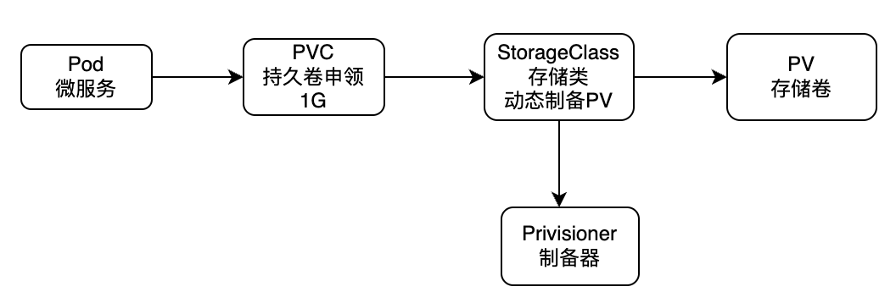

#### （2）制备器

参考https://kubernetes.io/docs/concepts/storage/storage-classes/#provisioner

制备器有k8s官方的，以`kubernetes.io`开头，例如使用本地文件系统可以使用`kubernetes.io/no-provisioner`，也可以使用外部的，例如NFS就没有官方的制备器。

### 4. 使用nas挂载

卷和pv都可以使用nas挂载，下面以卷为例

```yaml
apiVersion: apps/v1
kind: Deployment
metadata:
  name: mysql
  namespace: mp3
spec:
  selector:
    matchLabels:
      app: mysql
  replicas: 1
  template:
    metadata:
      labels:
        app: mysql
    spec:
      containers:
        - name: mysql
          image: mysql:latest
          volumeMounts:
            - name: nfs-volume
              mountPath: /var/lib/mysql
      volumes:
      - name: nfs-volume
        nfs:
          server: 10.2.11.226
          path: /sdsfs/nfs-wkocr/volume_test
```

由于将`10.2.11.226:/sdsfs/nfs-wkocr`挂载到`/datagrand`目录，因此我们将`/datagrand/volume_test`这个目录作为挂载目录，这里等效于nfs的path就是`/sdsfs/nfs-wkocr/volume_test`，可以看到此时已经挂载好了。

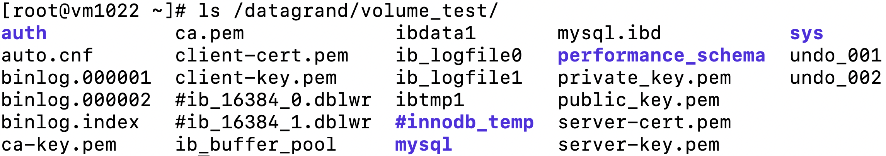

使用pv/pvc接入nas

（1）pv

```yaml
apiVersion: v1
kind: PersistentVolume
metadata:
  name: my-pv
  namespace: mp3
spec:
  capacity:
    storage: 50G
  volumeMode: Filesystem
  accessModes:
    - ReadWriteMany
  persistentVolumeReclaimPolicy: Retain
  nfs:
    server: 10.2.11.226
    path: /sdsfs/nfs-wkocr/volume_test
```

（2）pvc

```yaml
apiVersion: v1
kind: PersistentVolumeClaim
metadata:
  name: my-pvc
  namespace: mp3
spec:
  accessModes:
    - ReadWriteMany
  volumeMode: Filesystem
  resources:
    requests:
      storage: 50G
```

（3）Deployment

```yaml
apiVersion: apps/v1
kind: Deployment
metadata:
  name: mysql
  namespace: mp3
spec:
  selector:
    matchLabels:
      app: mysql
  replicas: 1
  template:
    metadata:
      labels:
        app: mysql
    spec:
      containers:
        - name: mysql
          image: mysql:latest
          imagePullPolicy: Never
          envFrom:
            - configMapRef:
                name: mysql-configmap
            - secretRef:
                name: mysql-secret
          volumeMounts:
            - name: mysql-volume
              mountPath: /var/lib/mysql
              subPath: mysql
      volumes:
      - name: mysql-volume
        persistentVolumeClaim:
          claimName: my-pvc
```

在建投这里还有一个更妙的设计，nas被k8s集群和挂载服务器同时挂载

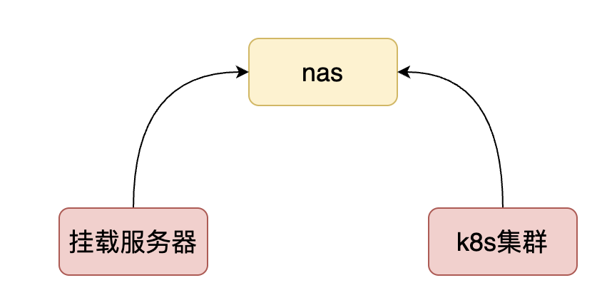

我们可以在挂载服务器上做一个挂载，例如建投这边是这样的

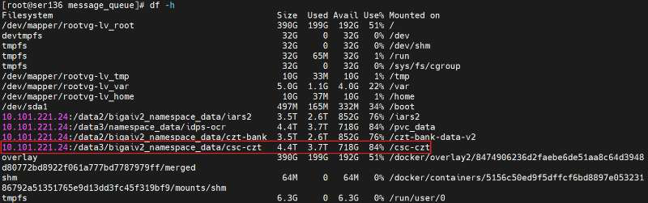

在k8s平台上，把nas相同的路径在上面进行挂载，就可以让挂载服务器和k8s拿到相同的数据了。

## 九、常见问题

### 1. pod

1、k8s为什么不是直接运行容器，而是让Pod介入？为什么在应用容器化如此普遍的情况下k8s要推出Pod概念？

```bash
答：最主要的原因是一个Pod可能包含多个容器，执行不同的操作。例如，在一个pod中，可能会有一个init-container，它负责做一些启动操作，初始化容器加载一些配置，以确保主容器正常工作。
```

> 参考https://stackoverflow.com/a/66043526/10844937

2、什么情况下，需要在一个pod内创建多个容器？

1. 把多个容器放到一个pod中，有什么好处，可以举例说明吗？
2. Web应用程序容器和数据库容器放在一个pod中，比放在不同的pod中，有啥优势呢？

### 2. pod控制器

1. 有哪些pod控制器？
2. 什么时候该用哪种pod控制器？
3. 为什么要用pod控制器，不直接使用pod？

### 3. 其他

1. 如何使用configMap？
2. k8s为什么需要做域名解析？
3. k8s的网络了解多少？
4. ingress的作用是什么？


