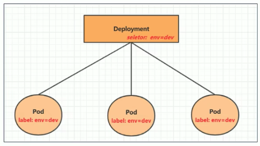
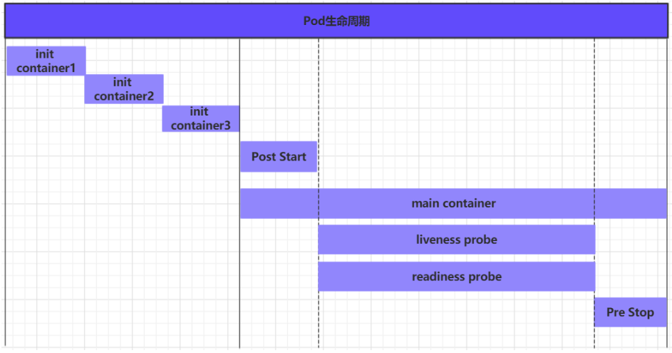

# k8s

## 一、 k8s简介

### 1. 为什么需要k8s?

因为采用容器部署，会出现如下问题：

- 一个容器故障停机了，怎么让另外一个容器去替补停机的容器
- 如果并发访问量突然增大，怎么横向扩展容器数量。访问量恢复正常之后，怎么恢复正常数目的容器数。

要解决这些问题，就需要用到容器编排软件。常见的容器编排工具有k8s，docker swarm。

### 2. k8s介绍

k8s本质是**一组服务器集群**，它提供了如下功能：

- 自我修复：一旦某一个容器崩溃，能够在1秒中左右迅速启动新的容器
- 弹性伸缩：可以根据需要，自动对集群中正在运行的容器数量进行调整。例如前面提到的请求突然增多，此时可以将容器数量增多。
- 服务发现：服务可以通过自动发现的形式找到它所依赖的服务。例如在集群中，web服务需要mysql和redis帮助，它可以在内部，以自动发现的形式，去寻找mysql和redis容器。
- 负载均衡：如果一个服务起动了多个容器，能够自动实现请求的负载均衡。注意：这个请求不仅仅只是web请求。
- 版本回退：如果发现新发布的程序版本有问题，可以立即回退到原来的版本。
- 存储编排：可以根据容器自身的需求自动创建存储卷。

### 3. k8s组件

k8s分为master和node


#### （1）控制节点master

master：集群的控制平面，负责集群的决策。通俗来说就是管理的。它有四大组件：

- ApiServer：资源操作的唯一入口，接收用户输入的命令，提供认证、授权、API注册和发现等机制。**可以在这里做鉴权等操作。**
- Scheduler：负责集群资源调度，按照预定的调度策略将Pod调度到相应的node节点上。通俗的说就是**由它来计算该谁干活**，因为ApiServer并不会去算。
- ControllerManager：负责维护集群的状态，比如程序部署安排、故障检测、自动扩展、滚动更新等。通俗的说就是**由它来安排该谁干活**，Scheduler只算不安排。
- Etcd：负责存储集群中各种资源对象的信息，它是一个数据库。通俗的说就是**它来记录现在谁在干活**，也可以用其他数据库mysql等，k8s默认是Etcd。

#### （2）工作节点node

node：集群的数据平面，负责为容器提供运行环境。通俗来说就是干活的。

- Kubelet：**负责维护容器的生命周期，即通过控制docker，来创建、更新、销毁容器**。通俗理解**它就是对接人，负责和master对接**，收到任务之后，它来把docker跑起来。  
- KubeProxy：负责提供集群内部的**服务发现和负载均衡**。需要注意的是，ApiServer是整个控制的访问入口，而KubeProxy是程序的入口。
- Docker：负责节点上容器的各种操作

#### （3）实例

下面是一个nginx部署实例来说明kubernetes系统各个组件调用关系：

1. k8s启动之后，master和node会将自身的信息存储到etcd数据库中。通俗来说，要通过记录数据库，知道自己管理多少人干活。
2. 一个nginx服务的安装请求会首先被发送到master节点的apiServer组件。
3. apiServer组件会调用scheduler组件来决定到底应该把这个服务安装到哪个node节点上。此时，scheduler会从etcd中读取各个node节点的信息，然后按一定的算法进行选择，并将结果告知apiServer
4. apiServer调用controller-manager去调度Node节点安装nginx服务。
5. kubelet接收到指令后，会通知docker，然后由docker来启动一个nginx的pod。pod是kubernetes的最小操作单元，容器必须跑在pod中。
6. 一个nginx服务就运行了，如果需要访问nginx，就需要通过kube-proxy来对pod产生访问的代理

这样，外界用户就可以访问集群中的nginx服务了

### 4. k8s基本概念

#### （1）Master

集群控制节点，每个集群需要至少一个master节点负责集群的管控

#### （2）Node

工作负载节点，由master分配容器到这些node工作节点上，然后node节点上的docker负责容器的运行

#### （3）Pod

kubernetes的最小控制单元，容器都是运行在pod中的，一个pod中可以有1个或者多个容器

#### （4）Controller

pod虽然是k8s的最小控制单元，但是k8s很少直接控制pod。而是通过控制器来实现对pod的管理，比如启动pod、停止pod、伸缩pod的数量等等。

#### （5）Service

pod对外服务的统一入口。例如下图中，**需要用到service，将外界的流量引进来**，交给tomcat，**通过service可以实现复杂均衡的效果**。


#### （6）Label

标签，用于对pod进行分类，同一类pod会拥有相同的标签。例如上图中，有三个pod是app:tomcat，**在service中，会定义一个选择器，根据标签对service进行选择**

#### （7）NameSpace

命名空间，用来隔离pod的运行环境。不同的namespace不能相互访问，类似于计算机网络中的vlan。

## 二、集群环境搭建

### 1. 部署方式

- minikube：快速搭建单节点k8s的工具
- kubeadm：搭建kubenetes集群的工具
- 二进制包：依次下载每个组件的二进制包

这里采用第二种方式，并且采用两台服务器，华为云(centos)和腾讯云(centos)。

### 2. 环境初始化

以下所有命令需要在master和node节点上执行

#### （1）禁用磁盘拷贝

```
sudo swapoff -a
```

#### （2）主机名解析

```bash
sudo vim /etc/hosts
43.143.70.145 master
121.41.55.89 node1
```

#### （3）禁用防火墙

```bash
sudo setenforce 0
sudo sed -i --follow-symlinks 's/SELINUX=enforcing/SELINUX=disabled/g' /etc/sysconfig/selinux
sudo systemctl stop firewalld
sudo systemctl disable firewalld
```

### 3. 安装组件

#### （1）安装docker相关

docker之前安装过，不再赘述，但是后续操作还需要执行

- 更改镜像源

```bash
cat <<EOF > daemon.json
{
  "exec-opts": ["native.cgroupdriver=systemd"],
  "registry-mirrors": ["https://ud6340vz.mirror.aliyuncs.com"]
}
EOF
```

- 镜像源移动到对应目录下

```bash
sudo mv daemon.json /etc/docker/
```

- 重启

```bash
sudo systemctl daemon-reload

sudo systemctl restart docker
```

#### （2）安装k8s相关

- 更改镜像源

```bash
cat <<EOF > kubernetes.repo
[kubernetes]
name=Kubernetes
baseurl=https://mirrors.aliyun.com/kubernetes/yum/repos/kubernetes-el7-x86_64
enabled=1
gpgcheck=0
repo_gpgcheck=0
gpgkey=https://mirrors.aliyun.com/kubernetes/yum/doc/yum-key.gpg https://mirrors.aliyun.com/kubernetes/yum/doc/rpm-package-key.gpg
EOF
```

- 移动镜像源

```bash
sudo mv kubernetes.repo /etc/yum.repos.d/
```

- 安装组件

```bash
sudo yum install yum-utils
sudo yum-config-manager --add-repo http://mirrors.aliyun.com/docker-ce/linux/centos/docker-ce.repo
sudo yum install -y kubelet-1.22.4 kubectl-1.22.4 kubeadm-1.22.4 docker-ce
```

> 注意：两个节点要安装一样的版本

- 重启

```bash
sudo systemctl enable kubelet
sudo systemctl start kubelet
sudo systemctl enable docker
sudo systemctl start docker
```

###  4. 集群安装

#### （1）拉取镜像

- 查看初始化需要的镜像

```
[haojie@manager ~]$ kubeadm config images list
k8s.gcr.io/kube-apiserver:v1.22.17
k8s.gcr.io/kube-controller-manager:v1.22.17
k8s.gcr.io/kube-scheduler:v1.22.17
k8s.gcr.io/kube-proxy:v1.22.17
k8s.gcr.io/pause:3.5
k8s.gcr.io/etcd:3.5.0-0
k8s.gcr.io/coredns/coredns:v1.8.4
```

- 替换镜像

```bash
[haojie@manager ~]$ vim kubeadm-config-image.yaml

apiVersion: kubeadm.k8s.io/v1beta2
kind: ClusterConfiguration
# 默认为k8s.gcr.io，但是网络不通，所以要替换为阿里云镜像
imageRepository: registry.aliyuncs.com/google_containers
```

- 检查是否替换成功

```bash
[haojie@manager ~]$ kubeadm config images list --config kubeadm-config-image.yaml
registry.aliyuncs.com/google_containers/kube-apiserver:v1.22.17
registry.aliyuncs.com/google_containers/kube-controller-manager:v1.22.17
registry.aliyuncs.com/google_containers/kube-scheduler:v1.22.17
registry.aliyuncs.com/google_containers/kube-proxy:v1.22.17
registry.aliyuncs.com/google_containers/pause:3.5
registry.aliyuncs.com/google_containers/etcd:3.5.0-0
registry.aliyuncs.com/google_containers/coredns:v1.8.4
```

- 拉取镜像

```bash
[haojie@manager ~]$ kubeadm config images pull --config kubeadm-config-image.yaml
```

> 注意：在两个节点上都需拉取镜像

#### （2）初始化集群

在云上部署集群，和在虚拟机里面完全不一样，具体参考https://blog.csdn.net/xmcy001122/article/details/127221661

- 生成默认配置

```bash
$ kubeadm config print init-defaults > kubeadm-config.yaml
```

- 修改配置

```bash
...
localAPIEndpoint:
  advertiseAddress: 121.36.104.55  # 修改为本机地址
  bindPort: 6443
nodeRegistration:
  criSocket: /var/run/dockershim.sock
  imagePullPolicy: IfNotPresent
  name: manager   # 修改为本机hostname
  taints: null
---
etcd:
  local:
    dataDir: /var/lib/etcd
imageRepository: registry.aliyuncs.com/google_containers  # 修改为阿里云
...
```

- 检查环境

```bash
$ kubeadm init phase preflight --config=kubeadm-config.yaml
```

- 初始化集群

```bash
$ kubeadm init --config=kubeadm-config.yaml
```

注意，这里一定会失败，但是不要紧。这次失败是为后续打基础。

- 编辑etcd配置文件

```bash
$ sudo vim /etc/kubernetes/manifests/etcd.yaml
```

将

```bash
- --listen-client-urls=https://127.0.0.1:2379,https://101.34.112.190:2379    
- --listen-peer-urls=https://101.34.112.190:2380
```

改为

```bash
- --listen-client-urls=https://127.0.0.1:2379
- --listen-peer-urls=https://127.0.0.1:2380
```

- 停止已启动的进程

```bash
# 先停止kubelet
$ systemctl stop kubelet 
# 把所有kube的进程杀掉
$ sudo netstat -anp |grep kube
```

注意，一定不要执行 `sudo kubeadm reset`，先 `systemctl stop kubelet `，然后手动通过 `netstat -anp |grep kube` 来找pid，再通过 `kill -9 pid` 强杀。否则又会`生成错误的etcd配置文件`，这里非常关键！

- 重新初始化

```bash
$ systemctl start kubelet
$ kubeadm init --config=kubeadm-config.yaml --skip-phases=preflight,certs,kubeconfig,kubelet-start,control-plane,etcd
```

如果一切正常，会有下面的输出

```bash
Your Kubernetes control-plane has initialized successfully!

To start using your cluster, you need to run the following as a regular user:

  mkdir -p $HOME/.kube
  sudo cp -i /etc/kubernetes/admin.conf $HOME/.kube/config
  sudo chown $(id -u):$(id -g) $HOME/.kube/config

Alternatively, if you are the root user, you can run:

  export KUBECONFIG=/etc/kubernetes/admin.conf

You should now deploy a pod network to the cluster.
Run "kubectl apply -f [podnetwork].yaml" with one of the options listed at:
  https://kubernetes.io/docs/concepts/cluster-administration/addons/

Then you can join any number of worker nodes by running the following on each as root:

kubeadm join 121.36.104.55:6443 --token abcdef.0123456789abcdef \
    --discovery-token-ca-cert-hash sha256:af2a6e096cb404da729ef3802e77482f0a8a579fa602d7c071ef5c5415aac748
```

> 注意，这里的ip是master的ip才是正确的

#### （3）加入集群

在node节点上执行

```bash
kubeadm join 121.36.104.55:6443 --token abcdef.0123456789abcdef \
    --discovery-token-ca-cert-hash sha256:af2a6e096cb404da729ef3802e77482f0a8a579fa602d7c071ef5c5415aac748
```

此时执行`kubectl get nodes`可以看到两个节点都加入进去了

```bash
[haojie@manager ~]$ kubectl get nodes
NAME      STATUS     ROLES                  AGE   VERSION
manager   NotReady   control-plane,master   13h   v1.22.4
node01    NotReady   <none>                 12h   v1.22.4
```

此时状态都还是NotReady，需要安装插件。

#### （4）网络插件安装

在master节点执行下面操作即可

```bash
kubectl apply -f https://docs.projectcalico.org/manifests/calico.yaml
```

等几分钟，就会发现状态变成Ready了

#### （5）创建必要文件

这个文件是`kubectl`命令要读取的配置文件

```bash
mkdir -p $HOME/.kube
sudo cp -i /etc/kubernetes/admin.conf $HOME/.kube/config
sudo chown $(id -u):$(id -g) $HOME/.kube/config
```

#### （6）环境测试

- 部署nginx

```bash
kubectl create deployment nginx --image=nginx:1.14-alpne
```

- 暴露端口

```bash
kubectl expose deployment nginx --port=80 --type=NodePort
```

- 查看服务状态

```bash
# 注意","两边不要有空格
[haojie@manager ~]$ kubectl get pods,service
NAME                         READY   STATUS    RESTARTS   AGE
pod/nginx-65c4bffcb6-872tv   1/1     Running   0          2d4h

NAME                 TYPE        CLUSTER-IP      EXTERNAL-IP   PORT(S)        AGE
service/kubernetes   ClusterIP   10.96.0.1       <none>        443/TCP        2d18h
service/nginx        NodePort    10.102.148.40   <none>        80:31724/TCP   2d4h
```

- 在页面上查看nginx服务

目前这里有个问题，可以通过腾讯云的ip+port访问，但是不能通过华为云的ip+port访问。服务是分配给了腾讯云，但是无论是k8s，还是swarm都可以端口共享，应该不存在这个问题。

腾讯云


华为云：端口30161暴露了

```bash
[haojie@manager ~]$ sudo lsof -i:30161
COMMAND     PID USER   FD   TYPE  DEVICE SIZE/OFF NODE NAME
kube-prox 27205 root   12u  IPv4 6482384      0t0  TCP *:31724 (LISTEN)
```

但是telnet 30161这个端口不通

```bash
[haojie@node01 ~]$ telnet 121.36.104.55 30161
Trying 121.36.104.55...
telnet: connect to address 121.36.104.55: Connection timed out
```

## 三、资源管理

### 1. 什么是资源？

**在k8s中，所有的内容都抽象为资源，用户需要通过操作资源来管理k8s**。

k8s的本质是一个集群系统，用户可以在集群中部署各种服务，**所谓的部署服务，其实就是在k8s集群中运行一个个的容器**，并将指定的程序跑在容器中。

**k8s的最小管理单元是pod而不是容器**，所以只能将容器放在Pod中，**而k8s一般也不会直接管理Pod**，而是通过**Pod控制器**(例如下图中的6种控制器)来管Pod。

Pod可以提供服务之后，就要考虑如何访问Pod中服务，k8s提供了**Service资源**实现这个功能。


### 2. yaml语言

yaml语言是一个类似于json，xml的标记性语言。yaml语言需要注意以下几点:

- 大小写敏感
- 使用缩进表示层级关系，**缩进的空格数不重要，只要相同的层级的元素左对齐即可**，注意不要使用tab键

yaml支持以下几种数据类型：

- 纯量：单个的，不可再分的值。

  - 字符串：直接写值。如果有特殊字符，用双引号或者单引号包裹。
  - 布尔值：`true`或者`True`
  - 整数：`234`
  - 浮点数：`3.14`
  - Null：使用`~`表示Null
  - 时间：`2023-05-01`,`yyyy-MM-dd`格式
  - 日期：`2023-05-01T15:03:01`

- 对象：键值对的集合

  ```yaml
  heima:
    age: 15
    addr: Beijing
  ```

- 数组：一组按次序排列的值

  ```yaml
  heima:
  	age: 15
  	addr: 
  	   - Beijing
  	   - Shenzhen
  ```

yaml语言可以和json相互转换，见<https://www.json2yaml.com/>

### 3. 资源管理方式

#### （1）命令式对象管理

直接使用命令去操作k8s资源。`kubectl`是k8s集群的命令行工具，通过它可以对集群进行管理，并在集群上进行容器化的安装部署。

```bash
# 前两个参数必须，后两个可选
kubectl [command] [type] [name] [flags]
```

- command: 对资源执行的操作。
  - 基本命令
    - create：创建一个资源
    - get：获取一个资源
    - patch：更新一个资源
    - delete：删除一个资源
    - explain：展示资源文档
  - 运行和调试
    - run：在集群中运行一个指定的镜像
    - expose：暴露资源位Service
    - **describe**：显示资源内部信息。
    - logs：输出容器在pod中的日志
    - attach：进入运行中的容器
    - exec：执行容器中的一个命令
    - **scale**：扩充pod的数量
  - 高级命令
    - apply：通过文件对资源进行配置
    - label：更新资源上的标签
  - 其他命令
    - version：查看版本
    - cluster-info：集群信息
- type: 指定资源类型
  - 集群级别资源
    - nodes：集群组成部分
    - namespaces：隔离pod
  - pod资源
    - pods：装载容器
  - pod资源控制器
    - deployments
    - replicasets
    - jobs
  - 服务发现资源
    - services：统一pod对外接口
    - ingress：统一pod对外接口
  - 存储资源
    - persistentvolumes：存储
  - 配置资源
    - configmaps：配置
    - secrets：配置
- name: 指定资源的名称，名称大小写敏感
- flags: 指定额外的可选参数

#### （2）命令式对象配置

通过命令配置和配置文件去操作k8s资源。

例子：

```yaml
apiVersion: v1
kind: Namespace
metadata:
	name: dev
	
--- 

apiVersion: v1
kind: Pod
metadata:
	name: nginxpod
	namespace: dev
spec:
	containers:
		- name: nginx-containers
			image: nginx:1.17.1
```

- 创建：`kubectl create -f nginx-pod.yaml`，创建一个namespace和一个pod。
- 删除：`kubectl delete -f nginx-pod.yaml`，删除namespace和一个pod。

这种方式可以认为是`命令+yaml文件`

#### （3）声明式对象配置

通过**`apply`命令**和配置文件去操作k8s资源，这种方式仅用于新增和更新。

- 首先执行`kubectl apply -f nginx-pod.yaml`，发现创建了资源。
- 然后再次执行`kubectl apply -f nginx-pod.yaml`，**发现说资源没有变动**。如果我们修改yaml文件里面的内容，此时会提示已更新。

总结：**当资源不存在时，`apply`命令相当于创建，等于`create`。如果资源存在，就更新，相当于`patch`**。

#### （4）总结

- 创建/更新资源，使用声明式对象配置，采用`kubectl apply -f XXX.yaml`
- 删除资源，采用命令式对象配置，`kubectl delete -f XXX.yaml`
- 查询资源，采用命令式对象管理，`kubectl get 资源名称`

## 四、实战入门

### 1. Namespace

#### （1）作用

主要作用是实现多套环境的资源隔离。 默认情况下，k8s中所有的pod是可以相互访问的，如果不想让两个pod相互访问，此时可以将它们放到两个Namespace中。


```bash
# kubectl get ns                  
NAME              STATUS   AGE
default           Active   28d
dev               Active   14m
ingress-nginx     Active   26d
kube-node-lease   Active   28d
kube-public       Active   28d
kube-system       Active   28d  # 所有集群组件会在这里
```

所有**未指定Namespace的对象都会被分配到default的Namespace中**。例如如果我们创建一个pod，没有指定namespace，那么它会自动分配给default，因此**每个pod都有namespace**。

#### （2）查看Namespace

```bash
kubectl get ns default  # 查看命名空间
kubectl describe ns default  # 描述命名空间
```

#### （3）创建Namespace

```
kubectl create ns default
```

#### （4）删除Namespace

```
kubectl delete ns default
```

#### （5）指定Namespace

当我们查询资源时，如果不指定`-n namespace`，**那么它默认使用的是default这个namespace**

```bash
[haojie@manager ~]$ kubectl get pods
NAME                     READY   STATUS    RESTARTS   AGE
nginx-6799fc88d8-vljg6   1/1     Running   0          12m
[haojie@manager ~]$ kubectl get pods -n default
NAME                     READY   STATUS    RESTARTS   AGE
nginx-6799fc88d8-vljg6   1/1     Running   0          15m
```

而系统则有一些pods

```bash
[haojie@manager ~]$ kubectl get pods -n kube-system
NAME                                       READY   STATUS    RESTARTS       AGE
calico-kube-controllers-5d4b78db86-kknjm   1/1     Running   21 (47m ago)   2d5h
calico-node-jhtql                          0/1     Running   0              2d5h
calico-node-xd7xq                          0/1     Running   0              2d5h
coredns-7f6cbbb7b8-2sc94                   1/1     Running   0              2d19h
coredns-7f6cbbb7b8-fft6q                   1/1     Running   0              2d19h
etcd-manager                               1/1     Running   1              2d19h
kube-apiserver-manager                     1/1     Running   19 (48m ago)   2d19h
kube-controller-manager-manager            1/1     Running   4 (99m ago)    2d19h
kube-proxy-4sv7s                           1/1     Running   0              2d19h
kube-proxy-dtj72                           1/1     Running   0              2d18h
kube-scheduler-manager                     1/1     Running   4 (99m ago)    2d19h
```


### 2. Pod

#### （1）作用 

Pod是k8s进行管理的最小单元，**程序要运行必须部署在容器中，而容器必须部署在Pod中， Pod是一个或多个容器的组合**，这些容器共享存储、网络和命名空间，以及如何运行的规范。


k8s在集群启动之后，集群中的各个组件也是以pod方式运行的。

```bash
➜  # kubectl get pod -n kube-system
NAME                               READY   STATUS    RESTARTS       AGE
coredns-787d4945fb-46tj7           1/1     Running   12 (85m ago)   28d
etcd-master                        1/1     Running   13 (85m ago)   28d
kube-apiserver-master              1/1     Running   14             28d
kube-controller-manager-master     1/1     Running   13 (85m ago)   28d
kube-proxy-5xprh                   1/1     Running   13 (85m ago)   28d
kube-scheduler-master              1/1     Running   12 (85m ago)   28d
storage-provisioner                1/1     Running   23 (85m ago)   28d
```

可以看到第一节介绍的apiserver，controller-manager，scheduler等组件。

#### （2）创建并运行pod

k8s没有单独命令来单独运行pod的命令，都是通过pod控制器来实现的。# todo，后面把这里的意思补充一下。

```bash
# 前面介绍过，run是在集群中运行一个指定的镜像
kubectl run nginx --image=nginx:1.17.1 --port=80 --namespace dev
```

#### （3）查看pod

```bash
kubectl get pods -n dev # 查看pod
kubectl get pods -n dev -o wide # 查看pod更详细的信息
kubectl describe pod nginxpod -n dev  # 描述信息,启动的时候如果有报错，可以通过这个命令看到
```

> 注意都要指定namespace，即加上`-n`参数 

#### （4）访问pod

一个正在跑的程序如果无法访问，是没有任何意义的。`kubectl get pods -n dev -o wide`可以拿到pod的ip地址

```bash
➜  # kubectl get pods -n dev -o wide     
NAME       READY   STATUS    RESTARTS   AGE   IP             NODE       NOMINATED NODE   READINESS GATES
nginx      1/1     Running   0          12m   10.244.0.144   minikube   <none>           <none>
nginxpod   1/1     Running   0          53m   10.244.0.143   minikube   <none>           <none>
```

访问的时候，可以通过`curl 10.244.0.144:80`来实现

#### （5）删除pod

```bash
kubectl delete pod nginx -n dev
```

### 3. Label

#### （1）作用

在资源上添加标识，用来对资源进行区分和选择，方便我们对这些资源对象进行统一的操作，例如删除等。和Namespace不同的是，**不同的Namespace之间不能相互访问，但是不同的标签之间可以相互访问**。Label的特点：

- 以键值对的形式附加到对象上，例如`"version":"release"`
- 一个资源对象可以定义多个Label，一个Label可以被添加到任意数量的资源对象上

#### （2）Label选择器

标签定义完成后，还要考虑到标签的选择，可以用到Label Selector，k8s目前有两种Label Selector

- 基于等式的：`name=slave`，选择所有`key=name`和`value=slave`的对象
- 基于集合的：`name in (master, slave)`，选择所有`key=name`和`value=slave`或者`value=master`的对象。

#### （3）新建Label

```bash
# pod ngingxpod，资源类型和资源名称
# -n dev，哪个Namespace
# version=1.0，标签名称
kubectl label pod nginxpod -n dev version=1.0
```

#### （4）查看Label

```bash
➜  # kubectl get pod nginxpod -n dev --show-labels
NAME       READY   STATUS    RESTARTS       AGE   LABELS
nginxpod   1/1     Running   1 (7m6s ago)   12h   version=1.0
```

#### （5）更新Label

```bash
kubectl label pod nginxpod -n dev version=2.0 --overwrite
```

如果是新增一个key-value，直接用打标签的命令即可，不用加`--overwrite`

```bash
# 新增标签
kubectl label pod nginxpod -n dev name=backend
# 查看
➜  # kubectl get pod nginxpod -n dev --show-labels 
NAME       READY   STATUS    RESTARTS      AGE   LABELS
nginxpod   1/1     Running   1 (11m ago)   12h   name=backend,version=2.0
```

#### （6）筛选Label

```bash
kubectl get pods -l "version=2.0" -n dev --show-labels
```

#### （7）删除Label

```bash
# 删除掉nginxpod这个pod的name标签
kubectl label pod nginxpod -n dev name-
```

### 4. Deployment

#### （1）作用

k8s中，Pod是最小的控制单元，**但是k8s很少直接控制Pod，一般都是通过Pod控制器来完成的**。Pod控制器用于pod的管理，确保pod资源符合预期(例如想要三个pod运行nginx服务)的状态，当pod资源出现故障时，会尝试进行重启或重建pod。

k8s有多种Pod控制器，Deployment就是其中一种。



#### （2）创建Deployment

创建Deployment的命令实际上在前面已经有写过

```bash
# kubectl run deployment，这里的nginx其实是deployment名称
# --image 指定pod的镜像
# --replicas 指定副本数
kubectl run nginx --image=nginx:1.17.1 --port=80 --replicas=3 -n dev
```

> 注意，有些时候需要写成 -- replicas=3，https://stackoverflow.com/a/67136382/10844937 

在高版本的k8s中，不能用上述的方式，而需要用如下命令

```bash
kubectl create deployment nginx --image=nginx:1.17.1 --port=80 --replicas=3 -n dev
```

#### （3）查看Deployment

```bash
➜  # kubectl get deployment -n dev
NAME    READY   UP-TO-DATE   AVAILABLE   AGE
nginx   3/3     3            3           2m21s
```

也可以一起看deployment和pod，更好理解这种关系

```bash
➜  # kubectl get deployment,pod -n dev
NAME                    READY   UP-TO-DATE   AVAILABLE   AGE
deployment.apps/nginx   3/3     3            3           3m17s

NAME                         READY   STATUS    RESTARTS   AGE
pod/nginx-54c4864cd8-7jvfj   1/1     Running   0          3m17s
pod/nginx-54c4864cd8-b4g56   1/1     Running   0          3m17s
pod/nginx-54c4864cd8-wnfr4   1/1     Running   0          3m17s
```

查看deployment的详细信息

```bash
kubectl describe deployment nginx -n dev
```

在创建deployment的时候，**创建出来的三个pod其实是有相同的标签选择器**，见上图

```bash
➜  # kubectl get pods -n dev --show-labels
NAME                     READY   STATUS    RESTARTS   AGE     LABELS
nginx-54c4864cd8-7jvfj   1/1     Running   0          6m51s   app=nginx,pod-template-hash=54c4864cd8
nginx-54c4864cd8-b4g56   1/1     Running   0          6m51s   app=nginx,pod-template-hash=54c4864cd8
nginx-54c4864cd8-wnfr4   1/1     Running   0          6m51s   app=nginx,pod-template-hash=54c4864cd8
```

#### （4）删除Deployment

```bash
# deployment可以简写为deploy
kubectl delete deploy nginx -n dev
```

删除deployment的时候，对应的pod也会被删除

    #### （5）yaml文件创建Deployment

```yaml
apiVersion: apps/v1
kind: Deployment
metadata:
  name: nginx
  namespace: dev
spec:  # 相当于命令行后面的--，额外参数
  replicas: 3  # 副本数
  selector:  # 选择器
    matchLabels:
      run: nginx
  template:  # pod模板, 下面都是定义pod的一些参数
    metadata:
      labels:
        run: nginx
    spec:
      containers:
      - image: nginx:1.17.1
        name: nginx
        ports:
        - containerPort: 80
          protocol: TCP
```

注意上面的template，这个是pod模板。采用`kubectl create -f nginxpod.yaml`即可创建Deployment。

### 5. Service

#### （1）作用

上面利用Deployment可以创建一组pod来提供高可用的服务，但是却存在如下问题

-  Pod IP会随着Pod的重建产生变化
- Pod IP仅仅是集群内可见的虚拟IP，外部无法访问

针对这两个问题，k8s设计了Service来解决这个问题。Service是一组同类Pod**对外的访问接口**，借助Service，应用可以方便地实现服务发现和负载均衡。


如上图所示，Deployment创建了三个Pod，当外部请求进来的时候，会到达Service，Service根据标签选择器，去选择对应的Pod来处理。

#### （2）暴露Service

```bash
# port, Service监听的端口
# target-port, 转发给Service的端口
# type: ClusterIP, ip类型
kubectl expose deployment nginx --name=svc-nginx1 --type=ClusterIP --port=80 --target-port=80 -n dev
```

这里是对nginx这个Deployment来进行Service暴露。另外`type=ClusterIP`，是只有集群内的机器可以访问，如果想要机器外的可以访问，需要设置为`type=NodePort`类型。

```bash
kubectl expose deployment nginx --name=svc-nginx2 --type=NodePort --port=80 --target-port=80 -n dev
```

#### （3）查看Service

```bash
➜  # kubectl get service -n dev
NAME         TYPE        CLUSTER-IP   EXTERNAL-IP   PORT(S)   AGE
svc-nginx1   ClusterIP   10.99.53.1   <none>        80/TCP    3m50s
svc-nginx2   NodePort    10.103.78.97 <none>        80:31667/TCP   12s
```

#### （4）访问Service

集群内`type=ClusterIP`

```bash
curl 10.99.53.1:80
```

集群外`type=NodePort`

```
curl 10.103.78.97:31667
```

## 三、pod详解

### 1. pod介绍

#### （1）pod结构

每个Pod都可以包含一个或多个容器，这些容器分为两类

- 用户程序所在的容器，数量可多可少
- Pause容器，这是每个Pod都有的根容器，它有两个作用
  1. 以它为依据，评估Pod的健康状态
  2. 在根容器上设置ip，Pod内其他容器都使用此ip


#### （2）pod定义

下面是一个较为完整的定义pod的yaml文件

```yaml
apiVersion: v1 #必选，版本号，例如v1
kind: Pod #必选，资源类型，例如 Pod
metadata: #必选，元数据
  name: string #必选，Pod名称
  namespace: string #Pod所属的命名空间，默认为“default”
  labels: 
    - name: string #自定义标签列表
spec: #必选，Pod中容器的详细定义
  containers: #必选，Pod中容器列表
  - name: string #必选，容器名称
    image: string #必选，容器的镜像名称
    imagePullPolicy: [ Always|Never|IfNotPresent ] #获取镜像的策略
    command: [string] #容器的启动命令列表，如不指定，使用打包时使用的启动命令
    args: [string] #容器的启动命令参数列表
    workingDir: string #容器的工作目录
    volumeMounts: #挂载到容器内部的存储卷配置
    - name: string #引用pod定义的共享存储卷的名称，需用volumes[]部分定义的的卷名
      mountPath: string #存储卷在容器内mount的绝对路径，应少于512字符
      readOnly: boolean #是否为只读模式
    ports: #需要暴露的端口库号列表
    - name: string #端口的名称
      containerPort: int #容器需要监听的端口号
      hostPort: int #容器所在主机需要监听的端口号，默认与Container相同
      protocol: string #端口协议，支持TCP和UDP，默认TCP
    env:   #容器运行前需设置的环境变量列表
    - name: string  #环境变量名称
      value: string #环境变量的值
    resources: #资源限制和请求的设置
      limits:  #资源限制的设置
        cpu: string     #Cpu的限制，单位为core数，将用于docker run --cpu-shares参数
        memory: string  #内存限制，单位可以为Mib/Gib，将用于docker run --memory参数
      requests: #资源请求的设置
        cpu: string    #Cpu请求，容器启动的初始可用数量
        memory: string #内存请求,容器启动的初始可用数量
    lifecycle: #生命周期钩子
        postStart: #容器启动后立即执行此钩子,如果执行失败,会根据重启策略进行重启
        preStop: #容器终止前执行此钩子,无论结果如何,容器都会终止
    livenessProbe:  #对Pod内各容器健康检查的设置，当探测无响应几次后将自动重启该容器
      exec:       　 #对Pod容器内检查方式设置为exec方式
        command: [string]  #exec方式需要制定的命令或脚本
      httpGet:       #对Pod内个容器健康检查方法设置为HttpGet，需要制定Path、port
        path: string
        port: number
        host: string
        scheme: string
        HttpHeaders:
        - name: string
          value: string
      tcpSocket:     #对Pod内个容器健康检查方式设置为tcpSocket方式
         port: number
       initialDelaySeconds: 0       #容器启动完成后首次探测的时间，单位为秒
       timeoutSeconds: 0    　　    #对容器健康检查探测等待响应的超时时间，单位秒，默认1秒
       periodSeconds: 0     　　    #对容器监控检查的定期探测时间设置，单位秒，默认10秒一次
       successThreshold: 0
       failureThreshold: 0
       securityContext:
         privileged: false
  restartPolicy: [Always | Never | OnFailure]  #Pod的重启策略
  nodeName: <string> #设置NodeName表示将该Pod调度到指定到名称的node节点上
  nodeSelector: obeject #设置NodeSelector表示将该Pod调度到包含这个label的node上
  imagePullSecrets: #Pull镜像时使用的secret名称，以key：secretkey格式指定
  - name: string
  hostNetwork: false   #是否使用主机网络模式，默认为false，如果设置为true，表示使用宿主机网络
  volumes:   #在该pod上定义共享存储卷列表
  - name: string    #共享存储卷名称 （volumes类型有很多种）
    emptyDir: {}       #类型为emtyDir的存储卷，与Pod同生命周期的一个临时目录。为空值
    hostPath: string   #类型为hostPath的存储卷，表示挂载Pod所在宿主机的目录
      path: string      　　        #Pod所在宿主机的目录，将被用于同期中mount的目录
    secret:       　　　#类型为secret的存储卷，挂载集群与定义的secret对象到容器内部
      scretname: string  
      items:     
      - key: string
        path: string
    configMap:         #类型为configMap的存储卷，挂载预定义的configMap对象到容器内部
      name: string
      items:
      - key: string
        path: string
```

由于上述文件内容实在较多，当记不住时，可以通过`kubectl explain`来查看每种资源的可配置项

```bash
# 查看pod的一级属性
kubectl explain pod
# 查看pod的medadata，二级属性
kubectl explain pod.metadata
```

### 2. pod的属性

在k8s，基本所有资源的一级属性都是一样的，主要包含5部分：
- apiVersion: 版本，由kubernetes内部定义，版本号必须可以用kubectl api-versions查询到。
- kind: 类型，由kubernetes内部定义，版本号必须可以用kubectl api-resources查询到。
- metadata: 元数据，主要是资源标识和说明，常用的有name、namespace、labels等
- spec: 描述，这是配置中最重要的一部分，里面是对各种资源配置的详细描述
- status: 状态信息，里面的内容不需要定义，由kubernetes自动生成

上面中，最重要的就是spec属性。spec有如下常用的属性

- containers <[]Object> : 容器列表，用于定义容器的详细信息
- nodeName <string>: 当前pod调度到哪个node节点上
- nodeSelector <map[]> : 根据标签进行调度，将pod调度到包含这些label的node上
- hostNetwork <boolean> : 是否使用主机网络模式，默认为false。如果设置为true，表示使用宿主机网络。一般很少改动，都不用宿主机模式。
- volumes <[]Object>: 存储卷，用于定义Pod上面挂在的存储信息
- restartPolicy <string>: 重启策略，表示Pod在遇到故障的时候的处理策略。

其中最重要的是container属性，可以看一下它包含的基本属性

```bash
[root@k8s-master01 ~]# kubectl explain pod.spec.containers
KIND:     Pod
VERSION:  v1
RESOURCE: containers <[]Object>   # 数组，代表可以有多个容器
FIELDS:
   name  <string>     # 容器名称
   image <string>     # 容器需要的镜像地址
   imagePullPolicy  <string> # 镜像拉取策略 
   command  <[]string> # 容器的启动命令列表，如不指定，使用打包时使用的启动命令
   args     <[]string> # 容器的启动命令需要的参数列表
   env      <[]Object> # 容器环境变量的配置
   ports    <[]Object>     # 容器需要暴露的端口号列表
   resources <Object>      # 资源限制和资源请求的设置
```

#### （1）基本配置(name, image)

创建一个yaml文件，内容如下

```yaml
apiVersion: v1
kind: Pod
metadata:
  name: pod-base
  namespace: dev
  labels:
    user: heima
spec:
  containers:
  - name: nginx
    image: nginx:1.17.1
  - name: busybox
    image: busybox:1.30
```

创建之后，可以查看基本信息

```bash
# 查看Pod状况
# READY 1/2 : 表示当前Pod中有2个容器，其中1个准备就绪，1个未就绪
# RESTARTS  : 重启次数，因为有1个容器故障了，Pod一直在重启试图恢复它
[root@k8s-master01 pod]# kubectl get pod -n dev
NAME       READY   STATUS    RESTARTS   AGE
pod-base   1/2     Running   4          95s

# 可以通过describe查看内部的详情
# 此时已经运行起来了一个基本的Pod，虽然它暂时有问题
[root@k8s-master01 pod]# kubectl describe pod pod-base -n dev
```

#### （2）镜像拉取(imagePullPolicy)

创建pod-imagepullpolicy.yaml文件，内容如下：

```yaml
apiVersion: v1
kind: Pod
metadata:
  name: pod-imagepullpolicy
  namespace: dev
spec:
  containers:
  - name: nginx
    image: nginx:1.17.1
    imagePullPolicy: Always # 用于设置镜像拉取策略
  - name: busybox
    image: busybox:1.30
```

imagePullPolicy，用于设置镜像拉取策略，kubernetes支持配置三种拉取策略：

- Always: 默认值，总是从远程拉取镜像。 **如果镜像版本号是latest, 默认用的是这种策略**
- IfNotPresent: 本地有用本地的, 本地没有拉远程的。**如果镜像版本号是具体的, 默认用的是这种策略**
- Never: 总是从本地拉

#### （3）启动命令(command, args)

在前面的案例中，busybox容器一直没有成功运行，这是因为busybox并不是一个程序，而是类似于一个工具类的集合，k8s集群启动管理后，它会自动关闭。解决方法就是让其一直在运行，这就用到了command配置。

创建pod-command.yaml文件，内容如下：

```yaml
apiVersion: v1
kind: Pod
metadata:
  name: pod-command
  namespace: dev
spec:
  containers:
  - name: nginx
    image: nginx:1.17.1
  - name: busybox
    image: busybox:1.30
    command: ["/bin/sh","-c","touch /tmp/hello.txt;while true;do /bin/echo $(date +%T) >> /tmp/hello.txt; sleep 3; done;"]
```

kubectl命令可以进入pod的某个容器，`kubectl exec  pod名称 -n 命名空间 -it -c 容器名称 /bin/sh`

```bash
# 进入容器
[root@k8s-master01 pod]# kubectl exec pod-command -n dev -it -c busybox /bin/sh
# 容器内
/ # tail -f /tmp/hello.txt
14:44:19
14:44:22
14:44:25
```

通过上面发现command已经可以完成启动命令和传递参数的功能，但是k8s为什么要提供一个args选项呢？，用于传递参数呢?这是因为k8s中的command、args两项其实是实现覆盖Dockerfile中ENTRYPOINT的功能。

- 如果command和args均没有写，那么用Dockerfile的配置。
- 如果command写了，但args没有写，那么Dockerfile默认的配置会被忽略，执行输入的command
- 如果command没写，但args写了，那么Dockerfile中配置的ENTRYPOINT的命令会被执行，使用当前args的参数
- 如果command和args都写了，那么Dockerfile的配置被忽略，执行command并追加上args参数

#### （4）环境变量(env)

用于向容器传递环境变量。

```yaml
apiVersion: v1
kind: Pod
metadata:
  name: pod-env
  namespace: dev
spec:
  containers:
  - name: busybox
    image: busybox:1.30
    command: ["/bin/sh","-c","while true;do /bin/echo $(date +%T);sleep 60; done;"]
    env: # 设置环境变量列表
    - name: "username"
      value: "admin"
    - name: "password"
      value: "123456"
```

一般在pod中不推荐直接写环境变量，更推荐将这些配置单独存储在配置文件中。

#### （5）端口设置(ports)

容器需要暴露的端口号地址

```bash
[root@k8s-master01 ~]# kubectl explain pod.spec.containers.ports
KIND:     Pod
VERSION:  v1
RESOURCE: ports <[]Object>
FIELDS:
   name         <string>  # 端口名称，如果指定，必须保证name在pod中是唯一的		
   containerPort<integer> # 容器要监听的端口(0<x<65536)
   hostPort     <integer> # 容器要在主机上公开的端口，如果设置，主机上只能运行容器的一个副本(一般省略) 
   hostIP       <string>  # 要将外部端口绑定到的主机IP(一般省略)
   protocol     <string>  # 端口协议。必须是UDP、TCP或SCTP。默认为“TCP”。
```
接下来，创建`pod-ports.yaml`

```
apiVersion: v1
kind: Pod
metadata:
  name: pod-ports
  namespace: dev
spec:
  containers:
  - name: nginx
    image: nginx:1.17.1
    ports: # 设置容器暴露的端口列表
    - name: nginx-port
      containerPort: 80
      protocol: TCP
```

访问容器中的程序需要使用的是`Podip:containerPort`

#### （6）资源配额(resources)

对容器做资源限制。如果不对资源做限制，那么它可能会吃掉大量的资源，导致其他的容器无法执行。

- limits：用于限制运行时容器的最大占用资源，当容器占用资源超过limits时会被终止，并进行重启
- requests ：用于设置容器需要的最小资源，如果环境资源不够，容器将无法启动

接下来，创建pod-resources.yaml

```bash
apiVersion: v1
kind: Pod
metadata:
  name: pod-resources
  namespace: dev
spec:
  containers:
  - name: nginx
    image: nginx:1.17.1
    resources: # 资源配额
      limits:  # 限制资源（上限）
        cpu: "2" # CPU限制，单位是core数
        memory: "10Gi" # 内存限制
      requests: # 请求资源（下限）
        cpu: "1"  # CPU限制，单位是core数
        memory: "10Mi"  # 内存限制
```

### 3. pod生命周期

#### （1）概述

将pod对象从创建至终的这段时间范围称为pod的生命周期

- pod创建过程
- 运行初始化容器（init container，容器的一种，后面会介绍）过程
- 运行主容器（也即用户容器）
  - 容器启动后钩子函数（Post Start）、容器终止前钩子函数（Pre Stop）
  - 容器的存活性探测（liveness probe）、就绪性探测（readiness probe）
- pod终止过程



在整个周期中，pod会出现5种状态

- 挂起（Pending）：apiserver已经创建了pod资源对象，但它尚未被调度完成或者仍处于下载镜像的过程中
- 运行中（Running）：pod已经被调度至某节点，并且所有容器都已经被kubelet创建完成
- 成功（Succeeded）：pod中的所有容器都已经成功终止并且不会被重启
- 失败（Failed）：所有容器都已经终止，但至少有一个容器终止失败，即容器返回了非0值的退出状态
- 未知（Unknown）：apiserver无法正常获取到pod对象的状态信息，通常由网络通信失败所导致

### 4. pod调度

