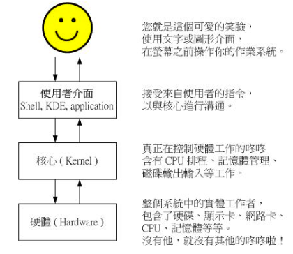
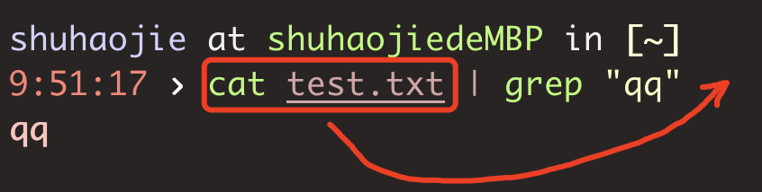
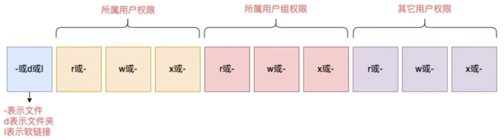
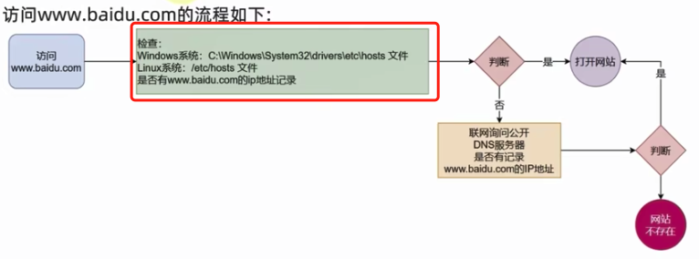
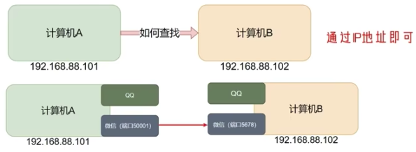
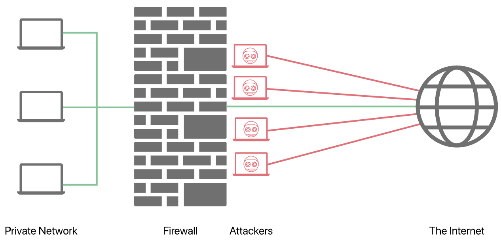

# Linux

## 一、shell

### 1. shell是什么？

计算机操作的一般交互过程，**图形界面 <=> Shell/应用程序 <=> 内核 <=> 硬件**



- Shell：接受来自用户的指令，与内核进行沟通。
- 内核：CPU调度、内存管理等
- 硬件：负责具体运算的，如CPU、总线等。

Shell分两大类

- 图形界面Shell：例如Linux Shell，GNOME，KDE等
- 命令行Shell：sh(/bin/sh)，bash(/bin/bash)，C Shell(/usr/bin/csh)等

> Bash(Bourne Again Shell)，是Shell中的一种，也是大多数Linux 系统默认的 Shell。

### 2. shell脚本与shell程序

- shell 脚本：和Python脚本一样，是内在的命令文件
- shell程序：第一节说的就是shell程序，接受来自用户的指令，并和内核进行沟通。

### 3. shell变量

#### （1）定义变量

```bash
your_name="haojie"
```

注意定义的时候，中间不能有空格

#### （2）使用变量

使用一个定义过的变量，只要在变量名前面加美元符号即可，如

```bash
your_name="qinjx"
echo $your_name
echo ${your_name}
```

变量名外面的花括号是可选的，加不加都行，但是更推荐加上，方便解释器识别变量的边界。

```bash
for skill in Ada Coffe Action Java; do
    echo "I am good at ${skill}Script"
done
```

### 4. shell字符串

#### （1）单引号和双引号

字符串可以用单引号，也可以用双引号，也可以不用引号。更推荐使用双引号，双引号支持变量或者转义符，单引号不支持。

#### （2）拼接字符串

```bash
your_name="runoob"
# 使用双引号拼接
greeting="hello, "$your_name" !"
greeting_1="hello, ${your_name} !"
echo $greeting  $greeting_1

# 使用单引号拼接
greeting_2='hello, '$your_name' !'
greeting_3='hello, ${your_name} !'
echo $greeting_2  $greeting_3
```

输出结果

```bash
hello, runoob ! hello, runoob !
hello, runoob ! hello, ${your_name} !
```

### 5. shell数组

#### （1）定义数组

```bash
arr=("shu" "haojie")
```

#### （2）获取数组元素

```bash
echo ${arr[0]}
```

### 6. shell传递参数

可以在执行shell脚本时，向shell脚本传递参数，例如

```bash
#!/bin/bash
# author:菜鸟教程
# url:www.runoob.com

echo "Shell 传递参数实例！";
echo "执行的文件名：$0";
echo "第一个参数为：$1";
echo "第二个参数为：$2";
echo "第三个参数为：$3";
```

为脚本设置可执行权限，并执行脚本，输出结果如下所示：

```bash
$ chmod +x test.sh 
$ ./test.sh 1 2 3
Shell 传递参数实例！
执行的文件名：./test.sh
第一个参数为：1
第二个参数为：2
第三个参数为：3
```

### 7. shell运算符

#### （1）算术运算符

原生bash不支持简单的数学运算，但是可以通过其他命令来实现，例如 awk 和 expr，expr 最常用。

```bash
#!/bin/bash

val=`expr 2 + 2`
echo "两数之和为 : $val"
```

#### （2）关系运算符

假定变量 a 为 10，变量 b 为 20

| 运算符 | 说明                                                  | 举例                       |
| ------ | ----------------------------------------------------- | -------------------------- |
| -eq    | 检测两个数是否相等，相等返回 true。                   | [ $a -eq $b ] 返回 false。 |
| -ne    | 检测两个数是否不相等，不相等返回 true。               | [ $a -ne $b ] 返回 true。  |
| -gt    | 检测左边的数是否大于右边的，如果是，则返回 true。     | [ $a -gt $b ] 返回 false。 |
| -lt    | 检测左边的数是否小于右边的，如果是，则返回 true。     | [ $a -lt $b ] 返回 true。  |
| -ge    | 检测左边的数是否大于等于右边的，如果是，则返回 true。 | [ $a -ge $b ] 返回 false。 |
| -le    | 检测左边的数是否小于等于右边的，如果是，则返回 true。 | [ $a -le $b ] 返回 true。  |

```bash
#!/bin/bash
a=10
b=20

if [ $a -eq $b ]
then
   echo "$a -eq $b : a 等于 b"
else
   echo "$a -eq $b: a 不等于 b"
fi
```

输出

```bash
10 -eq 20: a 不等于 b
```

#### （3）布尔运算符

假定变量 a 为 10，变量 b 为 20

| 运算符 | 说明                                                | 举例                                     |
| ------ | --------------------------------------------------- | ---------------------------------------- |
| !      | 非运算，表达式为 true 则返回 false，否则返回 true。 | [ ! false ] 返回 true。                  |
| -o     | 或运算，有一个表达式为 true 则返回 true。           | [ $a -lt 20 -o $b -gt 100 ] 返回 true。  |
| -a     | 与运算，两个表达式都为 true 才返回 true。           | [ $a -lt 20 -a $b -gt 100 ] 返回 false。 |

```bash
if [ $a -lt 100 -a $b -gt 15 ]
then
   echo "$a 小于 100 且 $b 大于 15 : 返回 true"
else
   echo "$a 小于 100 且 $b 大于 15 : 返回 false"
fi
```

输出

```bash
10 小于 100 且 20 大于 15 : 返回 true
```

#### （4）逻辑运算符

假定变量 a 为 10，变量 b 为 20

| 运算符 | 说明       | 举例                                       |
| ------ | ---------- | ------------------------------------------ |
| &&     | 逻辑的 AND | [[ $a -lt 100 && $b -gt 100 ]] 返回 false  |
| \|\|   | 逻辑的 OR  | [[ $a -lt 100 \|\| $b -gt 100 ]] 返回 true |

```bash
#!/bin/bash

a=10
b=20

if [[ $a -lt 100 && $b -gt 100 ]]
then
   echo "返回 true"
else
   echo "返回 false"
fi
```

输出

```bash
返回 false
```

#### （5）字符串运算符

假定变量 a 为 "abc"，变量 b 为 "efg"

| 运算符 | 说明                                         | 举例                     |
| ------ | -------------------------------------------- | ------------------------ |
| =      | 检测两个字符串是否相等，相等返回 true。      | [ $a = $b ] 返回 false。 |
| !=     | 检测两个字符串是否不相等，不相等返回 true。  | [ $a != $b ] 返回 true。 |
| -z     | 检测字符串长度是否为0，为0返回 true。        | [ -z $a ] 返回 false。   |
| -n     | 检测字符串长度是否不为 0，不为 0 返回 true。 | [ -n "$a" ] 返回 true。  |
| $      | 检测字符串是否不为空，不为空返回 true。      | [ $a ] 返回 true。       |

```bash
a="abc"
b="efg"
if [ $a ]
then
   echo "$a : 字符串不为空"
else
   echo "$a : 字符串为空"
fi
```

输出

```bash
abc : 字符串不为空
```

#### （6）文件测试运算符

| 操作符  | 说明                                                         |
| ------- | ------------------------------------------------------------ |
| -d file | 检测文件是否是目录，如果是，则返回 true。                    |
| -f file | 检测文件是否是普通文件（既不是目录，也不是设备文件），如果是，则返回 true。 |
| -r file | 检测文件是否可读，如果是，则返回 true。                      |
| -w file | 检测文件是否可写，如果是，则返回 true。                      |
| -x file | 检测文件是否可执行，如果是，则返回 true。                    |
| -s file | 检测文件是否为空（文件大小是否大于0），不为空返回 true。     |
| -e file | 检测文件（包括目录）是否存在，如果是，则返回 true。          |

变量 file 表示文件`/var/www/runoob/test.sh`，它的大小为 100 字节，具有 rwx 权限。

```bash
#!/bin/bash

file="/var/www/runoob/test.sh"
if [ -x $file ]
then
   echo "文件可执行"
else
   echo "文件不可执行"
fi
if [ -f $file ]
then
   echo "文件为普通文件"
else
   echo "文件为特殊文件"
fi
if [ -d $file ]
then
   echo "文件是个目录"
else
   echo "文件不是个目录"
fi
```

输出

```bash
文件可执行
文件为普通文件
文件不是个目录
```

### 8. shell输出命令

#### （1）echo命令

- 显示转义符

例如想输出`"It is a test"`，而不是`It is a test`

```bash
echo "\"It is a test\""
```

结果将是

```bash
"It is a test"
```

- 显示变量

```bash
#!/bin/sh
read name # read命令从标准输入中读取一行,并把输入行的每个字段的值指定给shell变量
echo "$name It is a test"
```

以上代码保存为 test.sh，name 接收标准输入的变量，结果将是:

```bash
[root@www ~]# sh test.sh
OK                     #标准输入
OK It is a test        #输出
```

- 显示换行

```bash
echo -e "OK! \n" # -e 开启转义
echo "It is a test"
```

输出结果

```bash
OK!

It is a test
```

#### （2）printf命令

```bash
#!/bin/bash
 
printf "%-10s %-8s %-4s\n" 姓名 性别 体重kg  
printf "%-10s %-8s %-4.2f\n" 郭靖 男 66.1234 
printf "%-10s %-8s %-4.2f\n" 杨过 男 48.6543 
printf "%-10s %-8s %-4.2f\n" 郭芙 女 47.9876
```

输出结果如下

```bash
姓名     性别   体重kg
郭靖     男      66.12
杨过     男      48.65
郭芙     女      47.99
```

- `%s %c %d %f` 都是格式替代符，`％s` 输出一个字符串，`％d` 整型输出，`％c` 输出一个字符，`％f` 输出实数，以小数形式输出。

- `%-10s` 指一个宽度为 10 个字符（`-` 表示左对齐，没有则表示右对齐），任何字符都会被显示在 10 个字符宽的字符内，如果不足则自动以空格填充，超过也会将内容全部显示出来。

- `%-4.2f` 指格式化为小数，其中 `.2` 指保留2位小数。

### 9. if语句

### （1）if

```bash
if condition
then
    command1 
    command2
    ...
    commandN 
fi
```

### （2）if...else

```bash
if condition
then
    command1 
    command2
    ...
    commandN
else
    command
fi
```

### （3）if...elif...else

```bash
if condition1
then
    command1
elif condition2 
then 
    command2
else
    commandN
fi
```

### 10. for循环

for循环的格式如下

```bash
for var in item1 item2 ... itemN
do
    command1
    command2
    ...
    commandN
done
```

例如

```bash
for loop in 1 2 3 4 5
do
    echo "The value is: $loop"
done
```

输出

```bash
The value is: 1
The value is: 2
The value is: 3
The value is: 4
The value is: 5
```

### 11. while循环

while循环的格式如下

```bash
#!/bin/bash
int=1
while(( $int<=5 ))
do
    echo $int
    let "int++"
done
```

例如

```bash
#!/bin/bash
int=1
while(( $int<=5 ))
do
    echo $int
    let "int++"
done
```

输出

```bash
1
2
3
4
5
```

### 12. shell函数

#### （1）定义函数

要定义一个函数，可以使用以下语法：

```bash
function_name() {
    # Commands and operations
}
```

例如

```bash
print_hello() {
    echo "Hello, world!"
}
```

#### （2）使用函数

```bash
print_hello
```

#### （3）传递参数

```bash
greet_person() {
    echo "Hello, $1!"
}

greet_person "Alice"
greet_person "Bob"
```

#### （4）返回值

```bash
check_file_exists() {
    if [ -e "$1" ]; then
        return 0  # File exists
    else
        return 1  # File does not exist
    fi
}

filename="example.txt"
if check_file_exists "$filename"; then
    echo "File exists."
else
    echo "File does not exist."
fi
```

### 13. awk

#### （1）作用

awk命令是用来处理表格数据的，可以把很多命令的输出理解为表格，例如`docker images`.可以利用awk命令来帮助我们做很多事情，例如要输出当前机器所有的镜像

```bash
[haojie@manager ~]docker images | awk 'NR>1 {print $1 ":" $2 }'
dockerhub.datagrand.com/databj/sxboard/format_convert:release_ci_20220419_eda779c
dockerhub.datagrand.com/ysocr/ocr_platform_api:release_ci_20230412_3d4f75c
dockerhub.datagrand.com/idps/new_extract_html:ci_20230626_f2b5660
dockerhub.datagrand.com/idps/fe_itp:ci_20230622_ad3176c
dockerhub.datagrand.com/idps/new_extract_html:ci_20230622_a852b2b
```

这里的`$1`表示输出表格的第一列，`NR>1`表示输出大于第一行之外的所有行。

#### （2）用法

> 以下内容来自chatgpt，https://chat.openai.com/share/a026b623-c2f5-4fea-8ca1-ca57c40c5f4a

awk的基本用法如下，它从输入文本中选择特定的行，并对这些行进行处理，以提取出想要的数据

```bash
awk [选项参数] 'pattern { action }' input_file
```

- `pattern`是一个条件，用于选择要处理的行。如果省略了条件，那么操作将适用于所有行。
- `action`是一系列命令，它定义了在满足条件时要执行的操作。多个命令可以使用分号或换行分隔。
- `input_file`是要处理的输入文件的名称。

例如查找文件中包含mq关键字的镜像

```bash
[haojie@manager ~]awk '/mq/ {print $0}' images.txt
dockerhub.datagrand.com/base_tools/rabbitmq:3.11.4-management
dockerhub.datagrand.com/base_tools/rabbitmq:3.8.26
```

前面的`/mq`就是pattern，而后面的`{print $0}`则是去执行的具体指令

#### （3）选项参数

- `-F`参数：用于指定字段分隔符，让 `awk` 在处理输入数据时根据指定的分隔符将每一行划分成不同的字段。

```bash
[haojie@manager ~]cat data.txt
Alice:25:F
Bob:30:M
Carol:28:F
David:22:M
# 这里","会空一格. 如果是"\t"，则会空4格
[haojie@manager ~]awk -F ':' '{ print "Name: " $1, "Age: " $2 }' data.txt
Name: Alice Age: 25
Name: Bob Age: 30
Name: Carol Age: 28
Name: David Age: 22
```

- `-v`参数：用于在 `awk` 命令中定义变量并赋值。这样可以在 `awk` 脚本中使用这些变量来进行计算、处理数据等操作

```
[haojie@manager ~]awk -F ':' -v increment=5 '{ print "Name: " $1 ,"Age: " $2+increment }' data.txt
Name: Alice Age: 30
Name: Bob Age: 35
Name: Carol Age: 33
Name: David Age: 27
```

### 14. sed命令

> 注意：这个命令在macOS上和Linux不太一样，操作的时候注意在linux上操作

#### （1）作用

sed命令根据指定的规则对文本进行转换、替换、删除等操作。`sed` 在文本处理和批量编辑中非常有用。

#### （2）文本替换

使用 `s` 命令可以替换文本中匹配某一模式的内容为指定的文本。

- 替换文本

```bash
sed 's/old_text/new_text/' input.txt
```

这会在 `input.txt` 文件中将第一次出现的 `old_text` 替换为 `new_text`。

- 替换所有匹配

```bash
sed 's/old_text/new_text/g' input.txt
```

通过在替换命令中添加 `g` 标志，`sed` 将替换所有出现的匹配项。

- 原地编辑

在实际使用中，经常需要加上`-i`选项，表示**原地编辑（in-place editing）**，

```bash
[haojie@manager ~]$ sed -i 's/node01/manager/g' linux.md
```

加上`-i`之后，会使文件发生改变，后面删除和新增同理，不再赘述

#### （3）文本删除

```bash
sed '/pattern_to_delete/d' input.txt
```

这会删除包含指定模式的行。

#### （4）文本添加

```bash
sed '3i\New line before' input.txt  # 在第3行之前添加文本
sed '3a\New line after' input.txt   # 在第3行之后添加文本
```

## 二、基础命令

linux命令的通用格式如下

```bash
command [-options] [parameter]
```

- command：命令本体，即命令本身
- options：可选选项，控制命令的行为细节
- parameter：可选参数，控制命令的指向目标

### 1. ls

```bash
ls [-a -l -h] [linux路径]
```

平铺显示当前工作目录内容

- `ls ~/workspaces/codes`: 显示这个路径下的所有内容
- `-a`: all，包括隐藏内容
- `-l`：以列表形式竖向展示，并展示更多信息
- `-h`：以更加人性化的方式展示文件的大小单位

### 2. mkdir

```bash
mkdir -p linux路径
```

- -p：一次性创建多个层级的目录

### 3. touch, cat, more

- `touch linux路径`：创建文件
- `cat linux路径`：查看文件内容
- `more linux路径`：查看文件内容，可翻页查看

### 4. cp, mv, rm

#### （1）cp

```bash
cp [-r] 参数1 参数2
```

- -r：可选，用于复制文件夹，表示迭代
- 参数1：被复制的文件
- 参数2：要复制去的地方

#### （2）mv

```bash
mv 参数1 参数2
```

- 参数1：被移动的文件或文件夹
- 参数2：要移动去的地方，如果目标不存在，则进行改名，确保目标存在

#### （3）rm

```bash
rm [-r -f] 参数1 参数2 ....参数n
```

- -r：用于删除文件夹
- -f：强制删除，force
- 参数1，参数2....参数n，要删除的文件或文件夹

### 5. which, find

#### （1）which

前面学习的linux命令，**它们的本体是一个个二进制可执行程序**，和windows中的.exe文件是一样的意思，可以通过which命令来查找命令的程序文件存放在哪里

```bash
which 要查找的命令
```

例如

```bash
[haojie@localhost ~]$ which cd
/usr/bin/cd
[haojie@localhost ~]$ which python
/usr/bin/python
```

#### （2）find

- 查找文件名

```bash
find 起始路径 -name "被查找文件名"
```

- 按照文件大小查找

```bash
# +，-表示大于和小于
# n表示大小数字
# kMG表示大小单位，k表示kb，M表示MB，G表示GB
find 起始路径 -size +|-n[kMG]
```

例如

```
find / size -10k # 查找小于10k的文件
find / size +20M # 查找大于20M的文件
```

### 6. grep, wc, 管道符

#### （1）grep

从文件中通过关键字过滤文件行 

```bash
grep [-n] 关键字 文件路径
```

- -n：在结果中显示匹配的行号
- 关键字：要过滤的关键字
- 文件路径：要过滤的文件路径，**可作为内容输入端口**

```bash
[haojie@localhost ~]$ grep "Haojie" test.txt
Haojie Shu is a python developer who works in DataGrand.
```

#### （2）wc

统计文件的行数，单词数等

```
wc [-c -m -l -w] 文件路径
```

- -c：统计bytes数量
- -m：统计字符数量
- -l：统计行数
- -w：统计单词数量

```bash
[haojie@localhost ~]$ wc test.txt 
  2  20 110 test.txt  # 2表示行数，20表示单词数，110表示字节数
```

#### （3）管道符（`|`）

管道符`｜`作用：将管道符左边命令的结果，作为右边命令的输入



任意只要能输出结果的都可以用管道符，管道符右边也可以用`wc`。例如可以通过下面的命令来统计路径下子文件的个数

```bash
[haojie@localhost ~]$ ls -l ~/workspace | wc -l
      10
```

此外任意的输出都可以使用`grep`来做过滤

```bash
[haojie@localhost ~]$ docker stack services idps-product-metal | grep predict
qtufjz1qkgl6   idps-product-metal_chapter_locating_predict             replicated   1/1        dockerhub.datagrand.com/idps/chapter_locating:release_ci_20221117_3ce18f3
nf4brcv01fxp   idps-product-metal_diff_extract_predict                 replicated   1/1        dockerhub.datagrand.com/idps/diff_extract:release_ci_20221117_360dd4d
```

另外，还可以通过-v来**去掉包含关键字的数据**

```bash
[haojie@master ~]$ docker images
REPOSITORY          TAG                 IMAGE ID            CREATED             SIZE
centos              latest              5d0da3dc9764        20 months ago       231MB
[haojie@master ~]$ docker images | grep -v centos
REPOSITORY          TAG                 IMAGE ID            CREATED             SIZE
```

### 7. echo, tail, 重定向符

#### （1）echo

输出制定内容，和print的功能类似

```bash
echo 要输出的内容
```

例如

```bash
echo Hello World. # 打印Hello World.
```

#### （2）反引号(``)

被反引号包围的内容，会被作为命令执行

```bash
echo pwd # 打印Hello World.
echo `pwd` # 打印/Users/shuhaojie
```

#### （3）重定向符(>,>>)

- `>`：将左边命令的结果，覆盖写入到符号右侧的文件中
- `>>`：将左边命令的结果，追加写入到符号右侧的文件中

```bash
echo "Hello World" > hello.txt # 覆盖
echo "Hello World" >> hello.txt # 追加
ls > hello.txt # 将ls的内容覆盖写入到文件中
```

#### （4）tail

查看文件尾部的内容，追踪文件的最新修改

```bash
# -f: 持续跟踪
# -num: 查看尾部多少行, 不指定默认10行
tail [-f -num] linux路径
```

### 8. vi

命令模式快捷键

```bash
0: 移动光标到当前行的开头
$(shift+4): 移动光标到当前行的结尾
yy: 复制当前行
p: 粘贴复制的内容
u: 撤销修改
gg: 跳到首行
G: 跳到尾行
```

底线模式快捷键

```
:set nu
```

## 三、linux用户

### 1. 切换用户

- `su`: switch user，切换用户。不仅仅可以切换到root用户，也可以切换到其他用户。

### 2. 用户和用户组

一个用户可以在多个组，一个组可以有多个用户

#### （1）用户组

```bash
groupadd 用户组 # 创建用户组
```

#### （2）用户

- 创建用户

```bash
# -g 表示加入哪个用户组，不指定的话，会自动加入同名用户组
# -d 创建home路径
useradd [-g -d]用户名
```

例如`adduser haojie -d /home/haojie`

- 删除用户

```bash
# -r 删除home路径
userdel [-r] 用户名
```

- 查看用户

```bash
# 不指定表示查看自己
id [用户名]
```

- 修改用户所在组

```
usermod -aG 用户组 用户名
```

### 3. 权限

通过ls -l命令可以看到如下内容

```bash
[haojie@localhost ~]$ ls -l
total 8
drwx------@  3 shuhaojie  staff    96  4 20 11:42 Applications
drwxr-xr-x   3 shuhaojie  staff    96  4 26 15:54 DataGripProjects
drwx------@  7 shuhaojie  staff   224  5 23 13:40 Desktop
drwx------+  9 shuhaojie  staff   288  5 23 20:01 Documents
drwx------@ 51 shuhaojie  staff  1632  5 22 18:42 Downloads
drwx------@ 88 shuhaojie  staff  2816  5 22 16:01 Library
```

- 第一列表示文件、文件夹的权限信息
- 第三列表示文件、文件夹所属用户
- 第四列表示文件、文件夹所属用户组

#### （1）权限信息

权限细节共分为10个槽位




例如`drwxr-xr-x`表达的意思为

- d:这是一个文件夹
- rwx:所属用户可读、可写、可执行
- r-x：所属用户组可读、不可写、可执行
- r-x：其他用户组可读、不可写、可执行

#### （2）rwx

- r：针对文件，可以查看文件内容；针对文件夹，可以查看文件夹内容，例如ls
- w：针对文件，表示可以修改此文件；针对文件夹，可以在文件夹内创建、删除、改名等操作。
- x：针对文件，表示可以将文件作为程序执行；针对文件夹，**表示可以更改工作目录到此文件夹，即`cd`命令**。

### 4. chmod命令

```bash
# -R，修改文件夹时，文件夹内的全部内容也应用同样的操作
chmod [-R] 权限 文件或文件夹
```

注意：**只有文件或文件夹所属用户，或者root用户才能修改权限**

### 5. chown命令

chown：修改文件或文件夹的所属用户、用户组。

```bash
# -R，同chmod
# :用于分割用户或者用户组
chown [-R] [用户][:][用户组] 文件或文件夹
```

注意：**只有root用户才能修改**

```bash
chown root hello.txt  # 文件所属用户修改为root
chown :root hello.txt # 文件所属用户组修改为root
```

## 四、linux网络

### 1. ip地址

#### （1）特殊ip地址

- 127.0.0.1：本机ip
- 0.0.0.0：既可以代表本机ip，又可以代表表示所有ip

#### （2）查看ip

```bash
[haojie@master ~]$ ifconfig
eth0: flags=4163<UP,BROADCAST,RUNNING,MULTICAST>  mtu 1500
        inet 10.0.4.11  netmask 255.255.252.0  broadcast 10.0.7.255
				.......
```

#### （3）域名解析



我们访问www.baidu.com，它的流程如下

1. 先查看本机是否有该域名的记录，`etc/hosts`
2. 如果第一步没有，再联网去DNS服务器(114.114.114，8.8.8.8)询问

### 2. 端口

#### （1）端口的定义



计算机程序之间的通讯，通过IP只能锁定计算机，但是无法锁定具体的程序。通过端口可以锁定计算机上具体的程序，确保程序之间进行沟通。IP地址相当于小区地址，在小区内可以有许多住户(程序)，而门牌号(端口)就是各个住户(程序)的联系地址。

#### （2）lsof命令

查看端口占用情况，注意，该命令需要用root用户

```bash
[haojie@manager ~]$ sudo lsof -i:8000
COMMAND   PID USER   FD   TYPE  DEVICE SIZE/OFF NODE NAME
dockerd 13841 root   47u  IPv6 5149361      0t0  TCP *:irdmi (LISTEN)
```

#### （3）netstat命令

netstat查看端口占用，需要安装`yum -y install net-tools`

```bash
[haojie@manager ~]$ sudo netstat -tunlp | grep 8000
tcp6       0      0 :::8000                 :::*                    LISTEN      13841/dockerd
```

### 3. 防火墙

#### （1）作用

防火墙的作用是内部网络和外部网络隔离。通常，防火墙可以保护内部/私有局域网免受外部攻击，并防止重要数据泄露。



#### （2）firewall防火墙

CentOS7 默认使用firewalld防火墙，如果想换回iptables防火墙，可关闭firewalld并安装iptables。

- 查看防火墙状态

```bash
firewall-cmd --state  # 关闭后显示notrunning，开启后显示running
```

- 关闭防火墙

```bash
systemctl stop firewalld
```

- 启动防火墙

```bash
systemctl start firewalld
```

#### （3）iptables防火墙

- 查看防火墙状态

```bash
service iptables status
```

- 停止防火墙

```bash
service iptables stop 
```

- 启动防火墙

```bash
service iptables start
```

- 重启防火墙

```bash
service iptables restart
```

### 4. 网络请求

#### （1）ping

检查指定的网络服务器是否连通

```bash
[haojie@manager ~]$ ping baidu.com
PING baidu.com (110.242.68.66) 56(84) bytes of data.
64 bytes from 110.242.68.66 (110.242.68.66): icmp_seq=1 ttl=48 time=11.1 ms
64 bytes from 110.242.68.66 (110.242.68.66): icmp_seq=2 ttl=48 time=11.0 ms
--- baidu.com ping statistics ---
3 packets transmitted, 3 received, 0% packet loss, time 2002ms
rtt min/avg/max/mdev = 10.952/11.022/11.111/0.108 ms
```

#### （2）telnet

用于检查服务器上是否打开特定端口，这个服务器可以是别人的服务器，例如检查百度的服务器是否开放

```bash
[haojie@manager ~]$ telnet 110.242.68.66 443
Trying 110.242.68.66...
Connected to 110.242.68.66.
Escape character is '^]'.
```

#### （3）wget

在命令行内下载网络文件

```bash
# -b 表示后台下载
wget [-b] url
```

#### （4）curl

 curl可以发送http网络请求，可用于下载文件、获取信息等

```bash
# -O用于下载文件
curl [-O] url
```

例如向cip.cc网站发送get请求

```bash
[haojie@master ~]$ curl cip.cc
IP	: 123.118.73.58
地址	: 中国  北京
运营商	: 联通
```

### 5. 经典问题

在k8s中，启动了nginx服务，按照教程，开放了外部的31724端口

```bash
[haojie@manager ~]$ kubectl get service
NAME         TYPE        CLUSTER-IP      EXTERNAL-IP   PORT(S)        AGE
kubernetes   ClusterIP   10.96.0.1       <none>        443/TCP        18h
nginx        NodePort    10.102.148.40   <none>        80:31724/TCP   4h12m
```

用lsof或者netstat查看端口占用情况，均显示端口被监听

```bash
[haojie@manager ~]$ sudo netstat -tunlp | grep 31724
tcp        0      0 0.0.0.0:31724           0.0.0.0:*               LISTEN      27205/kube-proxy
[haojie@manager ~]$ sudo lsof -i:31724
COMMAND     PID USER   FD   TYPE  DEVICE SIZE/OFF NODE NAME
kube-prox 27205 root   12u  IPv4 6482384      0t0  TCP *:31724 (LISTEN)
```

但是在本机或者其他机器上使用telnet命令，并没有通

```bash
[haojie@manager ~]$ telnet 127.0.0.1 31724
Trying 127.0.0.1...
[haojie@manager ~]$ telnet 121.36.104.55 31724
Trying 121.36.104.55...
```

## 五、linux状态

### 1. 进程管理

#### （1）查看进程

```bash
# -e: 显示全部的进程
# -f: 以完全格式化的形式展示全部的信息
ps [-e -f]
```

一般来说，经常用`ps -ef`，列出进程的全部信息

```bash
[haojie@manager ~]$ ps -ef | grep python
UID         PID   PPID  C STIME TTY          TIME CMD
root       603     1  0 6月27 ?       00:03:31 /usr/bin/python2 -Es /usr/sbin/tuned -l -P
root      7458  7439  0 11:27 ?        00:00:00 python app.py
root      7528  7458  0 11:27 ?        00:01:08 /usr/local/bin/python /code/app.py
haojie   15480 15443  0 17:12 pts/2    00:00:00 grep --color=auto python
root     17448     1  0 7月09 ?       00:00:00 python app.py
root     17517 17448  0 7月09 ?       01:30:10 /usr/local/bin/python /code/app.py
```

从左到右分别是

- uid：进程所属的用户id
- pid：进程的进程号id
- ppid：进程的父id，启动此进程的其他进程
- C：此进程的CPU占用率
- STIME：进程的启动时间
- TTY：启动此进程的终端序号。？表示非终端启动。pts/0表示0号终端。
- TIME：进程占用CPU的时间
- CMD：进程的启动命令

> 在服务器上开启一个进程，保持终端关闭后进程仍然运行，可以使用`nohup command &`

另外一种查看进程的方式是ps -aux

```bash
[haojie@manager ~]$ ps -aux | grep python
root       603  0.0  0.4 574288 17456 ?        Ssl  6月27   3:31 /usr/bin/python2 -Es /usr/sbin/tuned -l -P
root      7458  0.0  0.5  24712 21412 ?        Ss   11:27   0:00 python app.py
root      7528  0.3  1.5  63076 58412 ?        Sl   11:27   1:08 /usr/local/bin/python /code/app.py
haojie   15472  0.0  0.0 112828   988 pts/2    S+   17:11   0:00 grep --color=auto python
root     17448  0.0  0.5  24668 21192 ?        Ss   7月09   0:00 python app.py
root     17517  0.3  0.5  25988 21632 ?        Sl   7月09  90:10 /usr/local/bin/python /code/app.py
```

#### （2）关闭进程

```bash
# -9 强制关闭
kill [-9] 进程id
```

### 2. top命令

```bash
[haojie@localhost ~]$ top
top - 21:10:29 up  1:21,  2 users,  load average: 0.07, 0.04, 0.05
Tasks: 203 total,   1 running, 202 sleeping,   0 stopped,   0 zombie
%Cpu(s):  8.2 us,  2.7 sy,  0.0 ni, 89.0 id,  0.0 wa,  0.0 hi,  0.0 si,  0.0 st
KiB Mem :   995672 total,    72520 free,   682004 used,   241148 buff/cache
KiB Swap:        0 total,        0 free,        0 used.   139264 avail Mem 

   PID USER      PR  NI    VIRT    RES    SHR S %CPU %MEM     TIME+ COMMAND                                                
  1883 haojie    20   0 3012828 154968  27732 S  4.0 15.6   0:33.37 gnome-shell                                            
  1156 root      20   0  325788  40436  15816 S  3.7  4.1   0:15.14 X                                                      
  2469 haojie    20   0  682308  19948   8076 S  2.0  2.0   0:08.08 gnome-terminal-                                        
  2208 haojie    20   0  608948   9464   2344 S  1.0  1.0   0:16.98 vmtoolsd                                               
   292 root      20   0       0      0      0 S  0.3  0.0   0:08.47 xfsaild/sda3                                           
```

第一行

- `top - 21:10:29`，运行top的系统时间
- `up  1:21`，启动了1:21
- `2 users`，两个用户登录
- `load average: 0.07, 0.04, 0.05`，1分钟，5分钟，15分钟的平均负载

第二行

- `Tasks: 203 total`，有203个进程
- `1 running, 202 sleeping,   0 stopped,   0 zombie`，一个正在跑进程，202个睡眠进程，0个停止进程，0个僵尸进程

第三行Cpu，主要关注前面两个

- `8.2 us`，用户CPU使用率
- `2.7sy`，系统CPU使用率

第四行：Kib Mem：物理内存。第五行Kib Swap：虚拟内存。

- `total`：总量
- `free`：空闲
- `used`：使用
- `buff/cache`：buff和cache占用

下面

- PID：进程id
- USER：进程所属用户
- PR：进程优先级，越小越高
- NI：负值表示高优先级，正表示低优先级
- VIRT：进程使用虚拟内存，单位KB
- RES：进程使用物理内存，单位KB
- SHR：进程使用共享内存，单位KB
- S：进程状态（S休眠，R运行，Z僵死状态，N负数优先级，I空闲状态）
- ％CPU：进程占用CPU率
- ％MEM：进程占用内存率
- TIME＋：进程使用CPU时间总计，单位10毫秒
- COMMAND：进程的命令或名称或程序文件路径

### 3. 磁盘信息监控

#### （1）df命令

df：disk free，显示磁盘分区上可以使用的磁盘空间

```bash
[haojie@master ~]$ df -h
Filesystem      Size  Used Avail Use% Mounted on
devtmpfs        989M     0  989M   0% /dev
tmpfs          1000M   24K 1000M   1% /dev/shm
tmpfs          1000M  960K  999M   1% /run
tmpfs          1000M     0 1000M   0% /sys/fs/cgroup
/dev/vda1        40G  8.1G   30G  22% /
tmpfs           200M     0  200M   0% /run/user/0
tmpfs           200M     0  200M   0% /run/user/1001
```

- Filesystem：文件系统，文件系统是指保存数据的实际设备，用来管理和组织磁盘数据。面对一个原始的磁盘分区，可通过mkfs系列工具来制作文件系统，例如`mkfs.ext4 /dev/sda1`
- Mounted on：文件系统生成后，还不能直接使用，需要借助"mount"操作，将这个文件系统加入到Linux的管理，这样用户才能看到并访问

#### （2）du命令

du：disk used，检查磁盘空间使用量。直接输入du没有加任何选项时，则du会分析当前所在目录里的子目录所占用的硬盘空间。

```bash
[haojie@master ~]$ sudo du -sh /
6.7G	/
```

du命令显示出的用量和df稍微有些不一样，想深究可以看这个<https://serverfault.com/q/275206/942586>

#### （3）free命令

free：显示ram的详细信息

```bash
[haojie@master ~]$ free -h
              total        used        free      shared  buff/cache   available
Mem:           2.0G        313M         80M        1.0M        1.6G        1.5G
Swap:            0B          0B          0B
```

## 六、环境变量

### 1. 查看环境变量

可以通过`env`查看系统所有的环境变量，内容比较多，下面是比较常见的环境变量。

```bash
[haojie@localhost ~]$ env
HOSTNAME=localhost.localdomain
SHELL=/bin/bash
USER=haojie
USERNAME=haojie
PATH=/usr/local/bin:/usr/local/sbin:/usr/bin:/usr/sbin:/bin:/sbin:/home/haojie/.local/bin:/home/haojie/bin
PWD=/home/haojie
LANG=en_US.UTF-8
HOME=/home/haojie
```

之所以我们在任意目录都可以执行`cd`命令，是因为`cd`命令的二进制文件加入到环境变量`PATH`中了

### 2. $符合

`$`符合用于取"变量"的值，可以通过`$环境变量名`来取得环境变量的值，例如`echo $PATH`，就可以取得`PATH`这个环境变量的值了。

```bash
[haojie@localhost ~]$ echo $PATH
/usr/local/bin:/usr/local/sbin:/usr/bin:/usr/sbin:/bin:/sbin:/home/haojie/.local/bin:/home/haojie/bin
```

当和其他内容混合在一起的时候，可以加上`{}`

```bash
[haojie@localhost ~]$ echo ${PATH}-huanjingbianliang
/usr/local/bin:/usr/local/sbin:/usr/bin:/usr/sbin:/bin:/sbin:/home/haojie/.local/bin:/home/haojie/bin-huanjingbianliang
```

### 3. 设置环境变量

#### （1）临时设置

```bash
export 变量名=变量值
```

#### （2）永久生效

- 针对当前用户：修改`~/.bashrc`文件

- 针对所有用户：修改`/etc/profile`文件

## 七、文件操作

### 1. 文件上传、下载

```bash
rz # 上传
sz # 下载
```

### 2. tar命令

```bash
tar [-c -v -x -f -z -C]
```

- -c：创建压缩文件，用于压缩模式
- -v：显示压缩解压过程
- -x：解压模式
- -f：要创建或者解压的文件，该参数必须在最后
- -z：gzip模式，不使用就是.tar
- -C：选择解压目的地

压缩文件

```bash
[haojie@localhost ~]$ tar -zcvf test.zip test.txt 
test.txt
```

解压文件

```bash
[haojie@localhost ~]$ tar -xvf test.tar -C /home/haojie
test.txt
```

### 3. zip命令

```bash
zip [-r] 参数1, 参数2, 参数n
```

- -r：被压缩的包含文件夹的时候，需要-r选项

```bash
[haojie@localhost ~]$ zip -r test.zip test.txt Videos/
  adding: test.txt (deflated 9%)
  adding: Videos/ (stored 0%)
```

### 4. unzip命令

```bash
unzip [-d] 参数
```

- -d：指定要解压去的位置

```bash
[haojie@localhost ~]$ unzip test.zip -d ~/jieya/
Archive:  test.zip
  inflating: /home/haojie/jieya/test.txt  
   creating: /home/haojie/jieya/Videos/
```

## 八、linux软件

### 1. 快捷键

- ctrl+d: 退出某些程序的专属页面，例如mysql或者python
- history：查看历史命令

- ctrl+a：跳到命令开头
- ctrl+e：跳到命令结尾
- ctrl+键盘左键：左跳一个单词
- ctrl+键盘右键：右跳一个单词
- ctrl+l：清屏，等于clear

### 2. 软件安装

```bash
# -y: 自动确认, 无需手动确认或卸载过程
yum [-y] [install | remove | search] 软件名称
```

注意：

- yum需要root用户权限
- yum需要联网

### 3. systemctl命令

Linux系统很多软件（内置或第三方）均支持使用systemnctl命令控制：启动、停止、开机自启。**能够被systemctl管理的软件，一般也称之为：服务。**

```bash
systemctl start ｜ stop ｜ status ｜ enable ｜ disable 服务名
```

- start启动 

- stop 关闭

- status：查看状态

- enable：开启开机自启
- disable 关闭开机自启

系统内置的服务比较多，比如：

- NetworkManager，主网络服务
- network，副网络服务
- firewalld，防火墙服务
- sshd，ssh服务（FinalShell远程登录Linux使用的就是这个服务） 

可以用如下命令查看所有允许的服务

```bash
systemctl list-unit-files | grep enabled
```

### 4. 软链接

```bash
# 参数1: 被链接的文件或文件夹
# 参数2: 要链接去的目的地
ln -s 参数1 参数2 
```

### 5. 日期和地区

```
date [-d] [格式化字符串] 
```

ntp程序可以自动校准系统时间

```bash
yum -y install ntp
systemctl start ntp
systemctl enable ntp
```
