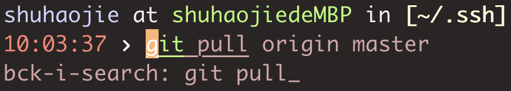

# Linux

## 一、命令基础

### 1. 通用格式

```bash
command [-options] [parameter]
```

- command：命令本体，即命令本身
- options：可选选项，控制命令的行为细节
- parameter：可选参数，控制命令的指向目标

### 2. ls

```bash
ls [-a -l -h] [linux路径]
```

平铺显示当前工作目录内容

- `ls ~/workspaces/codes`: 显示这个路径下的所有内容
- `-a`: all，包括隐藏内容
- `-l`：以列表形式竖向展示，并展示更多信息
- `-h`：以更加人性化的方式展示文件的大小单位

### 3. mkdir

```bash
mkdir -p linux路径
```

- -p：一次性创建多个层级的目录

### 4. touch, cat, more

- `touch linux路径`：创建文件
- `cat linux路径`：查看文件内容
- `more linux路径`：查看文件内容，可翻页查看

### 5. cp, mv, rm

#### （1）cp

```bash
cp [-r] 参数1 参数2
```

- -r：可选，用于复制文件夹，表示迭代
- 参数1：被复制的文件
- 参数2：要复制去的地方

#### （2）mv

```bash
mv 参数1 参数2
```

- 参数1：被移动的文件或文件夹
- 参数2：要移动去的地方，如果目标不存在，则进行改名，确保目标存在

#### （3）rm

```bash
rm [-r -f] 参数1 参数2 ....参数n
```

- -r：用于删除文件夹
- -f：强制删除，force
- 参数1，参数2....参数n，要删除的文件或文件夹

### 6. which, find

#### （1）which

前面学习的linux命令，**它们的本体是一个个二进制可执行程序**，和windows中的.exe文件是一样的意思，可以通过which命令来查找命令的程序文件存放在哪里

```bash
which 要查找的命令
```

例如

```bash
[haojie@localhost ~]$ which cd
/usr/bin/cd
[haojie@localhost ~]$ which python
/usr/bin/python
```

#### （2）find

- 查找文件名

```bash
find 起始路径 -name "被查找文件名"
```

- 按照文件大小查找

```bash
# +，-表示大于和小于
# n表示大小数字
# kMG表示大小单位，k表示kb，M表示MB，G表示GB
find 起始路径 -size +|-n[kMG]
```

例如

```
find / size -10k # 查找小于10k的文件
find / size +20M # 查找大于20M的文件
```

### 7. grep, wc, 管道符

#### （1）grep

从文件中通过关键字过滤文件行 

```bash
grep [-n] 关键字 文件路径
```

- -n：在结果中显示匹配的行号
- 关键字：要过滤的关键字
- 文件路径：要过滤的文件路径，**可作为内容输入端口**

```bash
[haojie@localhost ~]$ grep "Haojie" test.txt
Haojie Shu is a python developer who works in DataGrand.
```

#### （2）wc

统计文件的行数，单词数等

```
wc [-c -m -l -w] 文件路径
```

- -c：统计bytes数量
- -m：统计字符数量
- -l：统计行数
- -w：统计单词数量

```bash
[haojie@localhost ~]$ wc test.txt 
  2  20 110 test.txt  # 2表示行数，20表示单词数，110表示字节数
```

#### （3）管道符(｜)

管道符｜作用：将管道符左边命令的结果，作为右边命令的输入


任意只要能输出结果的都可以用管道符，管道符右边也可以用`wc`。例如可以通过下面的命令来统计路径下子文件的个数

```bash
[haojie@localhost ~]$ ls -l ~/workspace | wc -l
      10
```

此外任意的输出都可以使用`grep`来做过滤

```bash
[haojie@localhost ~]$ docker stack services idps-product-metal | grep predict
qtufjz1qkgl6   idps-product-metal_chapter_locating_predict             replicated   1/1        dockerhub.datagrand.com/idps/chapter_locating:release_ci_20221117_3ce18f3
nf4brcv01fxp   idps-product-metal_diff_extract_predict                 replicated   1/1        dockerhub.datagrand.com/idps/diff_extract:release_ci_20221117_360dd4d
```

另外，还可以通过-v来**去掉包含关键字的数据**

```bash
[haojie@master ~]$ docker images
REPOSITORY          TAG                 IMAGE ID            CREATED             SIZE
centos              latest              5d0da3dc9764        20 months ago       231MB
[haojie@master ~]$ docker images | grep -v centos
REPOSITORY          TAG                 IMAGE ID            CREATED             SIZE
```

### 8. echo, tail, 重定向符

#### （1）echo

输出制定内容，和print的功能类似

```bash
echo 要输出的内容
```

例如

```bash
echo Hello World. # 打印Hello World.
```

#### （2）反引号(``)

被反引号包围的内容，会被作为命令执行

```bash
echo pwd # 打印Hello World.
echo `pwd` # 打印/Users/shuhaojie
```

#### （3）重定向符(>,>>)

- `>`：将左边命令的结果，覆盖写入到符号右侧的文件中
- `>>`：将左边命令的结果，追加写入到符号右侧的文件中

```bash
echo "Hello World" > hello.txt # 覆盖
echo "Hello World" >> hello.txt # 追加
ls > hello.txt # 将ls的内容覆盖写入到文件中
```

#### （4）tail

查看文件尾部的内容，追踪文件的最新修改

```bash
# -f: 持续跟踪
# -num: 查看尾部多少行, 不指定默认10行
tail [-f -num] linux路径
```

### 9. vi编辑器

命令模式快捷键

```bash
0: 移动光标到当前行的开头
$(shift+4): 移动光标到当前行的结尾
yy: 复制当前行
p: 粘贴复制的内容
u: 撤销修改
gg: 跳到首行
G: 跳到尾行
```

底线模式快捷键

```
:set nu
```

## 二、linux用户

### 1. root用户

- `su`: switch user，切换用户。不仅仅可以切换到root用户，也可以切换到其他用户。

### 2. 用户和用户组

一个用户可以在多个组，一个组可以有多个用户

#### （1）用户组

```bash
groupadd 用户组 # 创建用户组
```

#### （2）用户

- 创建用户

```bash
# -g 表示加入哪个用户组，不指定的话，会自动加入同名用户组
# -d 创建home路径
useradd [-g -d]用户名
```

例如`adduser haojie -d /home/haojie`

- 删除用户

```bash
# -r 删除home路径
userdel [-r] 用户名
```

- 查看用户

```bash
# 不指定表示查看自己
id [用户名]
```

- 修改用户所在组

```
usermod -aG 用户组 用户名
```

### 3. 权限

通过ls -l命令可以看到如下内容

```bash
[haojie@localhost ~]$ ls -l
total 8
drwx------@  3 shuhaojie  staff    96  4 20 11:42 Applications
drwxr-xr-x   3 shuhaojie  staff    96  4 26 15:54 DataGripProjects
drwx------@  7 shuhaojie  staff   224  5 23 13:40 Desktop
drwx------+  9 shuhaojie  staff   288  5 23 20:01 Documents
drwx------@ 51 shuhaojie  staff  1632  5 22 18:42 Downloads
drwx------@ 88 shuhaojie  staff  2816  5 22 16:01 Library
```

- 第一列表示文件、文件夹的权限信息
- 第三列表示文件、文件夹所属用户
- 第四列表示文件、文件夹所属用户组

#### （1）权限信息

权限细节共分为10个槽位


例如`drwxr-xr-x`表达的意思为

- d:这是一个文件夹
- rwx:所属用户可读、可写、可执行
- r-x：所属用户组可读、不可写、可执行
- r-x：其他用户组可读、不可写、可执行

#### （2）rwx

- r：针对文件，可以查看文件内容；针对文件夹，可以查看文件夹内容，例如ls
- w：针对文件，表示可以修改此文件；针对文件夹，可以在文件夹内创建、删除、改名等操作。
- x：针对文件，表示可以将文件作为程序执行；针对文件夹，**表示可以更改工作目录到此文件夹，即`cd`命令**。

### 4. chmod命令

```bash
# -R，修改文件夹时，文件夹内的全部内容也应用同样的操作
chmod [-R] 权限 文件或文件夹
```

注意：**只有文件或文件夹所属用户，或者root用户才能修改权限**

### 5. chown命令

chown：修改文件或文件夹的所属用户、用户组。

```bash
# -R，同chmod
# :用于分割用户或者用户组
chown [-R] [用户][:][用户组] 文件或文件夹
```

注意：**只有root用户才能修改**

```bash
chown root hello.txt  # 文件所属用户修改为root
chown :root hello.txt # 文件所属用户组修改为root
```

## 三、linux软件

### 1. 小技巧快捷键

- ctrl+d: 退出某些程序的专属页面，例如mysql或者python
- history：查看历史命令
- ctrl+r：通过关键字搜索命令

​	 

- ctrl+a：跳到命令开头
- ctrl+e：跳到命令结尾
- ctrl+键盘左键：左跳一个单词
- ctrl+键盘右键：右跳一个单词
- ctrl+l：清屏，等于clear

### 2. 软件安装

```bash
# -y: 自动确认, 无需手动确认或卸载过程
yum [-y] [install | remove | search] 软件名称
```

注意：

- yum需要root用户权限
- yum需要联网

### 3. systemctl命令

Linux系统很多软件（内置或第三方）均支持使用systemnctl命令控制：启动、停止、开机自启。**能够被systemctl管理的软件，一般也称之为：服务。**

```bash
systemctl start ｜ stop ｜ status ｜ enable ｜ disable 服务名
```

- start启动 

- stop 关闭

- status：查看状态

- enable：开启开机自启
- disable 关闭开机自启

系统内置的服务比较多，比如：

- NetworkManager，主网络服务
- network，副网络服务
- firewalld，防火墙服务
- sshd，ssh服务（FinalShell远程登录Linux使用的就是这个服务） 

### 4. 软链接

```bash
# 参数1: 被链接的文件或文件夹
# 参数2: 要链接去的目的地
ln -s 参数1 参数2 
```

### 5. 日期和地区

```
date [-d] [格式化字符串] 
```

ntp程序可以自动校准系统时间

```bash
yum -y install ntp
systemctl start ntp
systemctl enable ntp
```

## 四、网络

### 1. ip地址和主机名

#### （1）特殊ip地址

- 127.0.0.1：本机ip
- 0.0.0.0：既可以代表本机ip，又可以代表表示所有ip

#### （2）查看ip

```bash
[haojie@master ~]$ ifconfig
eth0: flags=4163<UP,BROADCAST,RUNNING,MULTICAST>  mtu 1500
        inet 10.0.4.11  netmask 255.255.252.0  broadcast 10.0.7.255
        inet6 fe80::5054:ff:fefe:3906  prefixlen 64  scopeid 0x20<link>
        ether 52:54:00:fe:39:06  txqueuelen 1000  (Ethernet)
        RX packets 14680852  bytes 4330773676 (4.0 GiB)
        RX errors 0  dropped 0  overruns 0  frame 0
        TX packets 13105971  bytes 2528117760 (2.3 GiB)
        TX errors 0  dropped 0 overruns 0  carrier 0  collisions 0

lo: flags=73<UP,LOOPBACK,RUNNING>  mtu 65536
        inet 127.0.0.1  netmask 255.0.0.0
        inet6 ::1  prefixlen 128  scopeid 0x10<host>
        loop  txqueuelen 1000  (Local Loopback)
        RX packets 2756  bytes 147498 (144.0 KiB)
        RX errors 0  dropped 0  overruns 0  frame 0
        TX packets 2756  bytes 147498 (144.0 KiB)
        TX errors 0  dropped 0 overruns 0  carrier 0  collisions 0
```

#### （3）主机名

```bash
[haojie@master ~]$ hostname
master
```

#### （4）域名解析


我们访问www.baidu.com，它的流程如下

1. 先查看本机是否有该域名的记录，`etc/hosts`
2. 如果第一步没有，再联网去DNS服务器(114.114.114，8.8.8.8)询问

### 2. 网络请求

#### （1）ping

检查指定的网络服务器是否连通

```bash
ping [-c num] ip或主机名
```

#### （2）wget

在命令行内下载网络文件

```bash
# -b 表示后台下载
wget [-b] url
```

#### （3）curl

 curl可以发送http网络请求，可用于下载文件、获取信息等

```bash
# -O用于下载文件
curl [-O] url
```

例如向cip.cc网站发送get请求

```bash
[haojie@master ~]$ curl cip.cc
IP	: 123.118.73.58
地址	: 中国  北京
运营商	: 联通

数据二	: 北京市 | 联通

数据三	: 中国北京北京市 | 联通

URL	: http://www.cip.cc/123.118.73.58
```

### 3. 端口

#### （1）端口的定义

端口是设备与外界通讯交流的出入口，端口分为物理端口和虚拟端口

- 物理端口：USB接口，HDMI接口
- 虚拟端口：计算机内部的接口，是操作系统和外部进行交互使用的


计算机程序之间的通讯，通过IP只能锁定计算机，但是无法锁定具体的程序。通过端口可以锁定计算机上具体的程序，确保程序之间进行沟通。IP地址相当于小区地址，在小区内可以有许多住户(程序)，而门牌号(端口)就是各个住户(程序)的联系地址。

#### （2）查看端口占用

```bash
nmap IP地址
```

例如

```bash
[haojie@localhost ~]$ nmap 127.0.0.1

Starting Nmap 6.40 ( http://nmap.org ) at 2023-05-26 20:13 PDT
Nmap scan report for localhost (127.0.0.1)
Host is up (0.00030s latency).
Not shown: 996 closed ports
PORT    STATE SERVICE
22/tcp  open  ssh
25/tcp  open  smtp
111/tcp open  rpcbind
631/tcp open  ipp

Nmap done: 1 IP address (1 host up) scanned in 0.06 seconds
```

#### （3）netstat命令

netstat查看端口占用，安装`yum -y install net-tools`

```bash
netstat -anp | grep 端口号
```

#### （4）lsof命令

lsof命令也是查看端口占用

```bash
lsof -i:80 
```

## 五、linux状态

### 1. 进程管理

#### （1）查看进程

```bash
# -e: 显示全部的进程
# -f: 以完全格式化的形式展示全部的信息
ps [-e -f]
```

一般来说，经常用`ps -ef`，列出进程的全部信息

```bash
[haojie@localhost ~]$ ps -ef
UID         PID   PPID  C STIME TTY          TIME CMD
root          1      0  0 19:49 ?        00:00:02 /usr/lib/systemd/systemd --switched-root --system --deserialize 22
root          2      0  0 19:49 ?        00:00:00 [kthreadd]
root          4      2  0 19:49 ?        00:00:00 [kworker/0:0H]
root          6      2  0 19:49 ?        00:00:01 [ksoftirqd/0]
root          7      2  0 19:49 ?        00:00:00 [migration/0]
root          8      2  0 19:49 ?        00:00:00 [rcu_bh]
root          9      2  0 19:49 ?        00:00:01 [rcu_sched]
root         10      2  0 19:49 ?        00:00:00 [lru-add-drain]
haojie    52310   2476  0 20:59 pts/0    00:00:00 ps -ef
```

从左到右分别是

- uid：进程所属的用户id
- pid：进程的进程号id
- ppid：进程的父id，启动此进程的其他进程
- C：此进程的CPU占用率
- STIME：进程的启动时间
- TTY：启动此进程的终端序号。？表示非终端启动。pts/0表示0号终端。
- TIME：进程占用CPU的时间
- CMD：进程的启动命令

> 在服务器上开启一个进程，保持终端关闭后进程仍然运行，可以使用`nohup command &`

#### （2）关闭进程

```bash
# -9 强制关闭
kill [-9] 进程id
```

### 2. top命令

```bash
[haojie@localhost ~]$ top
top - 21:10:29 up  1:21,  2 users,  load average: 0.07, 0.04, 0.05
Tasks: 203 total,   1 running, 202 sleeping,   0 stopped,   0 zombie
%Cpu(s):  8.2 us,  2.7 sy,  0.0 ni, 89.0 id,  0.0 wa,  0.0 hi,  0.0 si,  0.0 st
KiB Mem :   995672 total,    72520 free,   682004 used,   241148 buff/cache
KiB Swap:        0 total,        0 free,        0 used.   139264 avail Mem 

   PID USER      PR  NI    VIRT    RES    SHR S %CPU %MEM     TIME+ COMMAND                                                
  1883 haojie    20   0 3012828 154968  27732 S  4.0 15.6   0:33.37 gnome-shell                                            
  1156 root      20   0  325788  40436  15816 S  3.7  4.1   0:15.14 X                                                      
  2469 haojie    20   0  682308  19948   8076 S  2.0  2.0   0:08.08 gnome-terminal-                                        
  2208 haojie    20   0  608948   9464   2344 S  1.0  1.0   0:16.98 vmtoolsd                                               
   292 root      20   0       0      0      0 S  0.3  0.0   0:08.47 xfsaild/sda3                                           
```

第一行

- `top - 21:10:29`，运行top的系统时间
- `up  1:21`，启动了1:21
- `2 users`，两个用户登录
- `load average: 0.07, 0.04, 0.05`，1分钟，5分钟，15分钟的平均负载

第二行

- `Tasks: 203 total`，有203个进程
- `1 running, 202 sleeping,   0 stopped,   0 zombie`，一个正在跑进程，202个睡眠进程，0个停止进程，0个僵尸进程

第三行Cpu，主要关注前面两个

- `8.2 us`，用户CPU使用率
- `2.7sy`，系统CPU使用率

第四行：Kib Mem：物理内存。第五行Kib Swap：虚拟内存。

- `total`：总量
- `free`：空闲
- `used`：使用
- `buff/cache`：buff和cache占用

下面

- PID：进程id
- USER：进程所属用户
- PR：进程优先级，越小越高
- NI：负值表示高优先级，正表示低优先级
- VIRT：进程使用虚拟内存，单位KB
- RES：进程使用物理内存，单位KB
- SHR：进程使用共享内存，单位KB
- S：进程状态（S休眠，R运行，Z僵死状态，N负数优先级，I空闲状态）
- ％CPU：进程占用CPU率
- ％MEM：进程占用内存率
- TIME＋：进程使用CPU时间总计，单位10毫秒
- COMMAND：进程的命令或名称或程序文件路径

### 3. 磁盘信息监控

#### （1）df命令

df：disk free，显示磁盘分区上可以使用的磁盘空间

```bash
[haojie@master ~]$ df -h
Filesystem      Size  Used Avail Use% Mounted on
devtmpfs        989M     0  989M   0% /dev
tmpfs          1000M   24K 1000M   1% /dev/shm
tmpfs          1000M  960K  999M   1% /run
tmpfs          1000M     0 1000M   0% /sys/fs/cgroup
/dev/vda1        40G  8.1G   30G  22% /
tmpfs           200M     0  200M   0% /run/user/0
tmpfs           200M     0  200M   0% /run/user/1001
```

- Filesystem：文件系统，文件系统是指保存数据的实际设备，用来管理和组织磁盘数据。面对一个原始的磁盘分区，可通过mkfs系列工具来制作文件系统，例如`mkfs.ext4 /dev/sda1`
- Mounted on：文件系统生成后，还不能直接使用，需要借助"mount"操作，将这个文件系统加入到Linux的管理，这样用户才能看到并访问

#### （2）du命令

du：disk used，检查磁盘空间使用量。直接输入du没有加任何选项时，则du会分析当前所在目录里的子目录所占用的硬盘空间。

```bash
[haojie@master ~]$ sudo du -sh /
6.7G	/
```

du命令显示出的用量和df稍微有些不一样，想深究可以看这个<https://serverfault.com/q/275206/942586>

#### （3）free命令

free：显示ram的详细信息

```bash
[haojie@master ~]$ free -h
              total        used        free      shared  buff/cache   available
Mem:           2.0G        313M         80M        1.0M        1.6G        1.5G
Swap:            0B          0B          0B
```

## 六、环境变量

### 1. 查看环境变量

可以通过`env`查看系统所有的环境变量，内容比较多，下面是比较常见的环境变量。

```bash
[haojie@localhost ~]$ env
HOSTNAME=localhost.localdomain
SHELL=/bin/bash
USER=haojie
USERNAME=haojie
PATH=/usr/local/bin:/usr/local/sbin:/usr/bin:/usr/sbin:/bin:/sbin:/home/haojie/.local/bin:/home/haojie/bin
PWD=/home/haojie
LANG=en_US.UTF-8
HOME=/home/haojie
```

之所以我们在任意目录都可以执行`cd`命令，是因为`cd`命令的二进制文件加入到环境变量`PATH`中了

### 2. $符合

`$`符合用于取"变量"的值，可以通过`$环境变量名`来取得环境变量的值，例如`echo $PATH`，就可以取得`PATH`这个环境变量的值了。

```bash
[haojie@localhost ~]$ echo $PATH
/usr/local/bin:/usr/local/sbin:/usr/bin:/usr/sbin:/bin:/sbin:/home/haojie/.local/bin:/home/haojie/bin
```

当和其他内容混合在一起的时候，可以加上`{}`

```bash
[haojie@localhost ~]$ echo ${PATH}-huanjingbianliang
/usr/local/bin:/usr/local/sbin:/usr/bin:/usr/sbin:/bin:/sbin:/home/haojie/.local/bin:/home/haojie/bin-huanjingbianliang
```

### 3. 设置环境变量

#### （1）临时设置

```bash
export 变量名=变量值
```

#### （2）永久生效

- 针对当前用户：修改`~/.bashrc`文件

- 针对所有用户：修改`/etc/profile`文件

## 七、文件操作

### 1. 文件上传、下载

```bash
rz # 上传
sz # 下载
```

### 2. tar命令

```bash
tar [-c -v -x -f -z -C]
```

- -c：创建压缩文件，用于压缩模式
- -v：显示压缩解压过程
- -x：解压模式
- -f：要创建或者解压的文件，该参数必须在最后
- -z：gzip模式，不使用就是.tar
- -C：选择解压目的地

压缩文件

```bash
[haojie@localhost ~]$ tar -zcvf test.zip test.txt 
test.txt
```

解压文件

```bash
[haojie@localhost ~]$ tar -xvf test.tar -C /home/haojie
test.txt
```

### 3. zip命令

```bash
zip [-r] 参数1, 参数2, 参数n
```

- -r：被压缩的包含文件夹的时候，需要-r选项

```bash
[haojie@localhost ~]$ zip -r test.zip test.txt Videos/
  adding: test.txt (deflated 9%)
  adding: Videos/ (stored 0%)
```

### 4. unzip命令

```bash
unzip [-d] 参数
```

- -d：指定要解压去的位置

```bash
[haojie@localhost ~]$ unzip test.zip -d ~/jieya/
Archive:  test.zip
  inflating: /home/haojie/jieya/test.txt  
   creating: /home/haojie/jieya/Videos/
```

