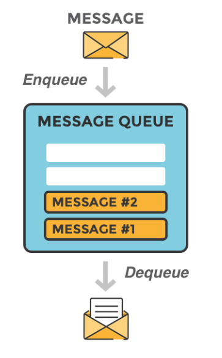
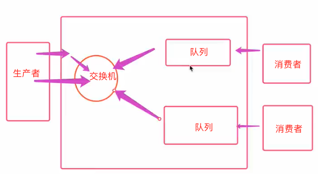

# mq

## 一、基本概念

### 1. 什么是MQ？

MQ的全称是Message Queue，字面意思是消息队列。消息队列是在消息的传输过程中**保存消息的容器**，简单来说就是消息（数据）以“管道”的形式在两个应用之间传递。



### 2. 什么是RabbitMQ？

可以把RabbitMQ理解为类似于MySQL的一种软件，MySQL存储关系型数据，而RabbitMQ是用来管理消息的软件，它提供接口开发给用户，用户把消息发给消息队列或者从消息队列里去取消息。

## 二、RabbitMQ工作模式

### 1. 简单模式

#### （1）生产者

- 连接rabbitmq
- 创建队列
- 向指定队列插入数据

```python
import pika

# 1. 连接rabbitmq
connection = pika.BlockingConnection(pika.ConnectionParameters('localhost'))
channel = connection.channel()

# 2. 创建队列(声明队列), 如果队列不存在时才需要创建队列, 已经存在就不需要创建了
channel.queue_declare(queue="hello")

# 3. 往队列里插入数据
channel.basic_publish(exchange='',  # 简单模式
                      routing_key='hello',  # 指定队列
                      body=b'Hello World!')
print("[x] Sent 'Hello World!'")
```

#### （2）消费者

- 连接rabbitmq
- 监听队列
- 确定回调函数

```python
import pika

# 1. 连接rabbitmq
connection = pika.BlockingConnection(pika.ConnectionParameters('localhost'))
channel = connection.channel()

# 注意，这里之所以也要去声明队列，是因为不确定publish那边是否创建了队列，因为有可能publish后执行，
# 如果没有队列，后面监听的地方会报错
channel.queue_declare(queue="hello")

# 2. 确定回调函数
def callback(ch, method, properties, body):
    print("[x] Received %r" % body)

# 3. 确定监听队列
channel.basic_consume(queue='hello',
                      auto_ack=True, # 默认应答
                      on_message_callback=callback)

print("[*] Waiting for messages. To exit press CTRL+C")
# 启动监听, 如果队列里没有数据, 就会hang住。如果队列里有数据，会去执行回调函数
channel.start_consuming()
```

注意

1. 在消费者这边之所以也要去声明队列，是因为不确定publish那边是否创建了队列，因为有可能publish后执行，如果没有队列，后面监听的地方会报错。
2. `start_consuming`启动监听, 如果队列里没有数据, 就会hang住。如果队列里有数据，会去执行回调函数，执行完回调之后会再次处于监听状态。

### 2. 参数使用

#### （1）应答(auto_ack)

前面消费者监听队列的时候，采用的是默认应答`auto_ack=True`。消费者从消息队列中取出一个消息的时候去做应答，此时消息队列里的消息会被取走(相当于删掉了)。这种方式可能会有一个问题，当消费者宕机，没有正确将消息给成功消费，重启后想再重新去消费已经不可能了。

针对这种形式的不足，可以采取手动应答的方式`auto_ack=False`，当消费者将逻辑处理完成之后，再做出应答。

- 将`basic_consume`自动应答改为手动应答
- 在`callback`里做出应答

```python
import pika

connection = pika.BlockingConnection(pika.ConnectionParameters('localhost'))
channel = connection.channel()

channel.queue_declare(queue="hello")


def callback(ch, method, properties, body):
    print("[x] Received %r" % body)
    ch.basic_ack(delivery_tag=method.delivery_tag)  # 逻辑处理完之后，手动应答


channel.basic_consume(queue='hello',
                      auto_ack=False,  # 手动应答
                      on_message_callback=callback)

print("[*] Waiting for messages. To exit press CTRL+C")
channel.start_consuming()
```

总结：

- 默认应答效率更高，但是安全性差
- 手动应答安全性好，但是效率较差

#### （2）持久化(durable)

当生产者将消息发布到消息队列里的时候，rabbitmq可能会崩掉，此时如果里面的消息还没有来得及被消费者消费，这条消息就相当于丢失了。此时需要考虑对消息进行持久化，共需要做两件事。

- 持久化队列
- 让消息持久化

```python
import pika

connection = pika.BlockingConnection(pika.ConnectionParameters('localhost'))
channel = connection.channel()

# 创建持久化队列
channel.queue_declare(queue="hello", durable=True)

channel.basic_publish(exchange='',
                      routing_key='hello',
                      body=b'Hello World!',
                      # 让消息持久化
                      properties=pika.BasicProperties(
                          delivery_mode=2,
                      ))
print("[x] Sent 'Hello World!'")
```

#### （3）分发参数

消费者从消息队列中取消息消费时，默认的方式是轮询的机制。例如有2个消费者，生产者往消息队列里发了三条消息，那么第一个消费者会消费第1条和第3条消息，第二个消费者消费第2条消息。这种方式一个很大的弊端是，如果第一个消费者的性能很差，消费一个消息需要10s，第二个消费者性能很强，它把第2条消息消费完成后，就没事干了，只能干等着。针对这种情况，可以加上分发参数。

```python
import pika

connection = pika.BlockingConnection(pika.ConnectionParameters('localhost'))
channel = connection.channel()

channel.queue_declare(queue="hello")

def callback(ch, method, properties, body):
    print("[x] Received %r" % body)

# 公平分发
channel.basic_qos(prefetch_count=1)

channel.basic_consume(queue='hello',
                      auto_ack=True, # 默认应答
                      on_message_callback=callback)

print("[*] Waiting for messages. To exit press CTRL+C")
channel.start_consuming()
```

### 3. 交换机模式

#### （1）发布订阅

发布订阅模式相比于简单模式多了一个交换机，在这种模式下，生产者创建交换机，消费者创建队列。生产者往交换机里发布消息时，每个订阅的队列都会收到消息，就像订阅报纸一样，人手一份。



生产者

- 连接mq
- 创建交换机（而不是之前创建队列）
- 往交换机里插入数据

```python
import pika

# 1. 连接rabbitmq
connection = pika.BlockingConnection(pika.ConnectionParameters('localhost'))
channel = connection.channel()

# 2. 声明交换机
channel.exchange_declare(
    # 交换机名称
    exchange="logs",
    # 交换机模式：发布订阅模式
    exchange_type="fanout"
)

# 3. 往交换机里插入数据
channel.basic_publish(
    # 往logs交换机插入数据
    exchange='logs',
    # 不涉及队列，置空
    routing_key='',
    body=b'Hello World!')

print("[x] Sent 'Hello World!'")
```

消费者

- 连接mq
- **创建队列**，生产者不再创建队列
- 将队列绑定到交换机
- 确定回调函数，监听

```python
import pika

# 1. 连接rabbitmq
connection = pika.BlockingConnection(pika.ConnectionParameters('localhost'))
channel = connection.channel()

# 2. 声明交换机
channel.exchange_declare(
    # 交换机名称
    exchange="logs",
    # 交换机模式：发布订阅模式
    exchange_type="fanout"
)

# 3. 往交换机里插入数据
channel.basic_publish(
    # 往logs交换机插入数据
    exchange='logs',
    # 不涉及队列，置空
    routing_key='',
    body=b'Hello World!')

print("[x] Sent 'Hello World!'")
```

#### （2）关键字模式

发布订阅模式有个弊端是，发布到交换机里的消息，会被所有订阅该交换机的消费者消费。但是有些场景我们并不想这样，例如往交换机里写日志，我们可能希望消费者1收所有类型(info, eror, warning)的日志，消费者2只收类型为error的日志。那么可以通过routing_key参数来定义要监听的关键字。

- 生产者：发布消息时，指定关键字。

```python
import pika

connection = pika.BlockingConnection(pika.ConnectionParameters('localhost'))
channel = connection.channel()


channel.exchange_declare(exchange="logs",
                         # 类型要改为direct
                         exchange_type="direct")

channel.basic_publish(
    exchange='logs',
    # 指定关键字routing_key
    routing_key='info',
    body=b'Info: Hello World!')

print("[x] Sent 'Hello World!'")
```

- 消费者：绑定到交换机上时，指定要监听的关键字。只消费交换机里关键字的消息，其他消息不消费。

```python
import pika

connection = pika.BlockingConnection(pika.ConnectionParameters('localhost'))
channel = connection.channel()

channel.exchange_declare(exchange="logs",
                         # 类型要改为direct
                         exchange_type="direct")

result = channel.queue_declare("", exclusive=True)
queue_name = result.method.queue

channel.queue_bind(
    exchange='logs',
    queue=queue_name,
    # 确定要监听的关键字
    routing_key='info'
)


def callback(ch, method, properties, body):
    print("[x] Received %r" % body)


channel.basic_consume(queue=queue_name, auto_ack=True, on_message_callback=callback)
print("[*] Waiting for messages. To exit press CTRL+C")
channel.start_consuming()
```

## 三、pika

### 1. basic_publish

将消息发布到特定的交换机，消息将被路由到交换机定义的队列，并分发给活跃的消费者。

```python
channel.basic_publish(
    exchange="",
    routing_key="video",
    body=json.dumps(message),
    properties=pika.BasicProperties(
        delivery_mode=pika.spec.PERSISTENT_DELIVERY_MODE
    ),
)
```

**当交换机设置为默认的空字符串时，创建的每个队列，都使用与队列名称相同的routing_key**，来自动绑定到它。

> 见官网说明<https://www.rabbitmq.com/tutorials/amqp-concepts.html#exchange-default>

### 2. basic_consume

### 3. basic_get

从mq中获取消息

```python
method_frame, header_frame, body = channel.basic_get('test')
```

如果获取到了消息，`method_frame`会是一个`pika.spec.Basic.GetOk` 对象，对象里会包含当前消息数、`delivery_tag`、`routing_key`

### 4. basic_ack

确认一条或者多条消息

```python
if method_frame:
    channel.basic_ack(method_frame.delivery_tag)
else:
    print('No message returned')
```