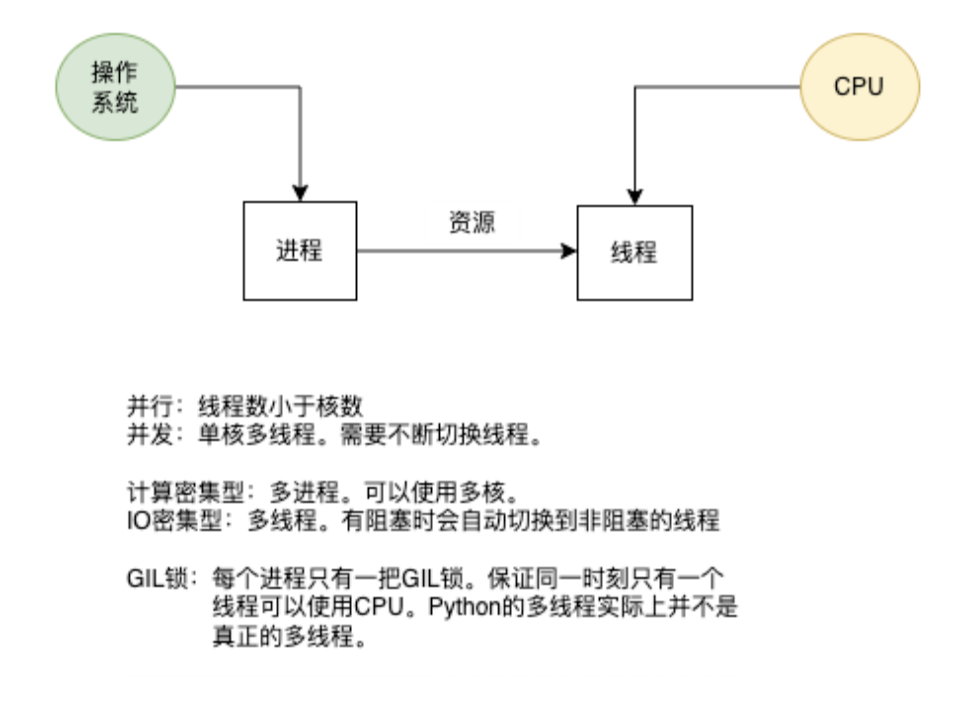
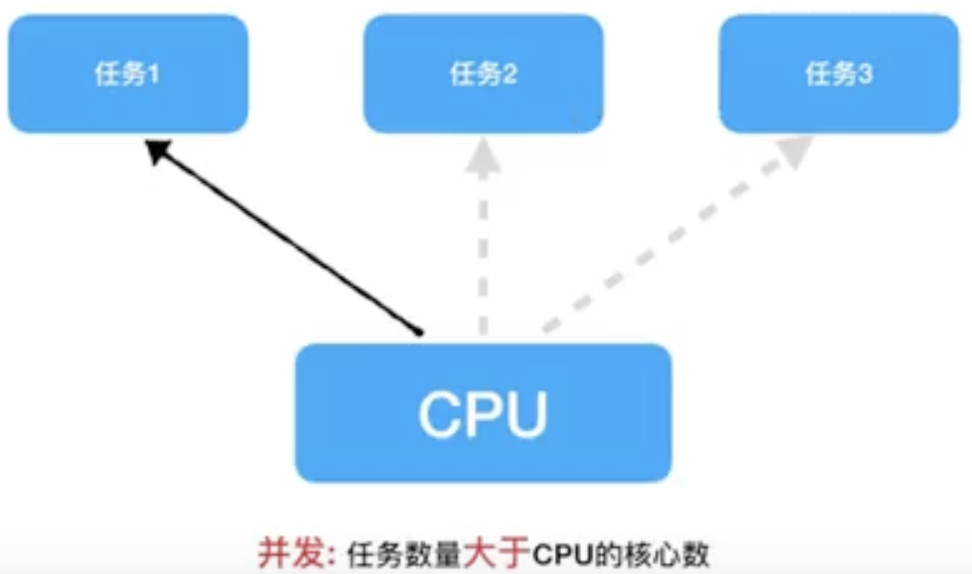
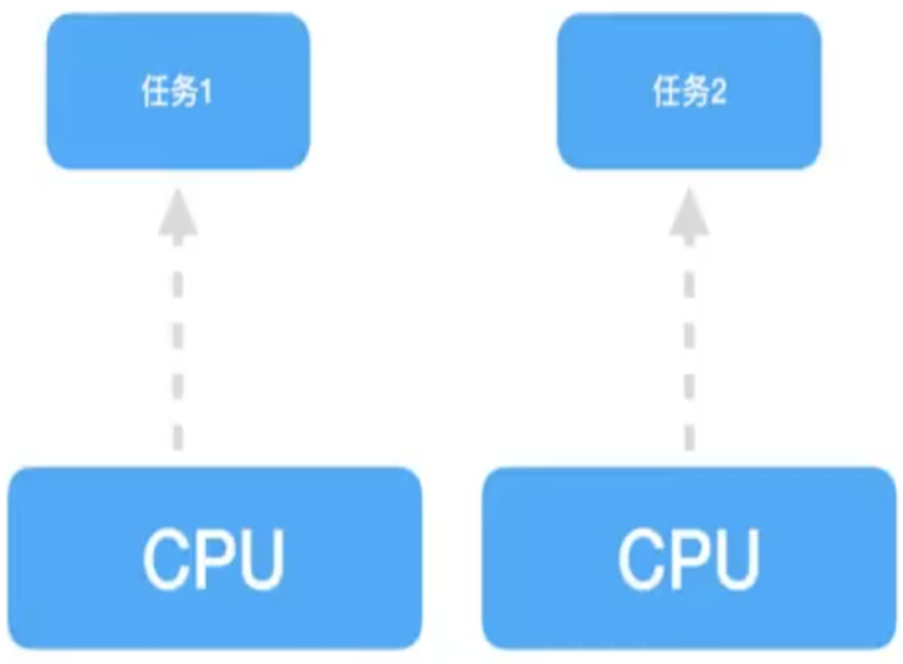
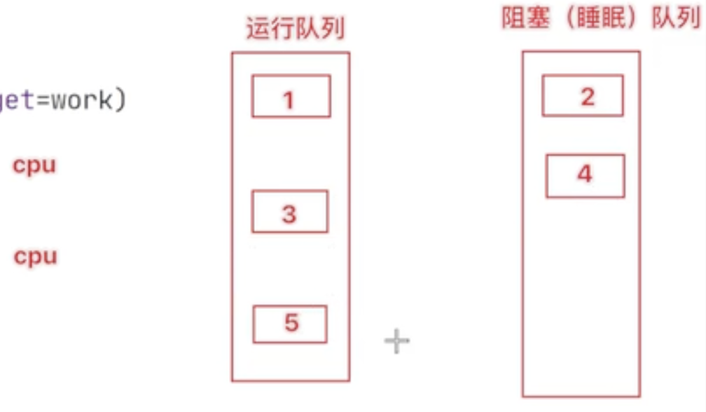

# # Python

## 一、 正则

### 1. 字符

正则表达式是用来匹配**字符串的**。

 `re.search`返回第一个匹配，此外还会返回匹配的字符索引范围。

```python
res = re.search(r'def', 'abcdefghijklmn')
print(res)  # <re.Match object; span=(3, 6), match='def'>, 表示匹配成功, 并且匹配的字符索引范围是(3,6)
print(res[0]) # def
```

#### （1）`.`

`.`：匹配除了换行符`\n`之外的任意字符

```python
re.search(r'...', '_*_') # <re.Match object; span=(0, 3), match='_*_'>
```

#### （2）`\`

转义字符，使后一个字符改变原来的意思。对于一些特殊字符，例如`.`,`\`等在匹配的时候，可以使用转义字符

```python
re.search(r'a\.c', 'a.c') # <re.Match object; span=(0, 3), match='a.c'>
re.search(r'a\\c', 'a\c') # <re.Match object; span=(0, 3), match='a\\c'>
```

####  （3）`[]`

- `[...]`: 匹配字符集，只要出现在[]里的规划内容，都算符合匹配规则
  - `[aeiou]`:匹配aeiou字符
  - `[a-z]`: 匹配小写字母
  - `[A-Z]`:匹配大写字母
  - `[0-9]`: 匹配任何数字

````python
re.match(r'[0-9a-zA-Z_]', 'Z')  # 由于Z出现在[]里，匹配成功
````

- `[^...]`: 出现在[^]里的规划内容，都不符合匹配规则
  - `[^aeiou]`:匹配非aeiou字符
  - `[^a-z]`:匹配非小写字母
  - `[^A-Z]`:匹配非大写字母
  - `[0-9]`: 匹配非数字

```python
re.match(r'[^0-9a-zA-Z_]', 'Z')  # 由于Z出现在[]里，匹配失败
```

### 2. 预定义字符集

#### （1）`\d`

`\d`：匹配一个数字

`\D`: 匹配任何一个非数字

```python
re.search(r'\d\dabc', '.*abc') # 匹配失败
re.search(r'\D\Dabc', '.*abc') # <re.Match object; span=(0, 5), match='.*abc'>
```

#### （2）`\w`

`\w`：匹配一个字母，数字，下划线

`\W`：匹配任何非字母、数字、下划线

```python
re.search(r'\w\wabc', '_1abc') # <re.Match object; span=(0, 5), match='_1abc'>
re.search(r'\W\Wabc', '_1abc') # 匹配失败
```

#### （3）`\s` 

`\s`：匹配空格

`\S`：匹配非空格

```python
re.search(r'a\sc', 'a c') # <re.Match object; span=(0, 3), match='a c'>
re.search(r'abc', 'a c') # 匹配失败
```

### 3. 边界上的匹配

#### （1）`^`

`^`：匹配字符串的起始点

```python
re.search(r'^a', 'abcd')  # <re.Match object; span=(0, 1), match='a'>
```

#### （2）`$`

`$`：匹配字符串的最后面

```python
re.search(r'c$', 'abc') # <re.Match object; span=(2, 3), match='c'>
```

#### （3）`\A`

`\A`：匹配字符串的起始点

```python
re.search(r'\Aa', 'abc')  # <re.Match object; span=(0, 1), match='a'>
```

#### （4）`\Z`

`\Z`：匹配字符串的最后面

```python
re.search(r'c\Z', 'abc')  # <re.Match object; span=(2, 3), match='c'>
```

#### （5）`\B`

`\B`：匹配除了字符串最后面的其他位置

```python
re.search(r'ful\B', 'colorful') # 匹配失败
```

### 4. 数量上的匹配

这几个都是对**前一个字符**进行数量上的匹配

#### （1）`*`

`*`：匹配前一个字符0次或无限次。例如`abc*`可以匹配`abccc`或者`ab`

```python
re.search("Go*d", "Goooooood") # <re.Match object; span=(0, 9), match='Goooooood'>
re.search("G*d", "Goooooood") # <re.Match object; span=(8, 9), match='d'>
```

第一个例子，会将o字母匹配7次

**第二个例子，会将G字母匹配0次**

#### （2）`+`

`+`：匹配前一个字符1次或无限次。例如`abc+`可以匹配`abccc`或者`abc`

```python
re.search("Go+d", "Goooooood") # <re.Match object; span=(0, 9), match='Goooooood'>
re.search("G+d", "Goooooood") # 匹配失败
```

#### （3）`?`

`?`：匹配前一个字符0次或1次。例如`abc+`可以匹配`ab`或者`abc`

```python
re.search(r'abc?', 'ab')  # <re.Match object; span=(0, 2), match='ab'>
re.search(r'abc?d', 'abcd')  # <re.Match object; span=(0, 4), match='abcd'>
```

#### （4）`{n}`

`{n}`：匹配前一个字符n次

```python
re.search("Go{7}d", "Goooooood") # <re.Match object; span=(0, 9), match='Goooooood'>
```

#### （5）`{n,}`

`{n}`：匹配前一个字符n次或n次以上

```python
re.search("Go{2,}d", "Goooooood") # <re.Match object; span=(0, 9), match='Goooooood'>
```

#### （6）`{n, m}`

`{n,m}`：匹配前一个字符n到m次

```python
re.search(r'\d{3}\s+\d{3,8}', '003 2134')  # <re.Match object; span=(0, 8), match='003 2134'>
```

### 5. 逻辑与分组

#### （1）`|`  

`｜`: 左右表达式任意匹配一个。如果`|` 没有出现在`()`中，它的匹配范围是整个表达式。

```python
re.match(r'P|python', 'python')  # <re.Match object; span=(0, 6), match='python'>
re.match(r'P|python', 'Python')  # <re.Match object; span=(0, 1), match='P'>, 因为进行全文匹配
re.match(r'(P|p)ython', 'Python')  # <re.Match object; span=(0, 6), match='Python'>
```

#### （2）`()`

- 以整个括号内的字符为一个单位

```python
re.search('(abc)*d', 'abcabcd') # <re.Match object; span=(0, 7), match='abcabcd'>
re.search('a(123|456)c', 'a456c')  # <re.Match object; span=(0, 5), match='a456c'>
```

- `(?P<name>exp)` : 对分组进行命名

```python
res = re.search('(?P<name>abc){2}d', 'abcabcd')
res[0] # abcabcd
res.group('name')  # 'abc'
```

注意**只需要关注命名的后面部分即可, 前面部分并没有实际意义, 只是用来命名而已**。

- `(?P=name)`：引用别名为`<name>`的分组匹配到的字符串。

```python
re.search('(?P<id1>\d)abc(?P=id1)', '6abc6')  # <re.Match object; span=(0, 5), match='6abc6'>
re.search('(?P<id2>\d)abc(?P=id2)', '2abc6')  # 匹配失败
```

实际案例

```python
import re

s = re.compile(fr'(?P<F_100375>^[一二三四五六七八九十零]+[、\.\s]+.*)', )
c = s.match('一、项目概况')
c.group('F_100375')  # 一、项目概况
```

最后的`.*`匹配任意字符

### 6. 贪婪匹配

正则匹配默认是贪婪匹配，也就是匹配尽可能多的字符

```python
re.match(r'^(\d+)(0*)$', '102300').groups()  # ('102300', '')
```

`\d+`会贪婪匹配，把所有的数字都匹配到，此时后面的`(0*)代表的是0个0。

```python
re.match(r'^(\d+?)(0*)$', '102300').groups()
```

### 7. 字符组合

#### （1）`\d+`

由前面的知识知道，`\d`匹配的是一个数字，`+`：匹配前一个字符1次或无限次。

#### （2）`.*`

bbb

### 8. re.compile

当我们在Python中使用正则表达式时，`re`模块内部会干两件事情：

1. 编译正则表达式，如果正则表达式的字符串本身不合法，会报错；
2. 用编译后的正则表达式去匹配字符串。

如果一个正则表达式要重复使用几千次，出于效率的考虑，我们可以预编译该正则表达式，接下来重复使用时就不需要编译这个步骤了，直接匹配。

```python
import re
re_telephone = re.compile(r'^(\d{3})-(\d{3,8})$')
re_telephone.match('010-12345').groups() # ('010', '12345')
re_telephone.match('010-8086').groups() # ('010', '8086')
```

### 9. re.findall

以列表的形式返回能匹配的子串。

例子1：字符串a = "not 404 found 张三 99 深圳"，每个词中间是空格，用正则过滤掉英文和数字，最终输出"张三 深圳"。

```python
import re

a = "not 404 found 张三 99 深圳"
# 筛选数字或者字母
res = re.findall(r'\d+|[a-zA-Z]+', a)
str_list = a.split(' ')
for r in res:
    str_list.remove(r)
c = " ".join(str_list)
```

例子2：将以下网址提取出域名

```python
import re

# 提取出域名
s2 = """http://www.interoem.com/messageinfo.asp?id=35`
http://3995503.com/class/class09/news_show.asp?id=14
https://lib.wzmc.edu.cn/news/onews.asp?id=769
http://www.zy-ls.com/alfx.asp?newsid=377&id=6
https://www.fincm.com/newslist.asp?id=415"""
# [s]?表示0个或者1个s
# [\w\.\-]+: 表示多个字母或者数字或者.或者-，注意中括号只需要满足一个
pattern = r'http[s]?://[\w\.\-]+'
domain_names = re.findall(pattern, s2)
print(domain_names)
```

### 10. re.search

扫描整个字符串并返回第一个成功的匹配，如果没有匹配，就返回一个None

### 11. re.sub

将匹配到的数据进⾏替换

例子1："张明 98分"，将98替换为100

```python
import re

a = "张明 100分"
re.sub(r'\d+', "100", a)
```

## 二、多任务编程



参考https://www.bilibili.com/video/BV1m341177Wk/?p=3&vd_source=e204e7b48214ba273c6eb797fd8b7a51

### 1. 多任务

#### （1）概念

**同一时期内执行多个任务**，现有的操作系统都是多任务，可以同时运行多个软件。多个任务同时执行可以**充分利用CPU资源**，大大提高程序执行效率。


#### （2）表现形式

##### a. 并发

在一段时间内，**交替**（关键字眼）去执行多个任务。**对于某个系统，只有单核cpu，它可以处理多任务吗？答案是肯定的，操作系统会轮流让各个任务交替执行**。例如: 软件1执行0.01纳秒，切换到软件2执行0.01纳秒，再切换到软件3，执行0.01纳秒。这种执行实际上是交替执行的，但由于CPU的执行速度实在是太快了，表面上感觉这些软件都在同时执行一样。因此对于单核CPU来说，也是可以执行多任务的，只是通过的是并发的这种方式来执行的。

**当任务数大于核数的时候，需要用到并发。** 例如有1000个任务，但是只有4核，此时需要用到并发。



##### b. 并行

在一段时间内**真正的同时一起**执行多个任务。**并行和并发不同的是，并行不需要去交替执行**。对于多核CPU处理多任务，操作系统会给cpu的每个内核安排一个执行的任务，多个内核是真正的一起同时执行多个任务。



**当任务数小于或等于CPU的核心数时**，可以使用并行。

### 2. 进程

#### （1）进程的介绍

- 程序：没有运行的程序，例如QQ.exe，它只占磁盘空间，不占CPU。

- 进程：运行起来后的程序，就是一个进程。进程占内存、CPU、磁盘、网络等资源。

进程是资源分配的最小单位，**它是操作系统进行资源分配和调度运行的基本单位**。通俗来说，一个正在运行的程序就是进程，例如QQ，微信。例如下图中的飞秋软件，它就是一个进程，会向操作系统申请一份资源，运行起来后会占用CPU、内存、磁盘、网络资源。


**进程是资源分配的最小单位**，可以使用多进程来完成多任务。

#### （2）多进程的使用

**程序运行的时候，默认会创建一个进程，称之为主进程**。程序运行后，又创建了一个进程，新的进程称之为子进程。可以用主进程执行一个函数，用子进程执行另外一个函数，两个进程一起执行。下面代码创建了两个子进程，**加上主进程，相当于总共有三个进程**。

```python
import time
import multiprocessing

def coding():
    for i in range(5):
        print('我在写代码....')
        time.sleep(1)


def music():
    for i in range(5):
        print('我在听音乐....')
        time.sleep(1)

if __name__ == '__main__':

    # 创建子进程对象1
    coding_process = multiprocessing.Process(target=coding)
    # 创建子进程对象2
    music_process = multiprocessing.Process(target=music)

    # 启动子进程1
    coding_process.start()
    # 启动子进程2
    music_process.start()
```

> 注意：
>
> 1. 上面代码中，创建、启动子进程都是主进程在跑
> 2. 主进程并不会去调用coding和music两个函数，而是去创建两个子进程，让子进程去执行这两个函数
> 3. 主进程在创建子进程的时候，**完全复制所有资源给子进程**，相当于开了三个微信，或者开了三个分片数。例如上面的代码，相当于有三份，只是子进程只去执行对应的coding和music部分的

#### （3）获取进程编号

当程序中进程数量越来越多时，如果没法区分主进程和子进程，以及不同的子进程，就无法进行有效的管理，每个进程都是有自己编号的。可以获取当前进程的编号， 以及当前父进程的编号。

1. 获取当前进程

```python
# 方法1
import os
pid1 = os.getpid()
# 方法2
import multiprocessing
pid2 = multiprocessing.current_process().pid
```

2. 获取父进程

```python
import os
pid = os.getppid()
```

#### （4）杀死进程

```python
import os

pid = os.getppid()
os.kill(pid, 9)
```

#### （5）进程的注意点

**1. 多进程之间不共享全局变量**

```python
import time
import multiprocessing

g_list = []


def read_data():
    print(f'读取数据:{g_list}')


def write_data():
    for i in range(5):
        g_list.append(i)
        time.sleep(0.2)
        print(f"写入数据:{g_list}")


if __name__ == '__main__':
    write_process = multiprocessing.Process(target=write_data)
    read_process = multiprocessing.Process(target=read_data)
    write_process.start()
    time.sleep(2)
    read_process.start()
```

打印结果如下，原因就是多进程之间不共享全局变量, **在创建子进程的时候，会把主进程的资源`g_list=[]`复制一份过去**，因此写这个子进程和读这个子进程拿到的`g_list`都是空列表，写入这个子进程再往里面添加数据

```bash
写入数据:[0]
写入数据:[0, 1]
写入数据:[0, 1, 2]
写入数据:[0, 1, 2, 3]
写入数据:[0, 1, 2, 3, 4]
读取数据:[]
```

2. **主进程会等所有的子进程执行结束再结束**

```python
import time
import multiprocessing


def work():
    for i in range(10):
        print("工作中.....")
        time.sleep(0.2)


if __name__ == '__main__':
    write_process = multiprocessing.Process(target=work)
    write_process.start()

    time.sleep(1)
    print(f"主进程结束")
```

打印结果，注意`Process finished with exit code 0`（翻译成中文就是：进程结束并退出），这个才代表主进程结束了。也就是说虽然主进程的所有代码都已经执行完成(打印了"主进程结束")， 但是主进程并没有结束，而是需要等待子进程结束它才结束（如果主进程结束了，此时后面5个"工作中...."就打印不出来了）

```bash
工作中.....
工作中.....
工作中.....
工作中.....
工作中.....
主进程结束
工作中.....
工作中.....
工作中.....
工作中.....
工作中.....

Process finished with exit code 0
```

如果想在主进程结束的时候，子进程也结束，有两种方案。

方案一：设置守护主进程。**子进程守护主进程，子进程随时观察主进程的情况，主进程退出后，子进程直接销毁，不再执行子线程的任务。**

```python
import time
import multiprocessing


def work():
    for i in range(10):
        print("工作中.....")
        time.sleep(0.2)


if __name__ == '__main__':
    write_process = multiprocessing.Process(target=work)
    write_process.daemon = True  # 子进程守护主进程
    write_process.start()

    time.sleep(1)
    print(f"主进程结束")
```

方案二：销毁子进程。主进程在结束的时候，将子进程直接销毁。

```python
import time
import multiprocessing


def work():
    for i in range(10):
        print("工作中.....")
        time.sleep(0.2)


if __name__ == '__main__':
    write_process = multiprocessing.Process(target=work)
    write_process.daemon = True
    write_process.start()

    time.sleep(1)
    write_process.terminate()  # 销毁子进程
    print(f"主进程结束")
```

#### （6）join方法

上述方法我们是用了`sleep`来保证write_data这个进程执行完，这里也可以使用`join()`, 它的作用是**主进程会等待write_data这个进程执行完再往下执行**

```python
import time
import multiprocessing

g_list = []


def read_data():
    print(f'读取数据:{g_list}')


def write_data():
    for i in range(5):
        g_list.append(i)
        time.sleep(0.2)
        print(f"写入数据:{g_list}")


if __name__ == '__main__':
    write_process = multiprocessing.Process(target=write_data)
    read_process = multiprocessing.Process(target=read_data)
    write_process.start()
    write_process.join()
    read_process.start()
    read_process.join()
    print(f"主进程:{g_list}")
```

打印结果

```bash
写入数据:[0]
写入数据:[0, 1]
写入数据:[0, 1, 2]
写入数据:[0, 1, 2, 3]
写入数据:[0, 1, 2, 3, 4]
读取数据:[]
主进程:[]
```

#### （7） 进程消息队列

前面说过，进程之间是不共享全局变量的，为了解决这个问题，可以引入消息队列Queue。消息队列可以作为进程间数据传递的一个工具，在消息队列里可以放入任意类型的数据。

```python
import time
import multiprocessing


def write_data(q):
    temp_list = []
    for i in range(5):
        # 往消息队列里放数据
        q.put(i)
        print(f"添加数据:{i}")
        time.sleep(0.2)
        temp_list.append(i)
    print(f"写进程写入数据:{temp_list}")


def read_data(q):
    temp_list = []
    # 获取消息消息队列中有效的消息个数
    while q.qsize() != 0:
        # 从消息队列里取数据
        i = q.get()
        temp_list.append(i)
    print(f"读进程写入数据:{temp_list}")


if __name__ == '__main__':
    # 创建进程消息队列，后面5表示消息队列总个数
    queue = multiprocessing.Queue(5)

    write_process = multiprocessing.Process(target=write_data, args=(queue,))
    read_process = multiprocessing.Process(target=read_data, args=(queue,))

    write_process.start()
    write_process.join()

    read_process.start()
```

### 3. 线程

#### （1）线程的介绍

为什么使用多线程，进程是分配资源的最小单位，一旦创建一个进程就会分配一定的资源。如果和两个人聊QQ，需要打开两个QQ软件，这样是会比较浪费资源的。

**线程是程序执行的最小单位，进程只负责分配资源**，而利用这些资源执行程序的是线程。一个进程最少有一个线程**。**线程自己不拥有系统资源**，只需要在运行中不可少的资源，它**可以和同一个进程中的其他线程共享进程所拥有的全部资源。就类似于QQ，打开两个窗口(两个线程)跟两个人聊天， 实现多任务的同时也节省了资源。

以一个程序执行的过程为例，过程是这样的：hello.py这个程序在运行的时候，会创建一个主进程，主进程去申请资源(cpu资源，内存资源，磁盘资源，网络资源)，**进程它只申请资源，不会去执行代码**，在一个进程里，默认会有一个线程叫做主线程，主线程相当于一个箭头，它指向哪里，程序就执行到哪里，也就是说**线程负责执行程序**

#### （2）多线程的使用

实现多任务也可以使用多线程

```python
import threading
import time


def coding():
    for i in range(5):
        print('我在写代码....')
        time.sleep(1)


def music():
    for i in range(5):
        print('我在听音乐....')
        time.sleep(1)


coding_thread = threading.Thread(target=coding)
music_thread = threading.Thread(target=music)
coding_thread.start()
music_thread.start()
```

#### （3）线程的注意点

1. **没有线程id**

和进程不同的是，线程并没有线程id，如果我们想看两个任务是不是同一个线程，可以使用python的logging模块

```python
import logging

# 创建logger对象
logger = logging.getLogger(__name__)
# 设置日志等级
logger.setLevel(logging.DEBUG)
# 指定日志文件名
log_filename = 'application.log'  
# 创建一个处理器，将日志写入文件
file_handler = logging.FileHandler(log_filename)
# 创建一个格式化器并将其添加到处理器
formatter = logging.Formatter(
    '%(asctime)s - %(name)s - %(levelname)s - Process ID: %(process)d - Thread ID: %(thread)d - %(message)s'
)
file_handler.setFormatter(formatter)
# 将处理器添加到logger对象
logger.addHandler(file_handler)
```

注意： 不要认为多线程只在一个核上跑，当有富余的CPU时，多线程会使用富余的资源。

2. **多线程执行是无序的**

```python
import threading
import time


def work():
    time.sleep(1)
    print(f"{threading.current_thread().name} - work......")


if __name__ == '__main__':
    for i in range(10):
        t = threading.Thread(target=work)
        t.start()
```

两次打印结果可能分别是

```bash
Thread-1 - work......
Thread-2 - work......
Thread-10 - work......
Thread-9 - work......
Thread-8 - work......
Thread-6 - work......
Thread-4 - work......
Thread-3 - work......
Thread-7 - work......
Thread-5 - work......

Process finished with exit code 0
```

```bash
Thread-1 - work......
Thread-2 - work......
Thread-3 - work......
Thread-4 - work......
Thread-5 - work......
Thread-6 - work......
Thread-9 - work......
Thread-10 - work......
Thread-7 - work......
Thread-8 - work......

Process finished with exit code 0
```

这是因为在创建多线程的时候，创建10个线程的时间非常短暂，相对sleep的1秒几乎可以忽略不计。创建10个子线程后，子线程都sleep了，谁先醒来谁工作。



当线程遇到阻塞时，例如网程序可能需要网络资源，但是网络当前不可用；或者是IO操作，但是磁盘被其他程序在使用。此时会将线程从运行队列放入到阻塞队列中，CPU只会去执行运行队列中的线程。当阻塞解决后，将其拿到运行队列中，又可以被CPU调用。

但是如果不睡眠，每次的打印结果都一样

```bash
Thread-1 - work......
Thread-2 - work......
Thread-3 - work......
Thread-4 - work......
Thread-5 - work......
Thread-6 - work......
Thread-7 - work......
Thread-8 - work......
Thread-9 - work......
Thread-10 - work......

Process finished with exit code 0
```

3. **线程之间共享全局变量**

多个线程都是在同一个进程中，**多个线程使用的都是同一个进程的资源，多线程共享全局变量**。例如：老板开一个公司，就相当于开了一个进程，大家共享座椅板凳。但是如果此时再开一个分公司，就相当于重新开了一个进程，这里的桌椅板凳和前一家无法共享。

```python
import threading
import time

g_list = []

def read_data():
    print(f'读取数据:{g_list}')

def write_data():
    for i in range(5):
        g_list.append(i)
        time.sleep(0.2)
    print(f"写入数据:{g_list}")

if __name__ == '__main__':
    write_process = threading.Thread(target=write_data)
    read_process = threading.Thread(target=read_data)
    write_process.start()
    write_process.join()  # 等write_process线程结束，再执行read_process线程
    read_process.start()
```

打印结果如下。和多进程不一样，由于多线程之间是可以共享全局变量的，因此可以读到写进程的数据。

```bash
写入数据:[0, 1, 2, 3, 4]
读取数据:[0, 1, 2, 3, 4]

Process finished with exit code 0
```

#### （4）线程共享全局变量带来报错(重要)

**1. 报错复现**

```python
import threading

g_num = 0


def work1():
    global g_num  # 全局变量直接拿过来用，需要先声明一下
    for i in range(1000000):
        g_num += 1
    print(f"任务1执行结果:{g_num}")


def work2():
    global g_num  # 全局变量直接拿过来用，需要先声明一下
    for i in range(1000000):
        g_num += 1
    print(f"任务2执行结果:{g_num}")


if __name__ == '__main__':
    write_process = threading.Thread(target=work1)
    read_process = threading.Thread(target=work2)
    write_process.start()
    read_process.start()
```

执行结果

```bash
任务1执行结果:1166267
任务2执行结果:1382955

Process finished with exit code 0
```

原因：再执行`g_num+=1`的时候分为三步

```bash
(1) 从内存中取出g_num
(2) 交给cpu, 做加法运算
(3) 将结果放到g_num中
```

这里很可能会出现一个情况：

```bash
(1) worker1做完前两步，还没有来得及做第三步的将结果放到g_num中，它的时间片到期了，此时内存中的g_num还是0
(2) worker2从内存中取出g_num（拿到的是0）, 做加法运算, 假设做10万次运算, 并且正常写入到内存中, 时间片到期
(3) worker1继续执行前面没有执行的任务, 将结果放入到g_num中, 此时g_num为1, 相当于步骤2的10万次加法全部白做
```

这就是资源竞争问题

**2. 解决方法-互斥锁**

互斥锁对共享数据进行锁定，**保证同一时刻只有一个线程去操作全局变量**。互斥锁是多个线程一起去抢，抢到锁的线程先执行，没有抢到锁的线程进行等待，等锁使用完释放后，其他线程再去抢这个锁。

```python
import threading

g_num = 0
g_lock = threading.Lock()  # 创建锁


def work1():
    global g_num  # 全局变量直接拿过来用，需要先声明一下
    for i in range(1000000):
        g_lock.acquire()  # 上锁
        g_num += 1
        g_lock.release()  # 释放锁
    print(f"任务1执行结果:{g_num}")


def work2():
    global g_num  # 全局变量直接拿过来用，需要先声明一下
    for i in range(1000000):
        g_lock.acquire()
        g_num += 1
        g_lock.release()
    print(f"任务2执行结果:{g_num}")


if __name__ == '__main__':
    write_process = threading.Thread(target=work1)
    read_process = threading.Thread(target=work2)
    write_process.start()
    read_process.start()
```

上述代码中，可能会出现同一时刻worker1和worker2都抢锁的情况，但是只会有一个抢到锁，另外一个需要等待锁释放。

> 这里没太弄明白，怎么解决前面的时间分片的问题

#### （5）死锁

一直等待对方释放锁的情景就是死锁。例如上锁之后，一直不释放锁，就会造成死锁。死锁会造成应用程序停止响应，不能再处理其他任务。

```python
import threading

g_list = [1, 2, 3, 4]
g_lock = threading.Lock()


def get_value(i):
    print(threading.current_thread())
    g_lock.acquire()
    if i >= len(g_list):
        print(f"超出列表范围:{i}")
        return
    value = g_list[i]
    print("获取数据:", value)
    g_lock.release()


if __name__ == '__main__':
    for i in range(10):
        write_process = threading.Thread(target=get_value, args=(i,))
        write_process.start()
```

打印结果

```bash
<Thread(Thread-1, started 123145333469184)>
获取数据: 1
<Thread(Thread-2, started 123145333469184)>
获取数据: 2
<Thread(Thread-3, started 123145333469184)><Thread(Thread-4, started 123145350258688)>
获取数据: 4

<Thread(Thread-5, started 123145350258688)><Thread(Thread-6, started 123145367048192)>
超出列表范围:5
<Thread(Thread-7, started 123145383837696)>
<Thread(Thread-8, started 123145400627200)>

<Thread(Thread-9, started 123145417416704)>
<Thread(Thread-10, started 123145367048192)>
```

上述代码会出现死锁的情况，原因是当i=4的时候，会超出列表范围，此时程序返回但是并没有释放锁。解决方法也恨简单，就是在合适的位置释放掉锁。

```python
import threading

g_list = [1, 2, 3, 4]
g_lock = threading.Lock()


def get_value(i):
    print(threading.current_thread())
    g_lock.acquire()
    if i >= len(g_list):
        print(f"超出列表范围:{i}")
        g_lock.release()  # 释放掉锁
        return
    value = g_list[i]
    print("获取数据:", value)
    g_lock.release()


if __name__ == '__main__':
    for i in range(10):
        write_process = threading.Thread(target=get_value, args=(i,))
        write_process.start()
```

### 4. 进程和线程对比

#### （1）进程和线程的关系

- 线程是依附在进程里面的，没有进程就没有线程。就像公司和员工一样，没有公司就没有员工。
- 一个进程默认提供一条线程，进程可以创建多个线程。一个公司至少有一个员工，也可以有多个员工。

#### （2）进程和线程的区别

- 全局变量：进程之间不共享全局变量，线程之间共享全局变量，但是要注意资源竞争的问题，解决办法：互斥锁或者线程同步(join方法)
- 开销：创建进程的资源开销要比创建线程的资源开销要大。进程开销最少开销10M以上，线程最少512K。
- 概念：进程是操作系统资源分配的基本单位，线程是CPU调度的基本单位
- 稳定性：**多进程开发要比单进程多线程开发稳定性要强**，单进程多线程的稳定性不如多进程。例如，多进程好比开了两个QQ，一个挂了另外一个还可以用。而如果单进程多线程，其中有一个负责网络的线程挂了，所有的线程就都不能用了。

#### （3）进程和线程的优缺点对比

进程优缺点:

* 优点: 可以使用多核，可以并发也可以并行
* 缺点: 资源开销大

线程优缺点:

* 优点: 资源开销小
* 缺点: 不能使用多核，只能并发（仅限于Python语言）

#### （4）多进程和多线程适用场景

**在计算密集型(绝大多数时间在计算)时最好用多进程，而在I/O密集型(绝大多是IO处理，大多时间是在等待)的时候最好用多线程。**

计算密集型：大量消耗CPU的数学与逻辑运算，也就是我们这里说的平行计算。

IO密集型：读取文件，读取网络套接字频繁。

原因: 计算密集型一直在计算，多进程可以平行的运行多个python解释器，从而令python程序可以利用多核CPU来提升执行速度。而IO密集型，由于会有大量的IO等待时间，如果是单线程会造成不必要的时间浪费，开启多线程能在线程A等待时，解释器会自动切换到线程B。

在flask框架中，默认使用的是单进程多线程的方式(`threaded=True`)，虽然只启了一个api服务，但是可以响应多个请求，并不会阻塞。Flask基于Werkzeug构建，利用Werkzeug提供的WSGI工具和HTTP实用功能来处理底层请求和响应，werkzeug默认是多线程的，具体可以使用一个logging模块来调试看看。

### 5. GIL锁

本部分参考https://www.bilibili.com/video/av212200906/?spm_id_from=333.999.0.0&vd_source=e204e7b48214ba273c6eb797fd8b7a51

#### （1）死循环CPU使用情况

单线程单进程

```python
def test():
    while True:
        pass

test()
```

此时的CPU使用情况为

<div align=center></div>

多进程

```python
import multiprocessing


def test():
    while True:
        pass


p1 = multiprocessing.Process(target=test)
p1.start()

test()
```

此时的CPU使用情况为

<div align=center></div>

多线程

```python
import threading


def test():
    while True:
        pass


p1 = threading.Thread(target=test)
p1.start()

test()
```

此时的CPU使用情况为

<div align=center></div>


#### (2) 原因分析

单线程单进程只用到一个CPU，因此htop中只有一个核占满。

多进程充分使用到了两个CPU，此时两个核都占满。

多线程两个CPU使用率都没有达到100%，这就是python GIL锁的机制导致的。注意，前面提到的多线程并不是只用一个核。


### 2. GIL锁

#### (1) 概念

GIL锁：全局解释器锁(global interpreter lock)，保证同一时间，只有一个线程使用CPU，一个进程只有一个GIL锁。任何Python线程执行前，必须先获得
GIL锁，然后每执行100条左右的字节码，会自动释放GIL锁，让别的线程有机会执行，所以多线程在python中只能交替执行。

因此严格意义上来说，python的多线程并不是并行的(任何代码执行的时候都需要获得GIL锁)，只是线程在切换的时候，速度太快，看起来像是并行的一样。

#### (2) GIL不是Python的特性

GIL是Cpython引入的概念，其他解释器，例如ipython等，并不会有这个问题

#### (3) GIL的释放

(1) 程序执行超时

(2) 程序执行阻塞操作

(3) 当前程序执行完成

#### (4) GIL解决方案

(1) 使用多进程：每个进程都会有一个解释器，因此可以获得的GIL锁不止一个，可以规避GIL锁的问题

(2) 将代码编译成.c文件，绕过Cpython解释器

## 六、 协程

### 1. 协程有什么作用?

在一个线程中，如果遇到IO等待时间，线程不会傻等，它会利用空闲时间再去干点其他的事。

### 2. 事件循环loop

可以把事件循环理解为一个死循环，例如在任务列表里有三个任务，每个任务有两种状态：可执行和已执行。死循环会去检测每个任务的状态，如果任务可执行，会
去执行。如果任务已完成，从任务列表里拿掉。如果任务列表是空的，死循环介绍。

```python
import asyncio
# 去生成一个事件循环
loop = asyncio.get_event_loop()
# 将任务放到任务列表里
task_list = []
loop.run_until_complete(task_list)
```

### 3. 协程函数和协程对象

协程函数: 定义函数时`async def`
协程对象: 执行协程函数得到的对象

```python
# 协程函数
async def func():
    print("Hello World")
# task: 协程对象
task = func()
```

注意，像上面这种方式**并不会去执行func()函数，只是会去得到一个协程对象而已**，想要执行，就需要像上面那样，把协程对象放到任务列表里

```python
import asyncio
async def func():
    print("Hello World")
task = func()
loop = asyncio.get_event_loop()
loop.run_until_complete(task)
```

在Python3.7之后，可以用更简洁的代码

```python
import asyncio
async def func():
    print("Hello World")
task = func()
asyncio.run(task)
```

### 4. await关键字

await可以理解为IO等待，当IO结束以后继续往下走。await后面要加可等待对象, Python中可等待对象一共有三种: 协程对象，Future，Task对象。

重点看这部分的代码，它的执行逻辑如下：

- 事件循环将任务加到任务列表
- 先打印`Hello World`
- 遇到IO等待，此时事件循环不会执行函数func, 而是会切换到其他协程对象
- 当其他任务执行完成，或者IO等待已经完成(结果回来了)，再切换回来

```python
import asyncio
async def func():
    print("Hello World")
    response = asyncio.sleep(2)
    print("结束", response)
task = func()
asyncio.run(task)
```

嵌套

```python
import asyncio

async def others():
    print("start")
    await asyncio.sleep(2)
    print("end")
    return '返回值'

async def func():
    print("Hello World")
    # await可以执行协程对象
    response = await others()
    print("结束", response)

task = func()
asyncio.run(task)
```

在这段代码中，当执行到`await others()`时，此时**它会去执行协程对象**，等待协程对象的完成。打印的结果为

```bash
Hello World
start
end
结束 返回值
```

### 5. Task对象

作用：在事件循环中添加任务。添加方法`asyncio.create_task()`

```python
import asyncio

async def others():
    print("start")
    await asyncio.sleep(2)
    print("end")
    return "返回值"

async def func():
    # 事件循环此时有两个任务，func, others
    task1 = asyncio.create_task(others())
    # 事件循环此时有两个任务，func, others, others
    task2 = asyncio.create_task(others())
    print("Hello World")
    res1 = await task1
    res2 = await task2
    print("结束", res1, res2)

task = func()
asyncio.run(task)
```

这段代码的执行顺序如下，`create_task`会在事件循环中添加两个任务，由于此时不涉及到IO等待，会继续往下走，当执行到`await task1`此时由于阻塞，会
去执行`task1`，**在`task1`中由于又遇到阻塞，此时会执行`task2`**，`task2`遇到阻塞会切换到`task1`，因此整个函数的打印结果如下

```bash
Hello World
start
start
end
end
结束 返回值 返回值
```

不过上述函数一般不会这么写，而是会用下面的形式来写

```python
import asyncio

async def others():
    print("start")
    await asyncio.sleep(2)
    print("end")
    return "返回值"

async def func():
    task_list = [
        asyncio.create_task(others()),
        asyncio.create_task(others())
    ]
    print("Hello World")
    done, pending = await asyncio.wait(task_list, timeout=None)
    print("结束", done)

task = func()
asyncio.run(task)
```

当两个任务完成之后，它们的结果都会放到`done`里面，`pending`目前不需要做过多关注。

另外这个函数还有一种简单写法

```python
import asyncio

async def others():
    print("start")
    await asyncio.sleep(2)
    print("end")
    return "返回值"
# 协程对象列表
task_list = [others(), others()]
asyncio.run(asyncio.wait(task_list))
```

### 6. Future对象

上一节的`Task`对象是继承`Future`对象的，`Task`对象内部`await`结果的处理基于`Future`对象来的。

对于Task对象来说，当其用`await`做IO等待时，是通过`Future`的值`_state`来维护状态的，如果`_state`变为`success`，就不需要再等待了。

```python
import asyncio

async def main():
    # 获取当前事件循环
    loop = asyncio.get_running_loop()
    # 创建future对象
    fut = loop.create_future()
    # 等待任务最终结果，这里由于future对象一直拿不到值，会一直等待
    await fut

asyncio.run(main())
```

```python
import asyncio

async def set_after(fut):
    await asyncio.sleep(10)
    # 给future对象赋值
    fut.set_result("666")

async def main():
    loop = asyncio.get_event_loop()
    # 创建future对象，future对象并不会往事件循环里加任务
    fut = loop.create_future()
    # 创建Task对象, 往事件循环里加任务
    print("Before create task")
    await loop.create_task(set_after(fut))
    print("After create task")
    # 由于这里future对象可以拿到值，因此会结束，而不会像上个例子那样，一直等待
    data = await fut
    print(data)

asyncio.run(main())
```

`data = await fut`这行代码，由于future对象可以拿到值，因此不会一直等待。打印结果如下：

```bash
Before create task
# 等待10s
After create task
666
```

### 7. concurrent.futures.Future对象

使用线程池、进程池实现异步操作时用到的对象

