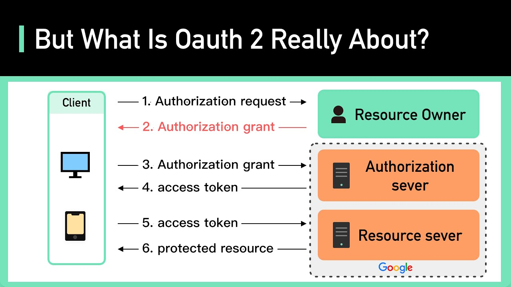

## 一、cookie和session

参考https://juejin.cn/post/6844904034181070861

### 1. 什么是cookie

cookie 是浏览器以键/值对形式存储的文本字符串


HTTP 是无状态的协议：每个请求都是完全独立的，服务端无法确认当前访问者的身份信息。所以服务器与浏览器为了进行会话跟踪（知道是谁在访问我），就必须主动的去维护一个状态，这个状态用于告知服务端前后两个请求是否来自同一浏览器。而这个状态需要通过 cookie 或者 session 去实现。

**cookie 存储在客户端：** cookie 是服务器发送到用户浏览器并保存在本地的一小块数据，它会在浏览器下次向同一服务器再发起请求时被携带并发送到服务器上。

**cookie 是不可跨域的：** 每个 cookie 都会绑定单一的域名，无法在别的域名下获取使用，**一级域名和二级域名之间是允许共享使用的**（**靠的是 domain）**。

### 2. 什么是 session

session 是另一种记录服务器和客户端会话状态的机制，**session 是基于cookie 实现的**，session 存储在服务器端，sessionId 会被存储到客户端的cookie 中


session 认证流程如下：

- 用户第一次请求服务器的时候，服务器根据用户提交的相关信息，创建对应的 session，请求返回时将session的唯一标识信息 sessionID 返回给浏览器
- 浏览器接收到服务器返回的sessionID信息后，会将此信息存入到Cookie中，同时Cookie记录此sessionID 属于哪个域名
- 当用户第二次访问服务器的时候，请求会自动判断此域名下是否存在 Cookie 信息，如果存在自动将 Cookie 信息也发送给服务端

- 服务端会从 Cookie 中获取 sessionID，再根据 sessionID 查找对应的 session 信息，如果没有找到说明用户没有登录或者登录失效，如果找到 session 证明用户已经登录可执行后面操作。

根据以上流程可知，**sessionID 是连接 Cookie 和 session 的一道桥梁**，大部分系统也是根据此原理来验证用户登录状态。

此外需要额外说明的是，前端开发人员并不需要额外的代码来保存cookie，当服务端在返回头中返回`Set-Cookie`这个key时，例如`Set-Cookie: sessionId=abcdef123456; Path=/; HttpOnly`，浏览器会自动将其保存为cookie


## 二、token

### 1. token

token指一种用于表示身份信息或授权信息的令牌，可以是任何形式的字符串，例如 UUID、随机数等，我们常见的token有bearer token和jwt bearer token。

- bearer token除了令牌本身之外，不包含任何其他信息，例如用户的身份，服务器需要将此信息存储在数据库中。以UUID形式的token为例，用户在登录成功后，服务器会生成一个 UUID 形式的 Token，并将其返回给客户端，服务器会将Token 和用户信息的映射关系存在数据库中。

- jwt bearer token：包含用户信息、过期时间等。

> 注意：
>
> **我们常说的token，实际上默认的就是jwt token。**下面部分提到的token也是指的jwt token。


token 的身份验证流程：

- 客户端使用用户名跟密码请求登录

- 服务端收到请求，去验证用户名与密码，验证成功后，服务端会签发一个 token 并把这个token发送给客户端

- 客户端收到 token 以后，会把它存储起来，例如放到localStorage 里，以后每次向服务端请求资源的时候需要带着服务端签发的 token

- 服务端收到请求，然后去验证客户端请求里面带着的token ，如果验证成功，就向客户端返回请求的数据

> token返回：将token放到response body中
>
> sessionId返回：将sessionId放到response header中

通过上面的步骤可以看出，token策略和session/cookie策略的不同，**token策略不需要在服务端做存储**，这样做的好处一是减少存储压力，二是减少数据库的查询，三是如果是集群架构，session 数据共享也是一个问题，而token则无需考虑这个问题。

### 2. jwt token

jwt token分为三部分

- 请求头（header）：描述JWT的元数据。

- 请求体（payload）：用来存放实际需要传递的数据。
- 签名（signature）：对前两部分的签名，防止数据篡改。这部分的加密需要指定一个密钥，这个密钥只有服务器才知道。

注意：

请求头和请求体的加密只是做了一个简单的base64加密，并没有用到密钥，因此一个jwt token的请求头是可以被任何人解密得到的。例如可以通过jwt.io网站解密。


### 3. access token和refresh token


通常我们使用token时，会颁发一个access token和refresh token，通常access token的过期时间短，refresh token的过期时间长。当access token过期时，客户端会使用refresh token去获取一个新的access token。当access token和refresh token都过期时，才会要求用户登录。

> 为什么不直接颁发一个长期的access token？
>
> 答：如果一个长期有效的 access token 被不小心或故意地滥用，那么该 access token 的滥用将会持续较长时间。而使用短期的 access token，尤其是与 refresh token 结合使用时，可以降低滥用的风险。

### 4. token和session的区别

首先思考一个问题？为什么有些应用在设计的时候，既用到了cookie又用到了token？


## 三、Oauth2

### 1. Oauth2是什么？

阮一峰博客（https://www.ruanyifeng.com/blog/2019/04/oauth_design.html）的经典例子：由于我经常网购，京东快递员想要进入小区，每次需要在大门打电话来让他进小区。如果把自己的密码告诉快递员，他就拥有了与我同样的权限，这样不太合适。于是设计了一套授权机制。

- 第一步，门禁系统的密码输入器下面，增加一个按钮，叫做"获取授权"。快递员需要首先按这个按钮，去申请授权。
- 第二步，快递员按下按钮以后，屋主（也就是我）的手机就会跳出对话框：有人正在要求授权。系统还会显示该快递员的姓名、工号和所属的快递公司。我确认请求属实，就点击按钮，告诉门禁系统，我同意给予他进入小区的授权。
- 第三步，门禁系统得到我的确认以后，向快递员显示一个进入小区的令牌（access token）。令牌就是类似密码的一串数字，只在短期内（比如七天）有效。
- 第四步，快递员向门禁系统输入令牌，进入小区。



这里有几个角色：

- 快递员：对应的是客户端(Client)。
- 屋主：对应的是资源所有者(Resource Owner)。
- 门禁系统：授权服务器(Authorization Server)，在获取用户的同意授权后，颁发访问令牌给应用程序，以便其获取资源服务器的数据等。
- 小区：资源服务器(Resource Server)，里面保存着各种资源。

### 2. 授权方式

Oauth2有四种授权方式，但是使用最多的是授权码形式。下面例子使用github来作为授权服务器的实现方式。

首先需要在github上做一个注册https://github.com/settings/applications/new，注册时，最重要的是填一个回调url。完成注册后，可以拿到client_id和client_secret。


- 第一步：跳转到GitHub获取授权，参考github接入oauth2的官方文档，https://docs.github.com/en/apps/oauth-apps/building-oauth-apps/authorizing-oauth-apps#1-request-a-users-github-identity，
- 第二步：提供一个可以跳转到github授权的链接，来让用户登录

```python
client_id = request.form.get('client_id')
redirect_url = f'https://github.com/login/oauth/authorize?client_id={client_id}&redirect_uri=http://localhost:8080/oauth/redirect'
```

- 第三步：此时会跳转到GitHub授权的页面，一旦同意授权，GitHub会跳转到注册时填入的回调url。
- 第四步：GitHub完成跳转后，可以从回调的请求里拿到`code`（授权码）参数，有了这个参数便可以拿到access_token。注意，这个token是GitHub的。

```python
code = request.args.get('code')
response = requests.post(
    url='https://github.com/login/oauth/access_token',
    json={
        "client_id": client_id,
        "client_secret": client_secret,
        "code": code
    },
    headers={"content-type": "application/json"}
)
response_content = response.content.decode('utf8')
access_token = response_content.split('=')[1].split('&')[0]
```

- 第五步：有了access_token后，可以去拿到用户相关的信息，例如用户名等

```python
headers = {
    'Accept': 'application/vnd.github+json',
    'Authorization': f'Bearer {access_token}',
    'X-GitHub-Api-Version': '2022-11-28',
}
response1 = requests.get(
    url='https://api.github.com/user',
    headers=headers
)
username = response1.json()['login']
```

> 注1：完整代码参考https://github.com/shuhaojie/advanced-learning/tree/master/codes/oauth2
>
> 注2：这个例子，由于需要填入client_id和client_secret，和我们理解的用github实现使用GitHub帐户实现社交登录不一样。如需实现GitHub帐户社交登录，可以参考https://stackoverflow.com/a/71741717/10844937

## 四、SSO

### 1. 单点登录和第三方登录

- 第三方登录：用户利用已有账号快速完成登录注册其他网络服务，称之为第三方登录。提供ID的服务称之为，IdP（Identifier Provider，身份提供商）。提供其他服务的称之为 SP（Service Provider，服务提供商）。


- 单点登录：**在多个应用系统中，只需要登录一次，就可以访问其他相互信任的应用系统。**例如用户只要登录了https://github.com，就可以登录https://gist.github.com，这种称之为单点登录。

### 2. 单点登录的实现


图中有4个系统，分别是App1、App2、App3、和SSO。**App1、App2、App3没有登录模块，而SSO只有登录模块，没有其他的业务模块**，当App1、App2、App3需要登录时，将跳到SSO系统，SSO系统完成登录，其他的应用系统也就随之登录了。

此外，在某一个系统退出登录了，所有的系统也退出登录了。

### 3. 单点登录流程

CAS 全名是 Central Authentication Service，一个独立的认证服务, 概念是在使用服务之前，如果是沒有登入的使用者, 會先被跳转到认证服务的地方进行登入，登入成功之后就会被导回去原本使用服务的页面

1. 用户访问app系统，app系统是需要登录的，但用户现在没有登录。
2. 跳转到CAS server，即SSO登录系统，**以后图中的CAS Server我们统一叫做SSO系统。** SSO系统也没有登录，弹出用户登录页。
3. 用户填写用户名、密码，SSO系统进行认证后，将登录状态写入SSO的session，浏览器（Browser）中写入SSO域下的Cookie。
4. SSO系统登录完成后会生成一个ST（Service Ticket），然后跳转到app系统，同时将ST作为参数传递给app系统。
5. app系统拿到ST后，从后台向SSO发送请求，验证ST是否有效。
6. 验证通过后，app系统将登录状态写入session并设置app域下的Cookie。

这样，就完成单点登录就了，以后我们再访问app系统时，app就是登录的。接下来，我们再看看访问app2系统时的流程。

1. 用户访问app2系统，app2系统没有登录，跳转到SSO。
2. 由于SSO已经登录了，不需要重新登录认证。
3. SSO生成ST，浏览器跳转到app2系统，并将ST作为参数传递给app2。
4. app2拿到ST，后台访问SSO，验证ST是否有效。
5. 验证成功后，app2将登录状态写入session，并在app2域下写入Cookie。

这样，app2系统不需要走登录流程，就已经是登录了。SSO，app和app2在不同的域，它们之间的session不共享也是没问题的。

