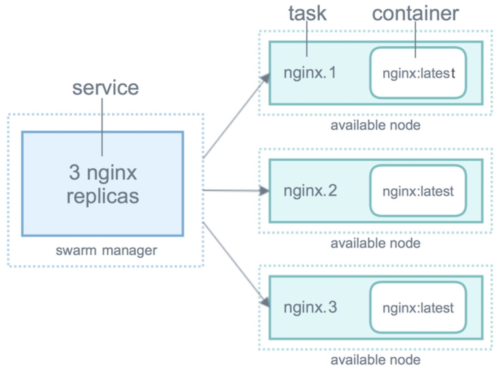

## 一、docker swarm

### 1. 基本概念

简单理解就是多台服务器搭建一个docker集群，每个服务器就是集群中的一个节点。swarm集群中有很多重要的概念，以上是它们的简单介绍。

- swarm：集群管理工具
- node：节点，简单理解就是一台一台的机器，可以是客户机或者是虚拟机。
- task：**任务是swarm集群调度的最小单位**。可以简单的理解为一个container容器。
- service：服务service是指一组任务task的集合

### 2. 理解service

参考 https://docs.docker.com/engine/swarm/how-swarm-mode-works/services/

#### （1）对服务的理解

**当我们在集群模式构建应用时，我们需要创建一个服务**。服务这个概念在docker-compose中就有，**服务是由一组容器组成**，在docker-compose中我们也可以指定容器个数。当我们创建一个服务时，我们通常会指定如下东西：

- 该服务要使用的镜像
- 在容器内要执行的命令
- swarm外部访问服务时的端口
- swarm内部连接其他服务的覆盖网络
- CPU，内存等的限制和保留
- 滚动更新策略
- 要在集群中运行的镜像的副本数量

> 后续补充yml

#### （2）service，task和container

当我们将服务部署到 swarm 时，swarm管理器根据yml文件中的服务定义，来作为服务的所需状态。然后，它将集群中的节点上的服务调度为一个或多个副本任务(task)。这些任务在集群中的节点上彼此独立运行



- container: 容器是一个独立的进程。
- task: 在集群模式模型中，每个任务只调用一个容器。一旦容器处于活动状态，调度程序就会识别出任务处于运行状态。如果容器运行状况检查失败或终止，则任务终止。

## 二、常用命令

### 1. swarm命令

#### （1）docker swarm init

用于初始化 swarm，将当前节点作为 swarm 的管理节点。执行此命令后，系统会创建一个 swarm 集群，并生成一个 token，在其他节点上使用该 token 即可加入 swarm 集群。

```bash
[haojie@node01 ~]$ docker swarm init
Swarm initialized: current node (vxxu7wgqgzwdd9tnz8d2kwc2x) is now a manager.

To add a worker to this swarm, run the following command:

    docker swarm join --token SWMTKN-1-65ynvoqi8u9rp2djn2busjuue9yqblybucbydo7pzf7h6op3ae-8rv1gksj0kia1ykqra6kzujly 10.0.4.11:2377

To add a manager to this swarm, run 'docker swarm join-token manager' and follow the instructions.
```

#### （2）docker swarm join

用于让节点加入到 swarm 集群中。注意如果是在云服务器上，需要用公网ip来替换上面的内网ip。

```
[haojie@node01 ~]$ docker swarm join --token SWMTKN-1-1doee9kyse6xmvedqt9x0peedkilbxb4brnsascsnmepd23vj0-8arz43emxx389hkm5p62s3h5a 121.36.104.55:2377
This node joined a swarm as a worker.
```

### 2. stack命令

#### （1）docker stack deploy

创建一个stack

```bash
[haojie@manager composetest]$ docker stack deploy -c docker-compose.yml demo
Ignoring unsupported options: build

Creating network demo_default
Creating service demo_web
Creating service demo_redis
```

#### （2）docker stack ls

查看有哪些stack

```bash
[haojie@manager composetest]$ docker stack ls
NAME                SERVICES            ORCHESTRATOR
demo                2                   Swarm
```

#### （3）docker stack ps

查看stack中的tasks

```bash
[haojie@manager composetest]$ docker stack ps demo
ID                  NAME                IMAGE                        NODE                DESIRED STATE       CURRENT STATE           ERROR               PORTS
g7j9y5ze6oub        demo_redis.1        redis:alpine                 manager             Running             Running 2 minutes ago
qnisl5mvxfup        demo_web.1          shuhaojie/stackdemo:latest   manager             Running             Running 2 minutes ago
```

#### （4）docker stack services

查看某个stack的services，如果只有一个stack，该命令和docker stack ls等价

```bash
[haojie@manager composetest]$ docker stack services demo
ID                  NAME                MODE                REPLICAS            IMAGE                        PORTS
9bjq19vhbbf0        demo_redis          replicated          1/1                 redis:alpine
n2p6kpkz1fc8        demo_web            replicated          1/1                 shuhaojie/stackdemo:latest   *:8000->8000/tcp
```

### 3. service命令

#### （1）docker service create

用于在 swarm 中创建服务。可以指定副本数量、容器镜像、端口等参数。例如：docker service create --name myapp --replicas 5 -p 8080:80 nginx

```bash
[haojie@node01 ~]$ docker service create --name myapp --replicas 5 -p 8080:80 nginx
is9qav2zozl3l48qurtwfcwst
overall progress: 5 out of 5 tasks
1/5: running   [==================================================>]
2/5: running   [==================================================>]
3/5: running   [==================================================>]
4/5: running   [==================================================>]
5/5: running   [==================================================>]
verify: Service converged
```

#### （2）docker service ls

列出在 swarm 集群中的服务（service）。

```bash
[haojie@node01 ~]$ docker service ls
ID                  NAME                MODE                REPLICAS            IMAGE               PORTS
is9qav2zozl3        myapp               replicated          5/5                 nginx:latest        *:8080->80/tcp
```

#### （3）docker service inspect

展示一个服务的细节。

```bash
# 细节较多，不全部展示
[haojie@manager ~]$ docker service inspect demo_redis --pretty

ID:		iiapvbhfun62z9m6uw9xz839b
Name:		demo_redis
Labels:
 com.docker.stack.image=redis:alpine
 com.docker.stack.namespace=demo
Service Mode:	Replicated
 Replicas:	1
Placement:
 Constraints:	[node.role!=worker]
UpdateConfig:
 Parallelism:	1
 On failure:	pause
 Monitoring Period: 5s
 Max failure ratio: 0
 Update order:      stop-first
RollbackConfig:
 Parallelism:	1
 On failure:	pause
 Monitoring Period: 5s
 Max failure ratio: 0
 Rollback order:    stop-first
ContainerSpec:
 Image:		redis:alpine@sha256:1717c713d3b2161db30cd026ceffdb9c238fe876f6959bf62caff9c768fb47ef
Resources:
Networks: demo_default
Endpoint Mode:	vip
```

#### （4）docker service ps

**查看运行服务的节点**。这里的id和name表示的是task，而不是container。

```bash
[haojie@node01 ~]$ docker service ps myapp
ID                  NAME                IMAGE               NODE                DESIRED STATE       CURRENT STATE           ERROR               PORTS
otnew27wvebp        myapp.1             nginx:latest        node01              Running             Running 4 minutes ago
bdqtyem2f2m4        myapp.2             nginx:latest        node01              Running             Running 4 minutes ago
ufkluh3qlv8c        myapp.3             nginx:latest        node01              Running             Running 4 minutes ago
yei6wxrbvugk        myapp.4             nginx:latest        node01              Running             Running 4 minutes ago
6z8x4jip0toh        myapp.5             nginx:latest        node01              Running             Running 4 minutes ago
```

#### （5）docker service scale

调整服务的副本数。

```bash
[haojie@node01 ~]$ docker service scale myapp=2
myapp scaled to 2
overall progress: 2 out of 2 tasks
1/2: running   [==================================================>]
2/2: running   [==================================================>]
verify: Service converged
```

#### （6）docker service update

调整服务的参数，例如镜像版本、环境变量等。例如：docker service update --image nginx:latest myapp。

```bash
[haojie@node01 ~]$ docker service update --image nginx:1.25.1 myapp
image nginx:1.25.1 could not be accessed on a registry to record
its digest. Each node will access nginx:1.25.1 independently,
possibly leading to different nodes running different
versions of the image.

myapp
overall progress: 2 out of 2 tasks
1/2: running   [==================================================>]
2/2: running   [==================================================>]
verify: Service converged
```

#### （7）docker service rm

删除服务

```bash
[haojie@node01 ~]$ docker service rm myapp
myapp
```

### 4. node命令

#### （1）docker node ls

```bash
[haojie@manager ~]$ docker node ls
ID                            HOSTNAME   STATUS    AVAILABILITY   MANAGER STATUS   ENGINE VERSION
02i3kcyu0b38qqmqsxjyhgee0 *   manager    Ready     Active         Leader           24.0.2
iib016mutslhhj63o482zx3ce     node01     Ready     Active                          18.06.3-ce
```

注意，这里的status必须是`Ready`，才可以分配服务到该节点

#### （2）docker node inspect 

```bash
[haojie@manager ~]$ docker node inspect node01 --pretty
ID:			pbx11ouwd08of4ln3jbac163t
Labels:
 - role=worker
 - worker
Hostname:              	node01
Joined at:             	2023-07-26 07:26:22.967751883 +0000 utc
Status:
 State:			Ready
 Availability:         	Active
 Address:		43.143.70.145
Platform:
 Operating System:	linux
 Architecture:		x86_64
Resources:
 CPUs:			2
 Memory:		1.952GiB
Plugins:
 Log:		awslogs, fluentd, gcplogs, gelf, journald, json-file, local, logentries, splunk, syslog
 Network:		bridge, host, ipvlan, macvlan, null, overlay
 Volume:		local
Engine Version:		24.0.4
TLS Info:
 TrustRoot:
-----BEGIN CERTIFICATE-----
...
-----END CERTIFICATE-----

 Issuer Subject:	MBMxETAPBgNVBAMTCHN3YXJtLWNh
 Issuer Public Key:	MFkwEwYHKoZIzj0CAQYIKoZIzj0DAQcDQgAERJS6bHBRQWFWyjIe+I+vGCI38fhrfoaQ/zRpV8XjZ2eMX8ygyzniymTy+pSDevgx8t8ySTq00OQW07jKL6eZLg==
```

#### （3）docker node update --label-add

给node打标签

```bash
[haojie@manager ~]$ docker node update --label-add worker node01
node01
# 这种方式也可以
[haojie@manager ~]$ docker node update --label-add role=worker node01
node01
```

此时再查看节点，可以看到

```bash
[haojie@manager ~]$ docker node inspect node01 --pretty
ID:			iib016mutslhhj63o482zx3ce
Labels:
 - worker
```

## 三、集群部署

### 1. 环境准备 

本次部署采用两台云服务器，华为云和阿里云，两台机器的docker版本均为24.0.4，均为centos系统。集群节点之间保证TCP 2377、TCP/UDP 7946和UDP 4789端口通信，另外本程序需要8000和6379端口，也需要放开

部署参考官方文档https://docs.docker.com/engine/swarm/stack-deploy/

### 2. 开启swarm模式

```
docker swarm init
# 开放端口
firewall-cmd --add-port=2377/tcp --permanent
firewall-cmd --reload
# 重启机器
```

在node上执行

```bash
# 注意，docker swarm init给出的内网地址，要换成公网地址
docker swarm join --token SWMTKN-1-1doee9kyse6xmvedqt9x0peedkilbxb4brnsascsnmepd23vj0-8arz43emxx389hkm5p62s3h5a 121.36.104.55:2377
```

### 3. 文件准备

- app.py

  ```python
  from flask import Flask
  from redis import Redis
  
  app = Flask(__name__)
  redis = Redis(host='redis', port=6379)
  
  @app.route('/')
  def hello():
      count = redis.incr('hits')
      return 'Hello World! I have been seen {} times.\n'.format(count)
  
  if __name__ == "__main__":
      app.run(host="0.0.0.0", port=8000, debug=True)
  ```

- Dockerfile

  ```dockerfile
  # syntax=docker/dockerfile:1
  FROM python:3.4-alpine
  ADD . /code
  WORKDIR /code
  RUN pip install -r requirements.txt
  CMD ["python", "app.py"]
  ```

- requirements.txt

  ```txt
  flask
  redis
  ```

- docker-compose.yml

  ```yml
  version: "3.9"
  
  services:
    web:
      image: shuhaojie/stackdemo:latest
      build: .
      ports:
        - "8000:8000"
    redis:
      image: redis:alpine
  ```

### 4. 构建镜像

- 构建镜像，`docker-compose up -d`: **既会构建镜像，也会去启动容器**。
- 将构建好的镜像推到仓库：`docker-compose push`

### 5. 构建栈

- 创建docker stack(栈)：`docker stack deploy --compose-file docker-compose.yml stackdemo`，最后一个参数是栈的名称。
- 查看栈中的服务状态：`docker stack services stackdemo`，查看由stackdemo这个栈创建的服务

- 测试manager节点：`curl http://localhost:8000`