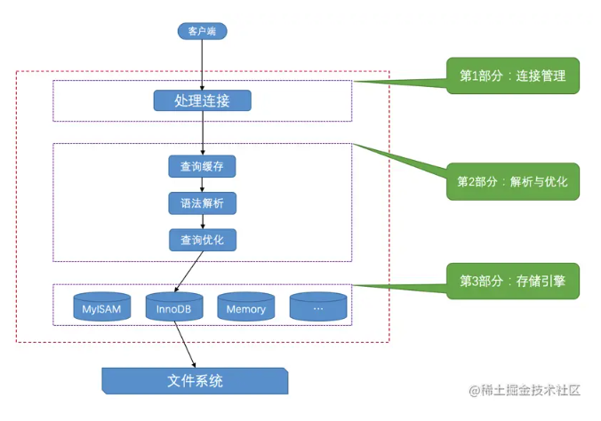
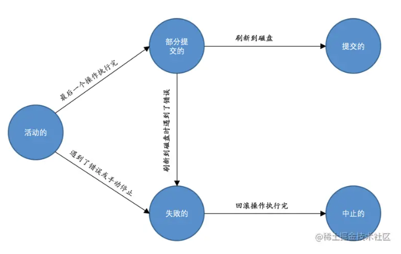

# 从根儿上理解MySQL

- 选自<https://juejin.cn/book/6844733769996304392/>
- 本文档为临时性文档，方便写读书笔记，后续注意将本文档内容完善到MySQL中，并销毁掉本文档


## 二、重新认识MySQL

### 1. 可执行文件

- MacOS安装目录：`/usr/local/mysql/bin`，里面有非常多的可执行文件，启动客户端程序和服务端程序都可以执行可执行文件。

```bash
➜  bin ls -la
-rwxr-xr-x   1 root  wheel    8867936  7  7  2022 mysql  # 启动客户端
-rwxr-xr-x   1 root  wheel       5002  7  7  2022 mysql_config
-rwxr-xr-x   1 root  wheel    9235680  7  7  2022 mysqlbinlog
-rwxr-xr-x   1 root  wheel    8498064  7  7  2022 mysqlcheck
-rwxr-xr-x   1 root  wheel   74288112  7  7  2022 mysqld  # 启动服务端
-rwxr-xr-x   1 root  wheel  298081328  7  7  2022 mysqld-debug
-rwxr-xr-x   1 root  wheel      27492  7  7  2022 mysqld_multi
-rwxr-xr-x   1 root  wheel      29190  7  7  2022 mysqld_safe
-rwxr-xr-x   1 root  wheel    8593856  7  7  2022 mysqldump
-rwxr-xr-x   1 root  wheel       7669  7  7  2022 mysqldumpslow
-rwxr-xr-x   1 root  wheel    8497344  7  7  2022 mysqlimport
-rwxr-xr-x   1 root  wheel    9584848  7  7  2022 mysqlpump
-rwxr-xr-x   1 root  wheel    8491152  7  7  2022 mysqlshow
-rwxr-xr-x   1 root  wheel    8519040  7  7  2022 mysqlslap
```

### 2. 客户端与服务端连接

- MySQL采用的是TCP协议，服务端默认监听3306端口，因此客户端需要去连接到3306端口
- 也可以采用套接字的形式建立连接

### 3. 服务端处理客户端请求

客户端进程向服务器进程发送一段文本（MySQL语句），服务器进程处理后再向客户端进程发送一段文本（处理结果）



#### （1）连接管理

每当有一个客户端进程连接到服务器进程时，服务器进程都会创建一个线程来专门处理与这个客户端的交互。`MySQL`服务器会为每一个连接进来的客户端分配一个线程，但是线程分配的太多了会严重影响系统性能，所以也需要限制一下可以同时连接到服务器的客户端数量。

当连接建立后，与该客户端关联的服务器线程会一直等待客户端发送过来的请求，`MySQL`服务器接收到的请求只是一个文本消息，该文本消息还要经过各种处理。

#### （2）解析与优化

MySQL服务器获得文本形式的请求后，还要经过九九八十一难的处理，其中的几个比较重要的部分分别是`查询缓存`、`语法解析`和`查询优化`

##### a. 查询缓存

如果我问你`9+8×16-3×2×17`的值是多少，我们计算得到结果`35`，如果我再问你一遍`9+8×16-3×2×17`的值是多少，由于刚刚已经算过了，直接说答案就好了。`MySQL`服务器程序处理查询请求的过程也是这样，会把刚刚处理过的查询请求和结果`缓存`起来，如果下一次有一模一样的请求过来，直接从缓存中查找结果就好了。

不过既然是缓存，那就有它缓存失效的时候。MySQL的缓存系统会监测涉及到的每张表，只要该表的结构或者数据被修改，**如对该表使用了`INSERT`、 `UPDATE`、`DELETE`等语句，那使用该表的所有高速缓存查询都将变为无效并从高速缓存中删除**

##### b. 语法解析

如果查询缓存没有命中，接下来就需要进入正式的查询阶段了。因为客户端程序发送过来的请求只是一段文本而已，所以`MySQL`服务器程序首先要对这段文本做分析，判断请求的语法是否正确，然后从文本中将要查询的表、各种查询条件都提取出来放到`MySQL`服务器内部使用的一些数据结构上来。

##### c. 查询优化

语法解析之后，服务器程序获得到了需要的信息，但我们写的`MySQL`语句执行起来效率可能并不是很高，`MySQL`的优化程序会对我们的语句做一些优化，如外连接转换为内连接、表达式简化、子查询转为连接等。优化的结果就是生成一个执行计划，这个执行计划表明了应该使用哪些索引进行查询，表之间的连接顺序是啥样的。

#### （3）存储引擎

截止到服务器程序完成了查询优化为止，还没有真正的去访问真实的数据表，`MySQL`服务器把数据的存储和提取操作都封装到了一个叫`存储引擎`的模块里。我们知道`表`是由一行一行的记录组成的，但这只是一个逻辑上的概念，物理上如何表示记录，怎么从表中读取数据，怎么把数据写入具体的物理存储器上，这都是`存储引擎`负责的事情。

为了管理方便，人们把`连接管理`、`查询缓存`、`语法解析`、`查询优化`这些并不涉及真实数据存储的功能划分为`MySQL server`的功能，把真实存取数据的功能划分为`存储引擎`的功能。各种不同的存储引擎向上边的`MySQL server`层提供统一的调用接口（也就是存储引擎API），包含了几十个底层函数。

所以在`MySQL server`完成了查询优化后，只需按照生成的执行计划调用底层存储引擎提供的API，获取到数据后返回给客户端就好了。


## 二十、事务

### 1. 为什么需要事务？

以给别人转账这个经典例子为例，事务的作用就是保证我给别人的转账要么成功，要么失败（重新转），而不至于出现我的钱转过去了，别人没有收到的情况。

此外，**数据库中的一条操作也可能被分解成若干个步骤**，例如转账

```
步骤一：将账户的余额减去转账金额 balance=balance-money。

步骤二：将账户修改过的余额写到磁盘里，这一步骤简写为write(balance)。
```

在任何一个可能的时间都可能发生意想不到的错误（可能是数据库本身的错误，或者是操作系统错误，甚至是直接断电之类的），设计数据库要保证如果在执行操作的过程中发生了错误，把已经做了的操作恢复成没执行之前的样子

### 2. 原子性

原子性：要么全做，要么全不做。

### 3. 隔离性

### 4. 一致性

### 5. 持久性

这个最好说，执行了就是永久的。

### 6. 事务状态

- 活动的（active）：事务对应的数据库操作正在执行过程中时，我们就说该事务处在`活动的`状态
- 部分提交的（partially committed）：当事务中的最后一个操作执行完成，但由于操作都在内存中执行，所造成的影响并没有刷新到磁盘
- 失败的（failed）：当事务处在`活动的`或者`部分提交的`状态时，可能遇到了某些错误（数据库自身的错误、操作系统错误或者直接断电等）而无法继续执行，或者人为的停止当前事务的执行，我们就说该事务处在`失败的`状态。
- 中止的（aborted）: 对失败的状态进行回滚，完成回滚就称之为中止的
- 提交的（committed）：当一个处在`部分提交的`状态的事务将修改过的数据都同步到磁盘上之后，我们就可以说该事务处在了`提交的`状态。




## 二十四、事务的隔离级别和MVCC

### 1. 事务隔离级别

对于同一个服务器来说，可以有若干个客户端与之连接，每个客户端与服务器连接上之后，就可以称之为一个会话（`Session`）。每个客户端都可以在自己的会话中向服务器发出请求语句，一个请求语句可能是某个事务的一部分，也就是对于服务器来说可能同时处理多个事务。在事务简介的章节中我们说过事务有一个称之为`隔离性`的特性，理论上在某个事务对某个数据进行访问时，其他事务应该进行排队，当该事务提交之后，其他事务才可以继续访问这个数据。但是这样子的话对性能影响太大，我们既想保持事务的`隔离性`，又想让服务器在处理访问同一数据的多个事务时性能尽量高些，鱼和熊掌不可得兼，舍一部分`隔离性`而取性能者也。

### 2. 并发事务遇到的问题

- 脏写：一个事务修改了另一个未提交事务修改过的数据。由于脏写这个问题太严重了，现在MySQL不论是哪种隔离级别，都不允许脏写的情况发生。

- 脏读：一个事务读到了另一个未提交事务修改过的数据。
- 不可重复读：如果一个事务只能读到另一个已经提交的事务修改过的数据，并且其他事务每对该数据进行一次修改并提交后，该事务都能查询得到最新值。
- 幻读：如果一个事务先根据某些条件查询出一些记录，之后另一个事务又向表中插入了符合这些条件的记录，原先的事务再次按照该条件查询时，能把另一个事务插入的记录也读出来。

## 二十五、锁

### 1. 并发事务的问题

